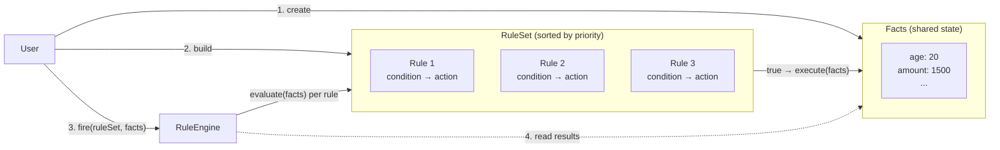
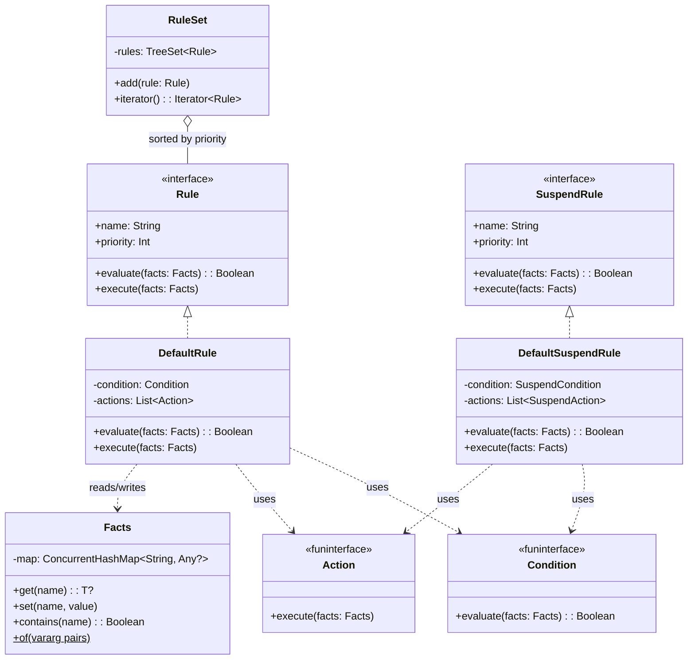
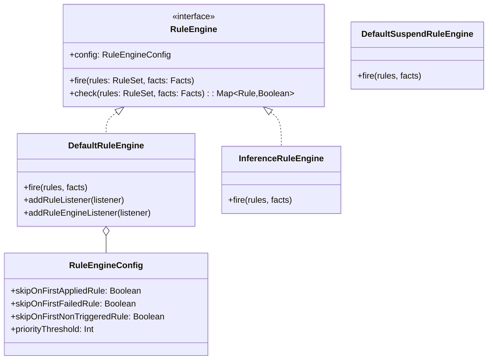
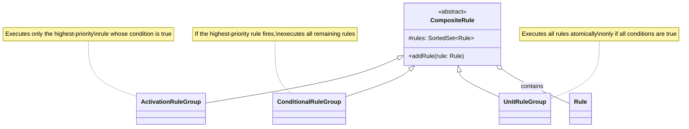
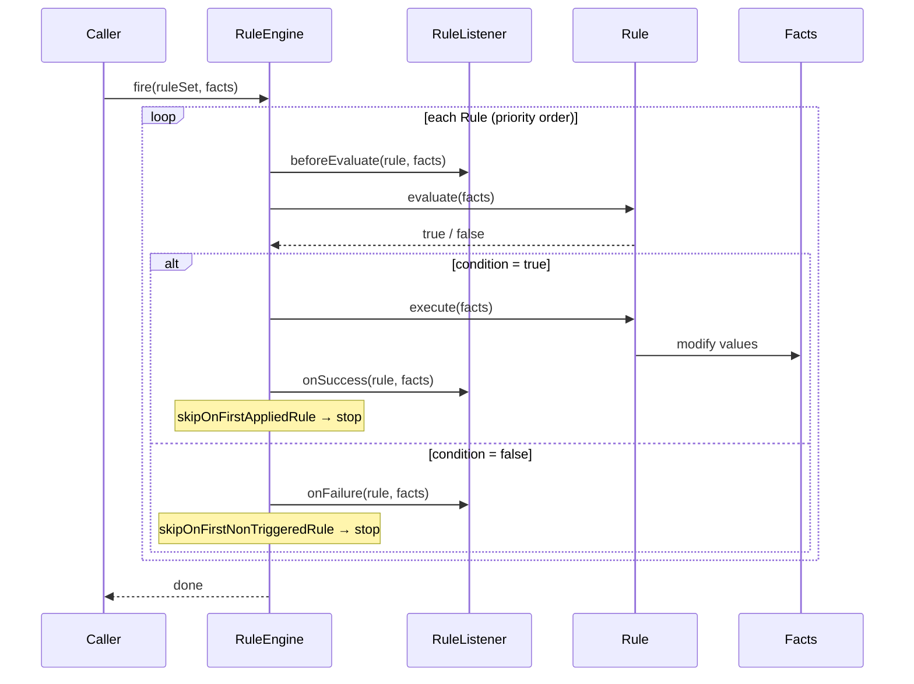
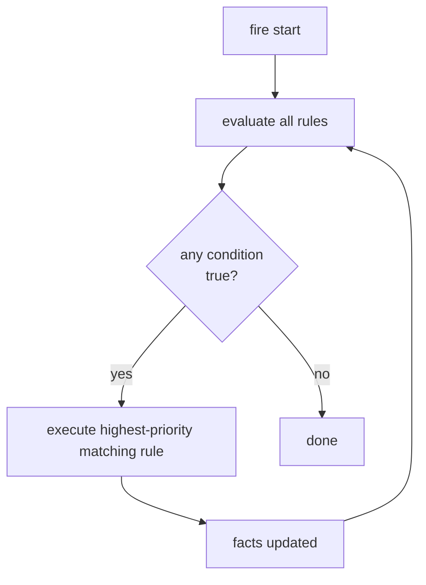
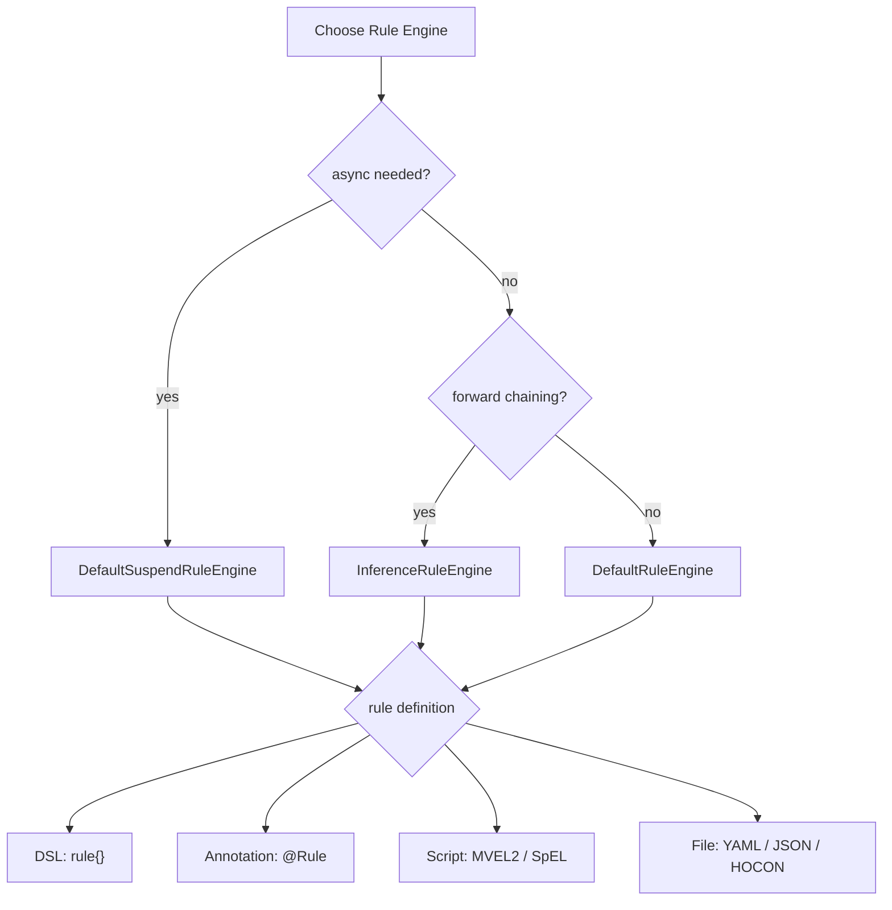

# bluetape4k-rule-engine

English | [한국어](./README.ko.md)

A lightweight rule engine library for Kotlin. It follows the Easy Rules pattern and adds Kotlin DSLs, coroutine support (`SuspendRule`), and annotation-based rule definitions.

## Architecture

### Concept Overview

The three core building blocks and how they interact:



A `Rule` has a **condition** (predicate on `Facts`) and an **action** (mutates `Facts`).  
`RuleEngine.fire()` iterates rules in priority order, evaluates each condition, and runs matching actions.

### Core Class Diagram



### Rule Engine Class Diagram



### Composite Rules



### Rule Execution Sequence



### InferenceRuleEngine (Forward Chaining)



### Rule Engine Selection Guide



## Core Features

- **DSL-based rule definitions**: `rule {}`, `suspendRule {}`, and `ruleEngine {}` DSLs
- **Annotation-based rules**: convert POJO classes into rules with `@Rule`, `@Condition`, `@Action`, and `@Fact`
- **Coroutine support**: asynchronous rule execution with `SuspendRule` and `SuspendRuleEngine`
- **Script engines**: dynamic rule definitions based on MVEL2, SpEL, and Kotlin Script
- **Rule readers**: load rule definitions from YAML, JSON, and HOCON files
- **Composite rules**: combine multiple rules with `ActivationRuleGroup`, `ConditionalRuleGroup`, and `UnitRuleGroup`
- **Forward chaining**: repeatedly execute while conditions are satisfied through `InferenceRuleEngine`

## Usage Examples

### DSL-Based Rule

```kotlin
val discountRule = rule {
    name = "discount"
    description = "Apply discount for orders above 1000 KRW"
    priority = 1
    condition { facts -> facts.get<Int>("amount")!! > 1000 }
    action { facts -> facts["discount"] = true }
}

val engine = ruleEngine { skipOnFirstAppliedRule = true }
val facts = Facts.of("amount" to 1500)
engine.fire(ruleSetOf(discountRule), facts)
```

### Annotation-Based Rule

```kotlin
@Rule(name = "ageCheck", description = "Adult check", priority = 1)
class AgeCheckRule {
    @Condition
    fun isAdult(facts: Facts): Boolean = facts.get<Int>("age")!! >= 18

    @Action
    fun allow(facts: Facts) { facts["allowed"] = true }
}

val rule = AgeCheckRule().asRule()
val facts = Facts.of("age" to 20)
DefaultRuleEngine().fire(ruleSetOf(rule), facts)
```

### Coroutine-Based `SuspendRule`

```kotlin
val asyncRule = suspendRule {
    name = "asyncProcess"
    condition { facts -> facts.get<Int>("value")!! > 0 }
    action { facts ->
        delay(100)
        facts["processed"] = true
    }
}

val engine = DefaultSuspendRuleEngine()
engine.fire(suspendRuleSetOf(asyncRule), facts)
```

### MVEL2 Script Rule

```kotlin
val rule = MvelRule(name = "discount", priority = 1)
    .whenever("amount > 1000")
    .then("discount = true")
```

### SpEL Script Rule

```kotlin
val rule = SpelRule(name = "discount", priority = 1)
    .whenever("#amount > 1000")
    .then("#discount = true")
```

### Load Rules from YAML

```yaml
# rules.yml
rules:
  - name: "discount"
    condition: "amount > 1000"
    actions:
      - "discount = true"
```

```kotlin
val reader = YamlRuleReader()
val definitions = reader.readAll(source).toList()
val mvelRules = definitions.map { it.toMvelRule() }
```

## Configuration Options

| Option                        | Description                         | Default         |
|-------------------------------|-------------------------------------|-----------------|
| `skipOnFirstAppliedRule`      | Stop after first rule fires         | `false`         |
| `skipOnFirstFailedRule`       | Stop after first rule throws        | `false`         |
| `skipOnFirstNonTriggeredRule` | Stop after first condition is false | `false`         |
| `priorityThreshold`           | Ignore rules above this priority    | `Int.MAX_VALUE` |

## Dependency

```kotlin
implementation(project(":bluetape4k-rule-engine"))

// optional (compileOnly)
implementation("org.mvel:mvel2:2.5.2.Final")              // MVEL2 engine
implementation("org.springframework:spring-expression")     // SpEL engine
implementation("org.jetbrains.kotlin:kotlin-scripting-jvm-host") // Kotlin Script engine
implementation("com.fasterxml.jackson.dataformat:jackson-dataformat-yaml") // YAML reader
implementation("com.typesafe:config:1.4.3")                // HOCON reader
```
