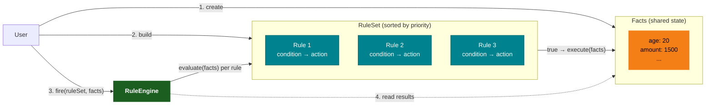
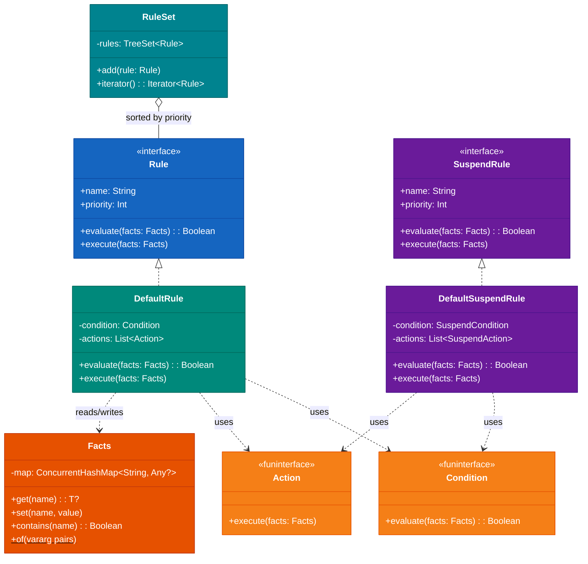
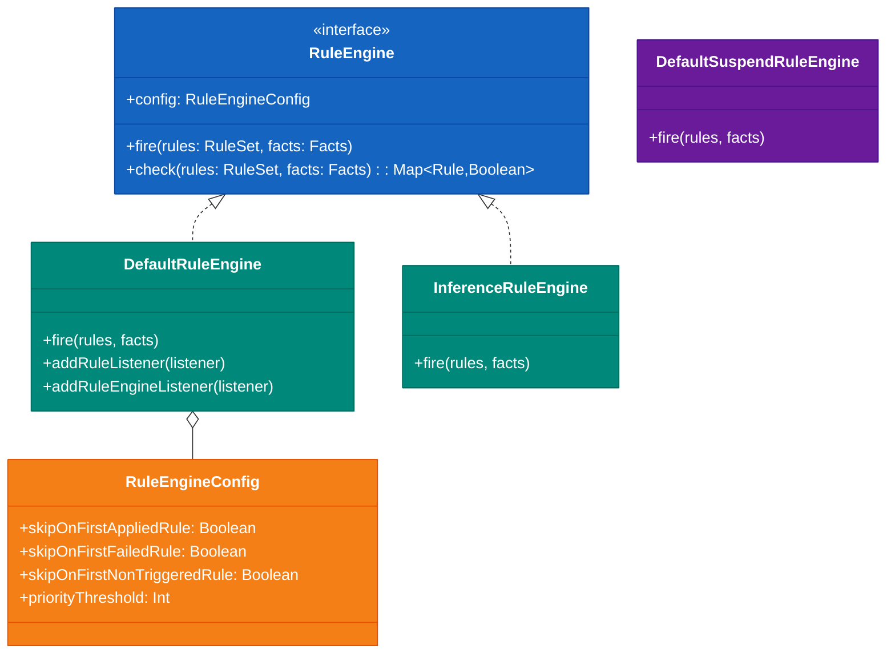
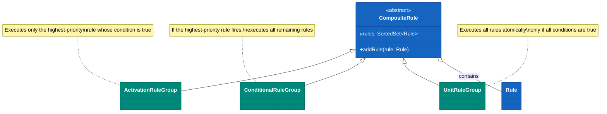
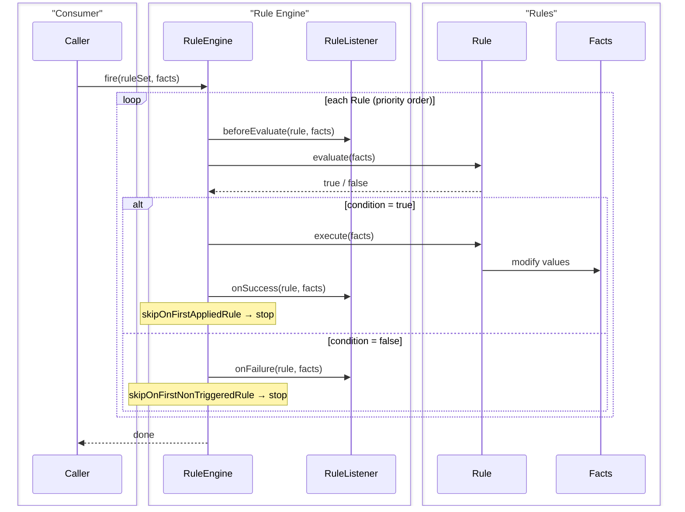
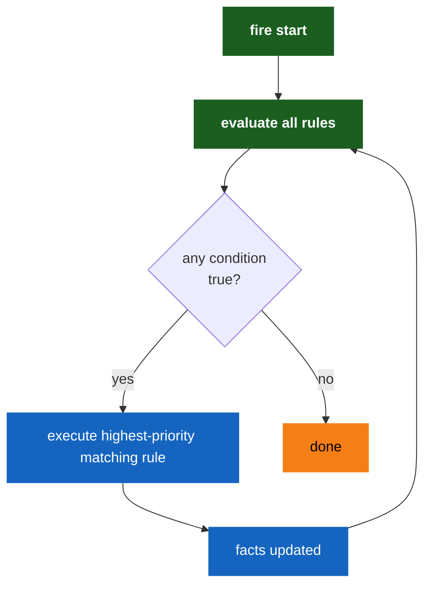
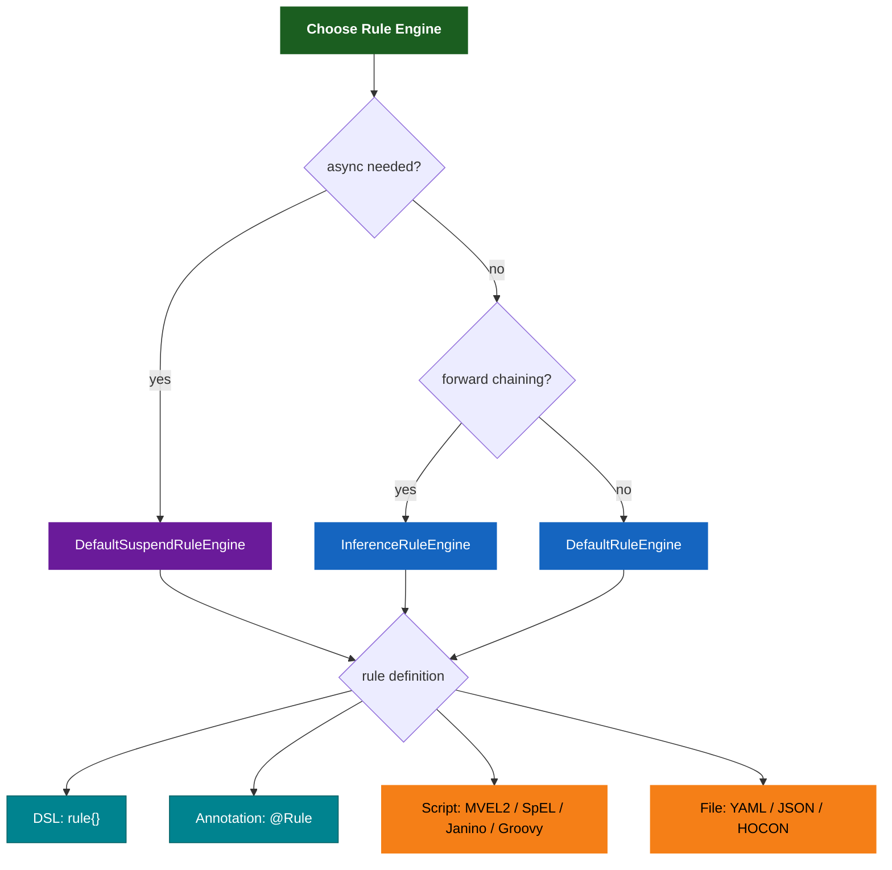
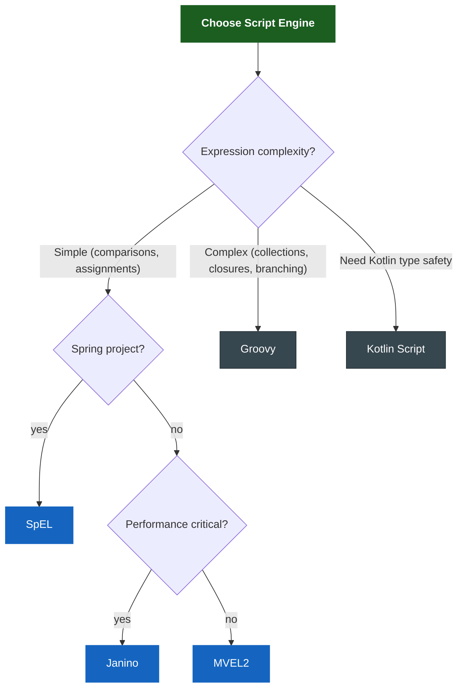

# bluetape4k-rule-engine

English | [한국어](./README.ko.md)

A lightweight rule engine library for Kotlin. It follows the Easy Rules pattern and adds Kotlin DSLs, coroutine support (
`SuspendRule`), and annotation-based rule definitions.

## Architecture

### Concept Overview

The three core building blocks and how they interact:



A `Rule` has a **condition** (predicate on `Facts`) and an **action** (mutates `Facts`).  
`RuleEngine.fire()` iterates rules in priority order, evaluates each condition, and runs matching actions.

### Core Class Diagram



### Rule Engine Class Diagram



### Composite Rules



### Rule Execution Sequence



### InferenceRuleEngine (Forward Chaining)



### Rule Engine Selection Guide



## Core Features

- **DSL-based rule definitions**: `rule {}`, `suspendRule {}`, and `ruleEngine {}` DSLs
- **Annotation-based rules**: convert POJO classes into rules with `@Rule`, `@Condition`, `@Action`, and `@Fact`
- **Coroutine support**: asynchronous rule execution with `SuspendRule` and `SuspendRuleEngine`
- **Cancellation-aware suspend engine**: `DefaultSuspendRuleEngine` rethrows `CancellationException` instead of treating cancellation as a normal rule failure
- **Script engines**: dynamic rule definitions based on MVEL2, SpEL, Kotlin Script, Janino, and Groovy
- **Rule readers**: load rule definitions from YAML, JSON, and HOCON files
- **Composite rules**: combine multiple rules with `ActivationRuleGroup`, `ConditionalRuleGroup`, and `UnitRuleGroup`
- **Forward chaining**: repeatedly execute while conditions are satisfied through `InferenceRuleEngine`

## Usage Examples

### DSL-Based Rule

```kotlin
val discountRule = rule {
    name = "discount"
    description = "Apply discount for orders above 1000 KRW"
    priority = 1
    condition { facts -> facts.get<Int>("amount")!! > 1000 }
    action { facts -> facts["discount"] = true }
}

val engine = ruleEngine { skipOnFirstAppliedRule = true }
val facts = Facts.of("amount" to 1500)
engine.fire(ruleSetOf(discountRule), facts)
```

### Annotation-Based Rule

```kotlin
@Rule(name = "ageCheck", description = "Adult check", priority = 1)
class AgeCheckRule {
    @Condition
    fun isAdult(facts: Facts): Boolean = facts.get<Int>("age")!! >= 18

    @Action
    fun allow(facts: Facts) { facts["allowed"] = true }
}

val rule = AgeCheckRule().asRule()
val facts = Facts.of("age" to 20)
DefaultRuleEngine().fire(ruleSetOf(rule), facts)
```

### Coroutine-Based `SuspendRule`

```kotlin
val asyncRule = suspendRule {
    name = "asyncProcess"
    condition { facts -> facts.get<Int>("value")!! > 0 }
    action { facts ->
        delay(100)
        facts["processed"] = true
    }
}

val engine = DefaultSuspendRuleEngine()
engine.fire(suspendRuleSetOf(asyncRule), facts)
```

### MVEL2 Script Rule

```kotlin
val rule = MvelRule(name = "discount", priority = 1)
    .whenever("amount > 1000")
    .then("discount = true")
```

### SpEL Script Rule

```kotlin
val rule = SpelRule(name = "discount", priority = 1)
    .whenever("#amount > 1000")
    .then("#discount = true")
```

### Janino Script Rule (Bytecode-Compiled Java)

Janino compiles Java expressions to bytecode at runtime for near-native execution speed.
Best suited for high-volume rule evaluation (pricing, validation, discount).

```kotlin
val rule = JaninoRule(name = "discount", priority = 1)
    .whenever("((Integer)facts.get(\"amount\")).intValue() > 1000")
    .then("facts.put(\"discount\", Boolean.TRUE);")
```

**Janino usage notes:**

- **Condition supports pure expressions only**: Built on `ExpressionEvaluator`, so variable declarations (`int x = ...`) are not allowed.
  Write complex conditions inline.
  ```java
  // ✅ Valid Condition
  "((Integer)facts.get(\"age\")).intValue() >= 18 && ((Integer)facts.get(\"age\")).intValue() <= 65"
  
  // ❌ Compile error — variable declaration is a statement, not an expression
  "int age = ((Integer)facts.get(\"age\")).intValue(); age >= 18 && age <= 65"
  ```
- **Action supports statement blocks**: Built on `ScriptEvaluator`, so variable declarations, if-else, for/while loops are all supported.
- **Explicit type casting required**: `facts` is `Map<String, Object>`, so `facts.get()` results must be cast explicitly.
- **For complex condition logic, consider Groovy** — it supports direct variable access, range operators (`in 18..65`), and closures.

### Groovy Script Rule

Groovy provides dynamic typing, closures, and Java-compatible syntax.
Best suited for complex rule logic requiring expressive language features.

```kotlin
val rule = GroovyRule(name = "discount", priority = 1)
    .whenever("amount > 1000")
    .then("discount = true")

// Groovy supports closures and rich expressions
val tierRule = GroovyRule(name = "tier")
    .whenever("amount > 0")
    .then("tier = amount > 5000 ? 'gold' : amount > 2000 ? 'silver' : 'bronze'")
```

**Groovy convenience features:**

- **Null-safe binding**: Uses `NullSafeBinding` — accessing a key not present in Facts returns `null` instead of throwing `MissingPropertyException`.
  Elvis operator and safe navigation work naturally.
  ```groovy
  // No MissingPropertyException even if 'name' key is absent from Facts
  displayName = name ?: 'Guest'         // Elvis — default when null
  upper = name?.toUpperCase()           // safe navigation — null if absent
  ```
- **Automatic GString conversion**: Groovy string interpolation (`"Hello, ${name}!"`) produces `GString`, which is automatically converted to `String` when stored back to Facts. `facts.get<String>()` is safe.
- **Direct variable access**: Facts keys are bound as Groovy variables — use `amount` instead of `facts.get("amount")`.
- **Automatic variable reflection**: Variables assigned in the script (`discount = true`) are automatically stored back to Facts.

### Script Engine Comparison

| Engine | Language | Compilation | Expression Syntax | Best For |
|--------|----------|-------------|-------------------|----------|
| MVEL2 | MVEL | Hybrid (interpreter + bytecode) | `amount > 1000` | Simple dynamic expressions |
| SpEL | Spring EL | Hybrid (optional compile) | `#amount > 1000` | Spring ecosystem integration |
| Janino | Java subset | **Bytecode** (native speed) | `((Integer)facts.get("amount")).intValue() > 1000` | High-volume evaluation, simple conditions |
| Groovy | Groovy | **Bytecode** | `amount > 1000` | Complex logic with closures/collections |
| Kotlin Script | Kotlin | Bytecode (slow cold start) | Full Kotlin syntax | Type-safe Kotlin expressions |

### Script Engine Selection Guide



| Scenario | Recommended | Reason |
|----------|-------------|--------|
| Price comparison, threshold check | Janino | Bytecode compilation, best performance |
| Bean references in Spring context | SpEL | Direct `#bean.method()` calls |
| Discount policy, tier classification | MVEL2 / Groovy | Concise syntax |
| Collection filter/transform, complex branching | Groovy | `collect`, `findAll`, `switch-range`, closures |
| Optional field handling | Groovy | `NullSafeBinding` + Elvis/safe navigation |
| Type-safe expressions | Kotlin Script | Full Kotlin syntax (slow cold start) |

### Load Rules from YAML

```yaml
# rules.yml
rules:
  - name: "discount"
    condition: "amount > 1000"
    actions:
      - "discount = true"
```

```kotlin
val reader = YamlRuleReader()
val definitions = reader.readAll(source).toList()
val mvelRules = definitions.map { it.toMvelRule() }
```

## Configuration Options

| Option                        | Description                         | Default         |
|-------------------------------|-------------------------------------|-----------------|
| `skipOnFirstAppliedRule`      | Stop after first rule fires         | `false`         |
| `skipOnFirstFailedRule`       | Stop after first rule throws        | `false`         |
| `skipOnFirstNonTriggeredRule` | Stop after first condition is false | `false`         |
| `priorityThreshold`           | Ignore rules above this priority    | `Int.MAX_VALUE` |

## Dependency

```kotlin
implementation(project(":bluetape4k-rule-engine"))

// optional (compileOnly)
implementation("org.mvel:mvel2:2.5.2.Final")              // MVEL2 engine
implementation("org.codehaus.janino:janino:3.1.12")        // Janino engine
implementation("org.apache.groovy:groovy:4.0.27")          // Groovy engine
implementation("org.springframework:spring-expression")     // SpEL engine
implementation("org.jetbrains.kotlin:kotlin-scripting-jvm-host") // Kotlin Script engine
implementation("com.fasterxml.jackson.dataformat:jackson-dataformat-yaml") // YAML reader
implementation("com.typesafe:config:1.4.3")                // HOCON reader
```
