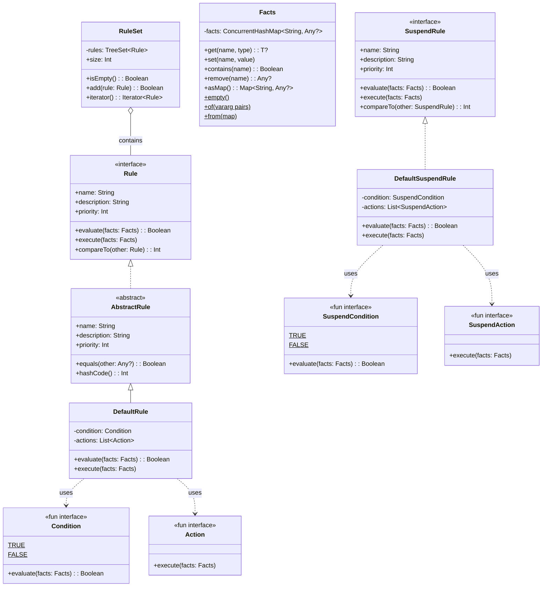
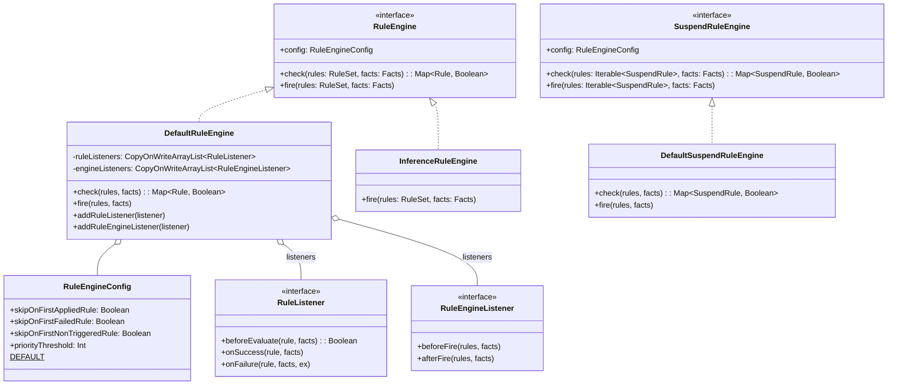
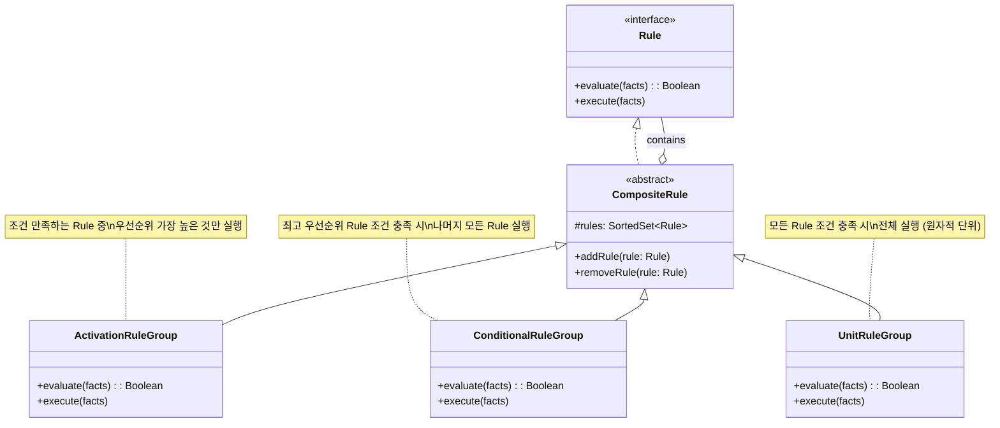
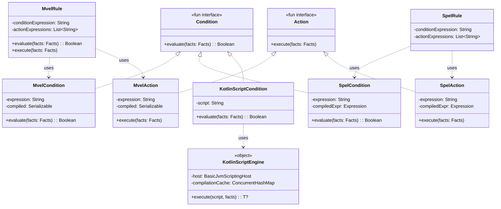
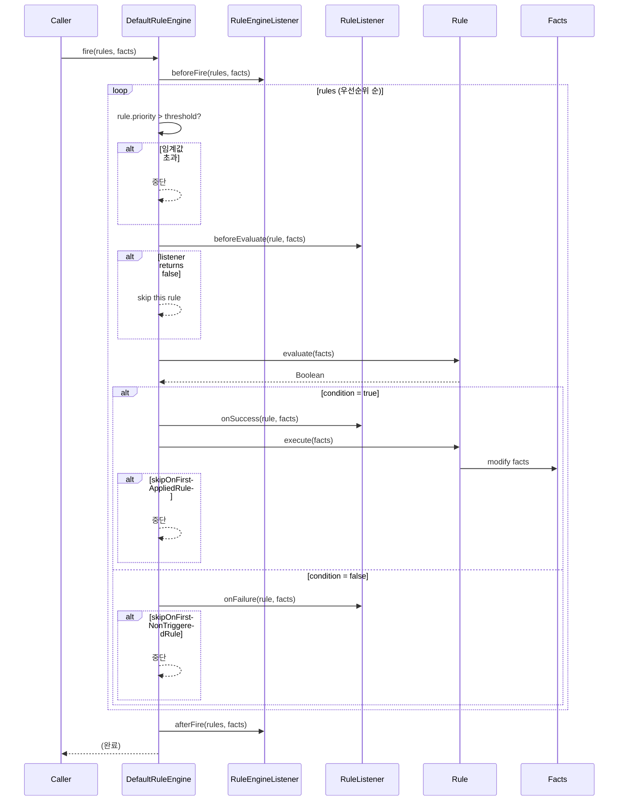
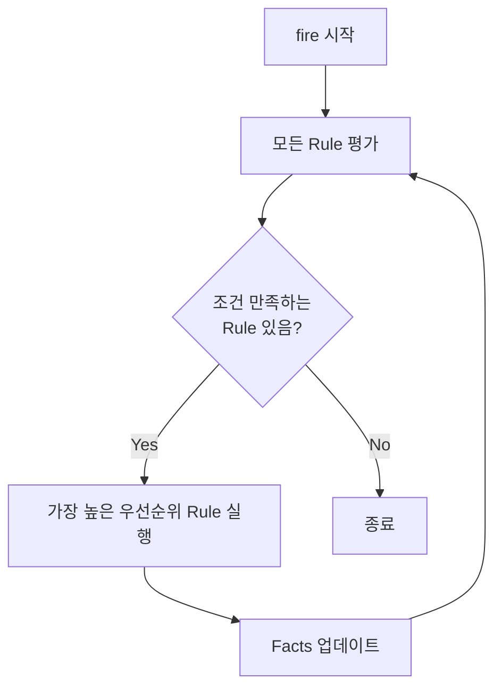
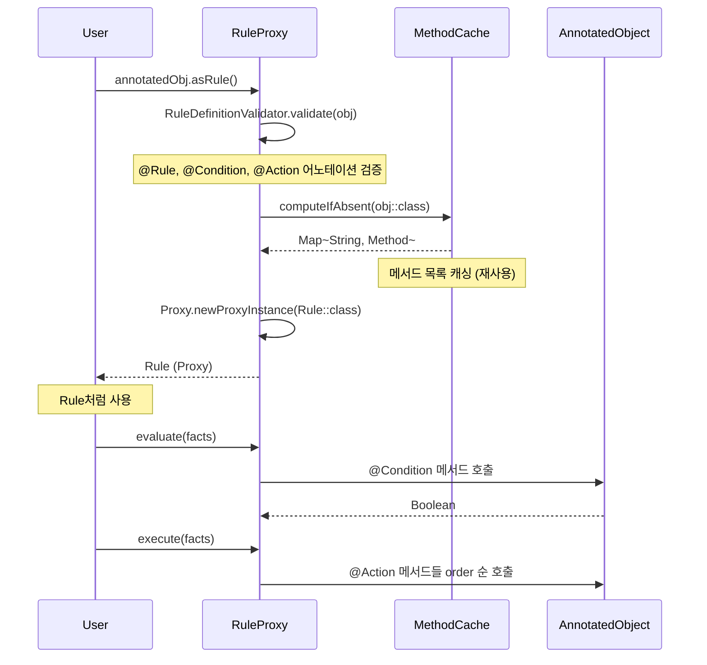

# bluetape4k-rule-engine

Kotlin 기반의 경량 Rule Engine 라이브러리입니다. Easy Rules 패턴을 기반으로 하되, Kotlin DSL, 코루틴(SuspendRule), 어노테이션 기반 Rule 정의를 지원합니다.

## 핵심 기능

- **DSL 기반 Rule 정의**: `rule {}`, `suspendRule {}`, `ruleEngine {}` DSL
- **어노테이션 기반 Rule**: `@Rule`, `@Condition`, `@Action`, `@Fact` 어노테이션으로 POJO 클래스를 Rule로 변환
- **코루틴 지원**: `SuspendRule`, `SuspendRuleEngine`으로 비동기 Rule 실행
- **스크립트 엔진**: MVEL2, SpEL, Kotlin Script 기반 동적 Rule 정의
- **Rule Reader**: YAML, JSON, HOCON 포맷으로 외부 파일에서 Rule 정의 로딩
- **Composite Rule**: `ActivationRuleGroup`, `ConditionalRuleGroup`, `UnitRuleGroup`으로 복합 Rule 조합
- **Forward Chaining**: `InferenceRuleEngine`으로 조건 만족 시 반복 실행

## 의존성

```kotlin
implementation(project(":bluetape4k-rule-engine"))

// 선택적 (compileOnly)
implementation("org.mvel:mvel2:2.5.2.Final")              // MVEL2 엔진
implementation("org.springframework:spring-expression")     // SpEL 엔진
implementation("org.jetbrains.kotlin:kotlin-scripting-jvm-host") // Kotlin Script 엔진
implementation("com.fasterxml.jackson.dataformat:jackson-dataformat-yaml") // YAML Reader
implementation("com.typesafe:config:1.4.3")                // HOCON Reader
```

## 사용 예시

### DSL 기반 Rule

```kotlin
val discountRule = rule {
    name = "discount"
    description = "1000원 이상 구매 시 할인 적용"
    priority = 1
    condition { facts -> facts.get<Int>("amount")!! > 1000 }
    action { facts -> facts["discount"] = true }
}

val engine = ruleEngine { skipOnFirstAppliedRule = true }
val facts = Facts.of("amount" to 1500)
engine.fire(ruleSetOf(discountRule), facts)

// facts.get<Boolean>("discount") == true
```

### 어노테이션 기반 Rule

```kotlin
@Rule(name = "ageCheck", description = "성인 확인", priority = 1)
class AgeCheckRule {
    @Condition
    fun isAdult(facts: Facts): Boolean = facts.get<Int>("age")!! >= 18

    @Action
    fun allow(facts: Facts) { facts["allowed"] = true }
}

val rule = AgeCheckRule().asRule()
val facts = Facts.of("age" to 20)
DefaultRuleEngine().fire(ruleSetOf(rule), facts)
```

### 코루틴 기반 SuspendRule

```kotlin
val asyncRule = suspendRule {
    name = "asyncProcess"
    condition { facts -> facts.get<Int>("value")!! > 0 }
    action { facts ->
        delay(100) // 비동기 작업
        facts["processed"] = true
    }
}

val engine = DefaultSuspendRuleEngine()
engine.fire(suspendRuleSetOf(asyncRule), facts)
```

### MVEL2 스크립트 Rule

```kotlin
val rule = MvelRule(name = "discount", priority = 1)
    .whenever("amount > 1000")
    .then("discount = true")
```

### SpEL 스크립트 Rule

```kotlin
val rule = SpelRule(name = "discount", priority = 1)
    .whenever("#amount > 1000")
    .then("#discount = true")
```

### YAML에서 Rule 로딩

```yaml
# rules.yml
rules:
  - name: "discount"
    condition: "amount > 1000"
    actions:
      - "discount = true"
```

```kotlin
val reader = YamlRuleReader()
val definitions = reader.readAll(source).toList()
val mvelRules = definitions.map { it.toMvelRule() }
```

## 아키텍처

### 전체 패키지 구조

```mermaid
graph TD
    M[bluetape4k-rule-engine] --> API[api/]
    M --> ANN[annotation/]
    M --> CORE[core/]
    M --> SUP[support/]
    M --> ENG[engines/]
    M --> READ[readers/]
    M --> EX[exception/]

    API --> R[Rule.kt]
    API --> SR[SuspendRule.kt]
    API --> F[Facts.kt]
    API --> RS[RuleSet.kt]
    API --> SRS[SuspendRuleSet.kt]
    API --> REC[RuleEngineConfig.kt]
    API --> RE[RuleEngine.kt]
    API --> SRE[SuspendRuleEngine.kt]

    ANN --> AR["@Rule"]
    ANN --> AC["@Condition"]
    ANN --> AA["@Action"]
    ANN --> AF["@Fact"]
    ANN --> AP["@Priority"]

    CORE --> DR[DefaultRule.kt]
    CORE --> DSR[DefaultSuspendRule.kt]
    CORE --> DRE[DefaultRuleEngine.kt]
    CORE --> DSRE[DefaultSuspendRuleEngine.kt]
    CORE --> IRE[InferenceRuleEngine.kt]
    CORE --> RP[RuleProxy.kt]
    CORE --> DSL[RuleDsl.kt]

    SUP --> ACT[ActivationRuleGroup.kt]
    SUP --> COND[ConditionalRuleGroup.kt]
    SUP --> UNIT[UnitRuleGroup.kt]

    ENG --> MV[mvel2/]
    ENG --> SPE[spel/]
    ENG --> KS[kotlinscript/]

    READ --> YR[YamlRuleReader.kt]
    READ --> JR[JsonRuleReader.kt]
    READ --> HR[HoconRuleReader.kt]
```



---

### 핵심 클래스 다이어그램



---

### Rule Engine 클래스 다이어그램



---

### Composite Rule 다이어그램



---

### Expression Engine 클래스 다이어그램



---

## Rule 실행 흐름

### DefaultRuleEngine.fire() 시퀀스



### InferenceRuleEngine (Forward Chaining) 흐름



### 어노테이션 → Rule 변환 (RuleProxy)



---

## 설정 옵션

| 옵션 | 설명 | 기본값 |
|------|------|--------|
| `skipOnFirstAppliedRule` | 첫 번째 성공 Rule 이후 중단 | `false` |
| `skipOnFirstFailedRule` | 첫 번째 실패 Rule 이후 중단 | `false` |
| `skipOnFirstNonTriggeredRule` | 첫 번째 미트리거 Rule 이후 중단 | `false` |
| `priorityThreshold` | 이 값 초과 우선순위 Rule 무시 | `Int.MAX_VALUE` |

## Rule Engine 선택 가이드

```mermaid
flowchart TD
    A[Rule Engine 선택] --> B{비동기 처리 필요?}
    B -- Yes --> C[DefaultSuspendRuleEngine]
    B -- No --> D{Forward Chaining?}
    D -- Yes --> E[InferenceRuleEngine]
    D -- No --> F[DefaultRuleEngine]

    C --> G{Rule 정의 방식}
    F --> G
    E --> G

    G --> H[DSL: rule&#123;&#125;]
    G --> I["어노테이션: @Rule"]
    G --> J[스크립트: MVEL2 / SpEL]
    G --> K[외부 파일: YAML / JSON / HOCON]
```


