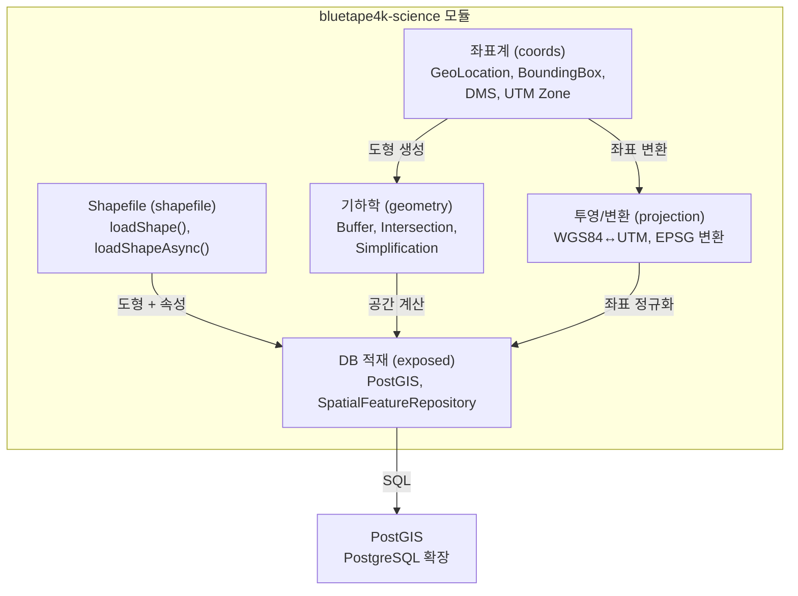

# Module bluetape4k-science

GIS(지리정보 시스템) 좌표 변환, Shapefile 처리, PostGIS 데이터베이스 적재 파이프라인을 제공하는 통합 모듈입니다.

## 제공 기능

### 좌표계 및 좌표 변환 (`coords` 패키지)

- **GeoLocation**: WGS84 위경도 좌표 (위도: -90~90, 경도: -180~180)
  - Haversine 공식 거리 계산
  - 사전 정의된 주요 지점 (서울, 뉴욕 등)
  
- **BoundingBox**: 사각형 경계 영역
  - 좌표 포함 여부 판정
  - 경계 간 교집합/합집합 계산
  - 중심점, 너비, 높이 계산

- **DMS (Degree Minute Second)**: 도분초 표기법
  - `37°33'59.4"N` 형식의 좌표 파싱 및 변환
  - GeoLocation과의 상호 변환

- **UTM Zone**: UTM(Universal Transverse Mercator) 좌표계
  - 위경도 → UTM Zone 자동 판정 (`utmZoneOf`)
  - UTM Easting/Northing 계산

- **CoordConverters**: 다양한 좌표 변환 유틸리티
  - 소수점 표기 ↔ DMS 변환
  - Decimal Degrees (DD) 체계 지원

### 좌표계 변환 및 투영 (`projection` 패키지)

- **Projections**: Proj4J 기반 좌표 변환
  - **WGS84 ↔ UTM 상호 변환**: `wgs84ToUtm()`, `utmToWgs84()`
  - **EPSG 코드 지원**: 임의의 EPSG 좌표계 간 변환
  - **CrsRegistry**: CRS(Coordinate Reference System) 캐싱 및 레지스트리
    - Proj4 문자열과 EPSG 코드 동시 지원
    - 성능 최적화를 위한 CRS 인스턴스 캐싱

### Shapefile 읽기 (`shapefile` 패키지)

- **loadShape()**: 동기 방식 Shapefile 읽기
  - `.shp`, `.shx`, `.dbf` 파일 자동 처리
  - 도형(Geometry) + 속성(Attributes) 통합 반환
  
- **loadShapeAsync()**: 코루틴 기반 비동기 읽기
  - `Dispatchers.IO` 기반 논블로킹 I/O
  - 대용량 Shapefile 처리에 최적화

- **Shape 모델**: GeoTools 타입 추상화
  - `Feature`: 도형 + 속성 쌍
  - `FeatureCollection`: 다수의 Feature 컬렉션
  - 공개 API에 GeoTools 타입 노출 안 함 (encapsulation)

- **지원 포맷**:
  - Point, LineString, Polygon, MultiPoint, MultiLineString, MultiPolygon
  - 속성 정보 (DBF) 자동 파싱 (UTF-8 및 커스텀 charset 지원)

### 공간 기하학 (`geometry` 패키지)

- **GeometryOperations**: JTS(Java Topology Suite) 기반 공간 계산
  - 교집합, 합집합, 차집합
  - 버퍼(Buffer) 영역 생성
  - 거리 및 거리 버퍼
  - 단순화(Simplification) — Douglas-Peucker 알고리즘
  - Envelope(최소 경계 사각형) 계산

### DB 적재 (`exposed` 패키지)

**PostGIS + Exposed JDBC 기반 공간 데이터 DB 저장소**

- **PoiTable**: 관심 지점(Point of Interest) 테이블
  - `geometry` 컬럼: PostGIS `geometry` 타입
  - `location` (WGS84 좌표): GeoLocation
  - 공간 인덱스 자동 생성

- **SpatialFeatureRepository**: Shapefile → DB 적재 파이프라인
  - 배치 적재 (Batch Insert)
  - 공간 검색 (Spatial Query)
  - BoundingBox 기반 범위 검색

- **SpatialTables**: PostGIS 전용 테이블 기본 클래스
  - GIS 컬럼 타입 선언
  - 공간 인덱스 설정

- **NetCdfRepository / NetCdfTables**: NetCDF 포맷 지원 (Phase 4 미구현)
  - TODO: Unidata NetCDF-Java 라이브러리 통합 예정

## 아키텍처 다이어그램



## 설치

각 기능은 `compileOnly`로 선언되어 있으므로, 필요에 따라 런타임 의존성을 추가해야 합니다.

```kotlin
dependencies {
    implementation("io.github.bluetape4k:bluetape4k-science:${bluetape4kVersion}")

    // GIS 기본 좌표 변환 (Proj4J)
    implementation(Libs.proj4j)
    implementation(Libs.proj4j_epsg)
    implementation(Libs.esri_geometry_api)

    // Shapefile 읽기 (GeoTools LGPL)
    // — GeoTools Maven 저장소 추가 필요 (아래 참고)
    implementation(Libs.geotools_shapefile)
    implementation(Libs.geotools_referencing)
    implementation(Libs.geotools_epsg_hsql)

    // PostGIS DB 적재
    implementation("io.github.bluetape4k:bluetape4k-exposed-postgresql:${bluetape4kVersion}")
    implementation(Libs.postgis_jdbc)

    // Coroutines 지원 (선택적)
    implementation("io.github.bluetape4k:bluetape4k-coroutines:${bluetape4kVersion}")
    implementation(Libs.kotlinx_coroutines_core)
}
```

### GeoTools Maven 저장소 설정

GeoTools는 LGPL 라이선스이며, OSGeo(Open Source Geospatial Foundation) Maven 저장소에서 배포됩니다.

`build.gradle.kts`에 다음을 추가하세요:

```kotlin
repositories {
    // 기본 저장소...
    
    // GeoTools 저장소
    maven(url = "https://repo.osgeo.org/repository/release/") {
        name = "OSGeo Release"
    }
}
```

## GeoTools LGPL 라이선스 주의사항

**bluetape4k-science는 GeoTools를 `compileOnly`로만 선언합니다.**

- **컴파일 시에만 필요**: Shapefile 처리 시 타입 체크
- **런타임 의존 없음**: 실제 배포 시 GeoTools를 포함하지 않음
- **재배포 제약**: GeoTools를 포함하여 배포하려면 LGPL 라이선스 준수 필요
  - LGPL 소스 공개
  - 또는 동적 링킹(Dynamic Linking) 가능

**권장 사항**:
1. 내부 시스템에서만 사용: 제약 없음
2. 외부 배포: `compileOnly` 유지 + 클라이언트 측에서 GeoTools 의존성 관리
3. 전체 포함 배포: LGPL 준수 문서 포함

## 패키지 구조

```
io.bluetape4k.science/
├── coords/               — 좌표 표기법 및 좌표계
│   ├── GeoLocation      — WGS84 위경도
│   ├── BoundingBox      — 사각형 경계
│   ├── DMS              — 도분초 표기
│   ├── UtmZone          — UTM 좌표계
│   └── Vector           — 벡터 연산
├── projection/           — 좌표계 변환 (Proj4J)
│   ├── Projections      — WGS84↔UTM, EPSG 변환
│   └── CrsRegistry      — CRS 캐싱
├── shapefile/            — Shapefile 읽기 (GeoTools)
│   ├── ShapefileReader  — 동기 읽기
│   ├── loadShape()      — 함수형 API
│   ├── loadShapeAsync() — 코루틴 API
│   └── ShapeModels      — Feature, FeatureCollection
├── geometry/             — 공간 기하학 (JTS)
│   ├── GeometryOperations — Buffer, Intersection, Simplify
│   └── (JTS Wrapper)
└── exposed/              — DB 적재 (Exposed + PostGIS)
    ├── PoiTable         — 관심 지점 테이블
    ├── SpatialFeatureRepository — 적재 파이프라인
    ├── SpatialTables    — PostGIS 기본 클래스
    └── NetCdf*          — NetCDF 지원 (Phase 4 미구현)
```

## 사용 예시

### 좌표 변환 (GeoLocation)

```kotlin
import io.bluetape4k.science.coords.GeoLocation

// WGS84 좌표 생성
val seoul = GeoLocation(37.5665, 126.9780)
val tokyo = GeoLocation(35.6762, 139.6503)

// 거리 계산 (Haversine 공식, 미터)
val distance = seoul.distanceTo(tokyo)
println("서울-도쿄 거리: ${distance / 1000} km")

// 사전 정의된 좌표
val newYork = GeoLocation.NEW_YORK
```

### 좌표 범위 (BoundingBox)

```kotlin
import io.bluetape4k.science.coords.BoundingBox

val bbox = BoundingBox(
    minLat = 37.4, maxLat = 37.6,
    minLon = 126.8, maxLon = 127.0
)

// 포함 여부 판정
if (bbox.contains(GeoLocation(37.5665, 126.9780))) {
    println("서울 시청은 범위 내입니다")
}

// 중심점, 너비, 높이
println("중심: ${bbox.center}")
println("너비(km): ${bbox.widthKm}")
```

### DMS 변환 (도분초)

```kotlin
import io.bluetape4k.science.coords.DMS

// 문자열 파싱
val dms = DMS.parse("37°33'59.4\"N")
println("위도: ${dms.toDecimal()}")  // 37.5665

// GeoLocation 변환
val location = dms.toGeoLocation(longitude = 126.9780)
```

### UTM 좌표계

```kotlin
import io.bluetape4k.science.coords.utmZoneOf
import io.bluetape4k.science.projection.wgs84ToUtm

val seoul = GeoLocation(37.5665, 126.9780)

// 해당 UTM Zone 자동 판정
val utmZone = utmZoneOf(seoul.latitude, seoul.longitude)
println("UTM Zone: ${utmZone.longitudeZone}${utmZone.hemisphere}")  // 52S

// WGS84 → UTM 변환
val (easting, northing) = wgs84ToUtm(seoul)
println("UTM Easting: $easting, Northing: $northing")
```

### 좌표계 변환 (EPSG)

```kotlin
import io.bluetape4k.science.projection.transformCoordinate

// EPSG:4326 (WGS84) → EPSG:5179 (Korea 2000, Central Belt)
val coord = transformCoordinate(
    x = 126.9780,
    y = 37.5665,
    sourceEpsg = 4326,
    targetEpsg = 5179
)
```

### Shapefile 읽기 (동기)

```kotlin
import io.bluetape4k.science.shapefile.loadShape
import java.io.File

val shapeFile = File("/path/to/provinces.shp")
val shape = loadShape(shapeFile, charset = Charsets.UTF_8)

// Feature 반복
shape.features.forEach { feature ->
    println("도형: ${feature.geometry.geometryType}")
    println("속성: ${feature.attributes}")
}
```

### Shapefile 읽기 (비동기, Coroutines)

```kotlin
import io.bluetape4k.science.shapefile.loadShapeAsync
import kotlinx.coroutines.runBlocking
import java.io.File

suspend fun processShapefile() {
    val shapeFile = File("/path/to/provinces.shp")
    val shape = loadShapeAsync(shapeFile)
    
    shape.features.forEach { feature ->
        println("비동기 처리: ${feature.geometry}")
    }
}

// 사용
runBlocking {
    processShapefile()
}
```

### 공간 기하학 연산

```kotlin
import io.bluetape4k.science.geometry.GeometryOperations
import org.locationtech.jts.geom.Coordinate
import org.locationtech.jts.io.WKTReader

val wktReader = WKTReader()
val poly1 = wktReader.read("POLYGON((0 0, 10 0, 10 10, 0 10, 0 0))")
val poly2 = wktReader.read("POLYGON((5 5, 15 5, 15 15, 5 15, 5 5))")

// 교집합
val intersection = GeometryOperations.intersection(poly1, poly2)
println("교집합: $intersection")

// 버퍼 (반경 100m 확대)
val buffered = GeometryOperations.buffer(poly1, 100.0)

// 단순화 (Douglas-Peucker, tolerance=1.0)
val simplified = GeometryOperations.simplify(poly1, 1.0)
```

### PostGIS DB 적재 (Shapefile → PostgreSQL)

```kotlin
import io.bluetape4k.science.exposed.SpatialFeatureRepository
import io.bluetape4k.science.shapefile.loadShape
import org.jetbrains.exposed.sql.Database
import java.io.File

// Exposed Database 초기화
val database = Database.connect(
    url = "jdbc:postgresql://localhost:5432/gis_db",
    driver = "org.postgresql.Driver",
    user = "user",
    password = "password"
)

// Shapefile 로드
val shapeFile = File("/path/to/provinces.shp")
val shape = loadShape(shapeFile)

// DB에 적재
transaction {
    val repo = SpatialFeatureRepository()
    repo.insertFeatures(shape.features)
}

// 공간 검색 (BoundingBox)
transaction {
    val repo = SpatialFeatureRepository()
    val bbox = BoundingBox(37.4, 37.6, 126.8, 127.0)
    val features = repo.searchWithinBbox(bbox)
    println("검색 결과: ${features.size}")
}
```

## Testcontainers를 이용한 테스트

테스트는 Testcontainers + PostgreSQL + PostGIS를 사용합니다.

```kotlin
import io.bluetape4k.science.exposed.PoiRepositoryTest
import org.junit.jupiter.api.Test
import org.testcontainers.containers.PostgreSQLContainer
import org.testcontainers.junit.jupiter.Container
import org.testcontainers.junit.jupiter.Testcontainers

@Testcontainers
class SpatialQueryTest {
    companion object {
        @Container
        val postgres = PostgreSQLContainer("postgis/postgis:16-3.4")
            .withDatabaseName("test_gis")
            .withUsername("test_user")
            .withPassword("test_pass")
    }

    @Test
    fun testSpatialQuery() {
        // Testcontainers가 제공하는 JDBC URL 사용
        val database = Database.connect(
            url = postgres.jdbcUrl,
            driver = "org.postgresql.Driver",
            user = postgres.username,
            password = postgres.password
        )
        
        // 테스트 실행...
    }
}
```

## NetCDF 지원 상태

NetCDF 포맷 지원은 **Phase 4**에서 구현될 예정입니다.

- 현재 상태: `NetCdfRepository`, `NetCdfTables` 클래스는 존재하지만 미구현
- 필요 라이브러리: `edu.ucar:netcdfAll` (Unidata Maven 저장소)
- TODO: Unidata Maven 저장소 재구성 후 정확한 아티팩트 좌표 확인

## 성능 최적화

1. **CRS 캐싱**: Proj4J의 CRS(Coordinate Reference System) 인스턴스는 `CrsRegistry`에 의해 캐시됨
2. **대용량 Shapefile**: `loadShapeAsync()` 사용 권장 (I/O 논블로킹)
3. **공간 인덱스**: PostGIS 테이블 생성 시 GIST 인덱스 자동 생성
4. **배치 적재**: `SpatialFeatureRepository.insertFeatures()` 배치 처리 최적화

## 관련 모듈

- `bluetape4k-core`: 기본 유틸리티
- `bluetape4k-coroutines`: 코루틴 확장
- `bluetape4k-exposed-jdbc`: Exposed JDBC 저장소
- `bluetape4k-exposed-postgresql`: PostGIS 컬럼 타입
- `bluetape4k-testcontainers`: Testcontainers 통합
- `bluetape4k-junit5`: JUnit 5 테스트 유틸리티

## 라이선스

**GeoTools는 LGPL**: `compileOnly` 선언으로 런타임 의존성 제거. 자세한 내용은 [GeoTools LGPL 라이선스 주의사항](#geotools-lgpl-라이선스-주의사항) 섹션 참고.
