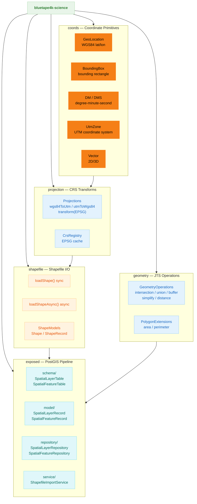
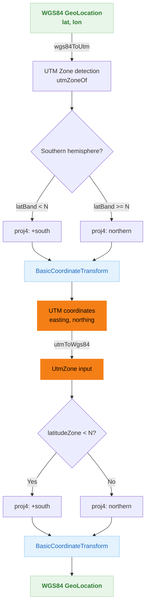
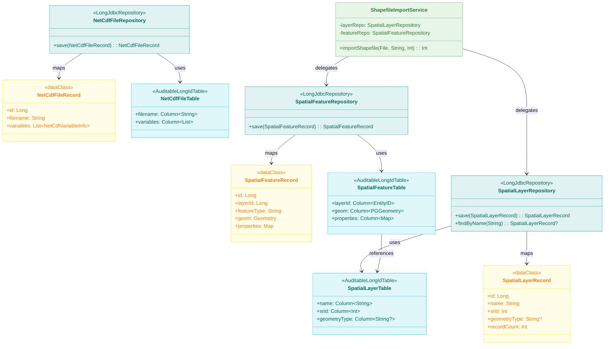
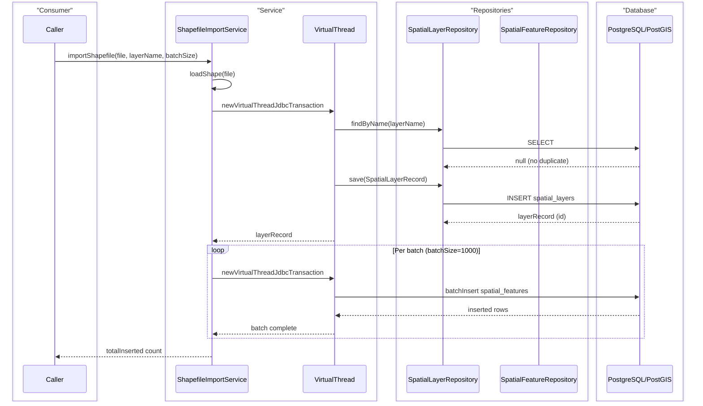

# Module bluetape4k-science

English | [한국어](./README.ko.md)

An integrated module for GIS coordinate conversion, Shapefile processing, JTS geometry operations, and PostGIS data-loading pipelines.

It includes coordinate transforms based on Proj4J, GeoTools-backed Shapefile parsing, JTS spatial geometry operations, and database pipelines built on Exposed + PostGIS.

## Architecture

### Module Overview



---

### Coordinate Transformation Flow



---

### PostGIS Database Pipeline Class Diagram



---

### Shapefile Import Sequence



---

## Key Features

- **Coordinate Primitives**: `GeoLocation` (WGS84), `BoundingBox`, `DM/DMS`, `UtmZone`, `Vector`
- **Coordinate Transforms**: Proj4J-based WGS84 ↔ UTM and arbitrary EPSG code transformations via `CrsRegistry`
- **Shapefile I/O**: Synchronous and async Shapefile reading; type-safe `ShapeModels` without exposing GeoTools types
- **JTS Geometry**: `GeometryOperations` — intersection, union, difference, buffer, simplify, distance
- **PostGIS Pipeline**: `SpatialLayerTable/Repository` + `SpatialFeatureTable/Repository` +
  `ShapefileImportService` backed by Virtual Threads

## Usage Examples

### Coordinate Primitives

**GeoLocation — WGS84 latitude/longitude**

```kotlin
import io.bluetape4k.science.coords.GeoLocation

val seoul = GeoLocation(latitude = 37.5665, longitude = 126.9780)
val tokyo = GeoLocation(latitude = 35.6762, longitude = 139.6503)

// Haversine distance (meters)
val distanceMeters = seoul.distanceTo(tokyo)
val distanceKm = distanceMeters / 1000.0
println("Seoul↔Tokyo: $distanceKm km")

// Predefined locations
val newYork = GeoLocation.NEW_YORK
val london = GeoLocation.LONDON
```

**BoundingBox — rectangular boundary**

```kotlin
import io.bluetape4k.science.coords.BoundingBox

val seoulArea = BoundingBox(
    minLat = 37.4, maxLat = 37.6,
    minLon = 126.8, maxLon = 127.0
)

if (seoulArea.contains(seoul)) {
    println("Seoul City Hall is within the area")
}

println("Center: ${seoulArea.center}")
println("Width: ${seoulArea.widthKm} km")
println("Height: ${seoulArea.heightKm} km")
```

**DMS — degree-minute-second notation**

```kotlin
import io.bluetape4k.science.coords.DMS

val dms = DMS.parse("37°33'59.4\"N")
val decimal = dms.toDecimal()  // 37.5665
println("DMS → decimal: $decimal")

val dmsStr = DMS(degree = 37, minute = 33, second = 59.4, direction = 'N').toString()
println("Decimal → DMS: $dmsStr")
```

**UtmZone — UTM coordinate system**

```kotlin
import io.bluetape4k.science.coords.utmZoneOf

val zone = utmZoneOf(37.5665, 126.9780)
println("Seoul: UTM Zone ${zone.longitudeZone}${zone.hemisphere}")  // 52S

val bbox = zone.boundingBox()
println("Zone boundary: $bbox")
```

### Coordinate Transformation

**WGS84 ↔ UTM**

```kotlin
import io.bluetape4k.science.projection.wgs84ToUtm
import io.bluetape4k.science.projection.utmToWgs84
import io.bluetape4k.science.coords.UtmZone

val seoul = GeoLocation(37.5665, 126.9780)
val (easting, northing) = wgs84ToUtm(seoul)
println("WGS84(37.5665, 126.9780) → UTM($easting, $northing)")

val zone = UtmZone(longitudeZone = 52, hemisphere = 'S')
val restored = utmToWgs84(easting, northing, zone)
println("UTM → WGS84: $restored")
```

**EPSG code transformation**

```kotlin
import io.bluetape4k.science.projection.transform

// EPSG:4326 (WGS84) → EPSG:5179 (Korea 2000 Central Belt)
val (transformedX, transformedY) = transform(
    x = 126.9780,
    y = 37.5665,
    sourceEpsg = 4326,
    targetEpsg = 5179
)
println("EPSG:4326 → EPSG:5179: ($transformedX, $transformedY)")
```

### Shapefile Reading

**Synchronous**

```kotlin
import io.bluetape4k.science.shapefile.loadShape
import java.io.File

val shapeFile = File("/data/provinces.shp")
val shape = loadShape(shapeFile, charset = Charsets.UTF_8)

println("Type: ${shape.shapeType}, Records: ${shape.recordCount}")

shape.records.forEach { record ->
    println("Geometry: ${record.geometry.geometryType}")
    println("Attributes: ${record.attributes}")
}
```

**Asynchronous (Coroutines)**

```kotlin
import io.bluetape4k.science.shapefile.loadShapeAsync
import java.io.File

suspend fun processLargeShapefile() {
    val shapeFile = File("/data/large_dataset.shp")

    // Processes on Dispatchers.IO
    val shape = loadShapeAsync(shapeFile)

    shape.records.forEach { record ->
        // process geometry
    }
}
```

### JTS Geometry Operations

```kotlin
import io.bluetape4k.science.geometry.GeometryOperations
import org.locationtech.jts.io.WKTReader

val wkt = WKTReader()

val poly1 = wkt.read("POLYGON((0 0, 10 0, 10 10, 0 10, 0 0))")
val poly2 = wkt.read("POLYGON((5 5, 15 5, 15 15, 5 15, 5 5))")

// Intersection
val intersection = GeometryOperations.intersection(poly1, poly2)

// Union
val union = GeometryOperations.union(poly1, poly2)

// Buffer (100m radius)
val buffered = GeometryOperations.buffer(poly1, 100.0)

// Simplify (Douglas-Peucker, tolerance=1.0)
val simplified = GeometryOperations.simplify(poly1, 1.0)

// Distance
val distance = GeometryOperations.distance(poly1, poly2)
println("Distance: $distance m")
```

### PostGIS Database Pipeline

```kotlin
import io.bluetape4k.science.exposed.service.ShapefileImportService
import io.bluetape4k.science.exposed.repository.SpatialFeatureRepository
import io.bluetape4k.science.exposed.repository.SpatialLayerRepository
import org.jetbrains.exposed.sql.Database
import java.io.File

val database = Database.connect(
    url = "jdbc:postgresql://localhost:5432/gis_db",
    driver = "org.postgresql.Driver",
    user = "postgres",
    password = "password"
)

val layerRepo = SpatialLayerRepository()
val featureRepo = SpatialFeatureRepository()
val service = ShapefileImportService(layerRepo, featureRepo)

val shapeFile = File("/data/harbors.shp")
val importedCount = service.importShapefile(
    file = shapeFile,
    layerName = "harbors-2024"
)
println("Imported: $importedCount records")
```

## Tests (Testcontainers + PostGIS)

Integration tests can be run with Testcontainers-backed PostgreSQL / PostGIS environments. The Korean README includes the full setup and sample test scenarios.

## Performance Optimization

- Cache CRS instances through `CrsRegistry`
- Use `loadShapeAsync()` for large files
- Process imports in batches through the PostGIS pipeline
- Use PostGIS GIST/BRIN spatial indexes for range queries

## Phase 4: NetCDF Support (Planned)

Planned support includes NetCDF metadata cataloging and grid-value persistence through the same
`exposed` package pipeline.

## Related Modules

- `data/exposed-postgresql`
- `data/exposed-jdbc`
- `testing/testcontainers`

## Installation and Dependencies

`bluetape4k-science` declares optional, feature-specific dependencies through
`compileOnly`. Add only the libraries you actually need at runtime.

### Basic Installation

```kotlin
dependencies {
    implementation("io.github.bluetape4k:bluetape4k-science:${bluetape4kVersion}")
}
```

### Feature-specific Dependencies

**Coordinate transformation (Proj4J)**

```kotlin
implementation(Libs.proj4j)
implementation(Libs.proj4j_epsg)
```

**Shapefile reading (GeoTools — LGPL)**

```kotlin
// repositories block
maven(url = "https://repo.osgeo.org/repository/release/") { name = "OSGeo Release" }

// dependencies
implementation(Libs.geotools_shapefile)
implementation(Libs.geotools_referencing)
implementation(Libs.geotools_epsg_hsql)
```

**Spatial geometry (JTS)**

```kotlin
implementation(Libs.jts_core)
```

**PostGIS database**

```kotlin
implementation("io.github.bluetape4k:bluetape4k-exposed-postgresql:${bluetape4kVersion}")
implementation(Libs.postgis_jdbc)
```
