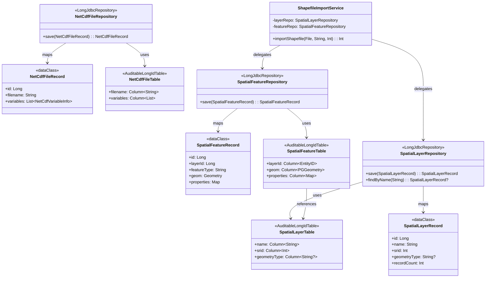
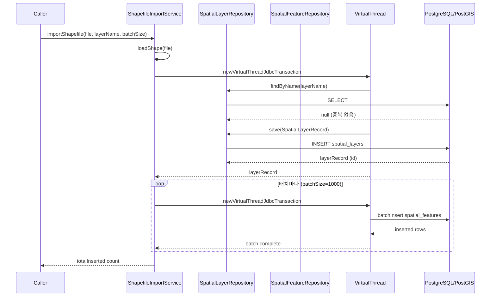
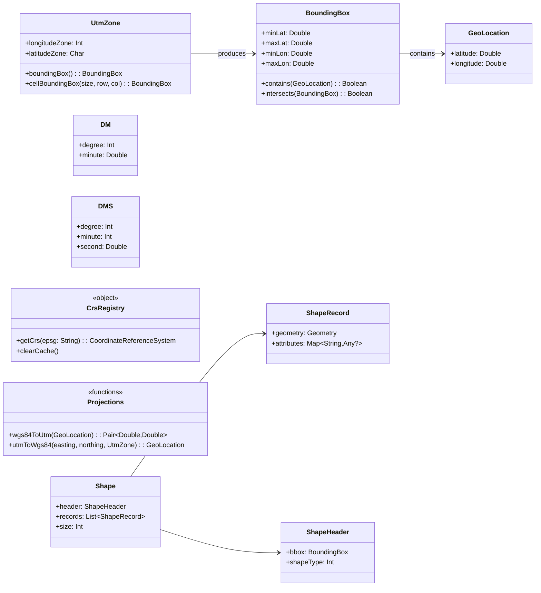
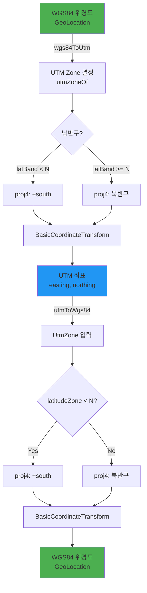

# Module bluetape4k-science

GIS(지리정보 시스템) 좌표 변환, Shapefile 처리, JTS 도형 연산, PostGIS 데이터베이스 적재 파이프라인을 제공하는 통합 모듈입니다.

Proj4J 기반 좌표계 변환, GeoTools Shapefile 파싱, JTS 공간 기하학 연산, 그리고 Exposed + PostGIS를 활용한 데이터베이스 파이프라인을 포함합니다.

## 핵심 기능

### 좌표 기본 타입 (coords 패키지)

**GeoLocation** — WGS84 위경도 좌표
- 위도: -90~90, 경도: -180~180
- Haversine 공식 거리 계산
- 사전 정의된 지점: `SEOUL`, `NEW_YORK`, `TOKYO` 등

**BoundingBox** — 사각형 경계 영역
- 좌표 포함 여부 판정
- 교집합/합집합 계산
- 중심점, 너비, 높이 계산

**DM / DMS** — 도분 / 도분초 표기법
- `37°33'59.4"N` 형식 파싱
- GeoLocation 상호 변환

**UtmZone** — UTM 좌표계
- 위경도 → 해당 Zone 자동 판정 (`utmZoneOf()`)
- Easting/Northing 변환

**Vector** — 2D/3D 벡터 연산

**CoordConverters** — 좌표 변환 유틸리티
- 십진도 ↔ DM/DMS 변환
- 좌표 정규화

### 좌표 변환 및 투영 (projection 패키지)

**Projections** — Proj4J 기반 변환
- `wgs84ToUtm()` — WGS84 → UTM
- `utmToWgs84()` — UTM → WGS84
- `transform()` — EPSG 코드 간 임의의 좌표 변환

**CrsRegistry** — CRS 레지스트리
- EPSG 코드 및 Proj4 문자열 지원
- 인스턴스 캐싱으로 성능 최적화

### Shapefile 읽기 (shapefile 패키지)

**ShapefileReader / loadShape()** — 동기 Shapefile 읽기
- `.shp`, `.shx`, `.dbf` 파일 자동 처리
- 도형(Geometry) + 속성(Attributes) 통합 반환
- UTF-8 및 커스텀 charset 지원

**loadShapeAsync()** — 비동기 읽기
- Coroutines 기반, `Dispatchers.IO` 사용
- 대용량 파일 처리에 최적화

**ShapeModels** — 타입 안전 모델
- `Shape`: 파일 메타데이터
- `ShapeRecord`: 도형 + 속성
- `ShapeHeader`: 파일 헤더 정보
- 공개 API에 GeoTools 타입 노출 안 함

**지원 기하학 타입**
- Point, LineString, Polygon, MultiPoint, MultiLineString, MultiPolygon

### 공간 기하학 연산 (geometry 패키지)

**GeometryOperations** — JTS 기반 연산
- 교집합, 합집합, 차집합
- 버퍼(Buffer) 영역 생성 (지정 거리)
- 거리 계산
- 단순화 (Douglas-Peucker 알고리즘)
- Envelope (최소 경계 사각형)
- 포함 여부 판정

**PolygonExtensions** — 다각형 확장
- 면적 계산
- 둘레 계산

### PostGIS 데이터베이스 파이프라인 (exposed 패키지)



**Schema** — Exposed 테이블 정의
- `SpatialLayerTable` / `SpatialFeatureTable` — 공간 데이터 저장
- `PoiTable` — 관심 지점(Point of Interest)
- `NetCdfFileTable` / `NetCdfGridValueTable` — NetCDF 메타데이터 (Phase 4)

**Models** — Serializable 데이터 클래스
- `SpatialLayerRecord` / `SpatialFeatureRecord` — 공간 데이터
- `NetCdfVariableInfo`, `NetCdfDimensionInfo`, `NetCdfFileRecord` — NetCDF (Phase 4)

**Repository** — JDBC 저장소
- `SpatialLayerRepository` — 레이어 관리
- `SpatialFeatureRepository` — 피처 CRUD 및 공간 검색
- `NetCdfRepository` — NetCDF 카탈로그 (Phase 4)

**Service** — 비즈니스 로직
- `ShapefileImportService.importShapefile()` — Virtual Thread 기반 배치 임포트
- `NetCdfCatalogService` — NetCDF 파일 등록 (Phase 4)



## 아키텍처

```
coords (좌표 기본 타입)
  ├─ GeoLocation (위경도)
  ├─ BoundingBox (경계 사각형)
  ├─ DM / DMS (도분/도분초)
  ├─ UtmZone (UTM 좌표계)
  └─ Vector (벡터)
    │
    └─→ projection (좌표 변환)
          ├─ Projections (Proj4J 기반)
          │  ├─ wgs84ToUtm()
          │  ├─ utmToWgs84()
          │  └─ transform() [EPSG]
          └─ CrsRegistry (캐싱)
              │
              ├─→ shapefile (Shapefile 읽기)
              │     ├─ loadShape() [동기]
              │     ├─ loadShapeAsync() [비동기]
              │     └─ ShapeModels
              │          │
              │          └─→ exposed (PostGIS 파이프라인)
              │                ├─ schema/ (테이블)
              │                ├─ model/ (직렬화 데이터)
              │                ├─ repository/ (JDBC)
              │                └─ service/ (비즈니스 로직)
              │
              └─→ geometry (JTS 도형 연산)
                    ├─ GeometryOperations
                    │  ├─ intersection()
                    │  ├─ buffer()
                    │  ├─ simplify()
                    │  └─ distance()
                    └─ PolygonExtensions
                         │
                         └─→ exposed (DB 적재)
```

## 설치 및 의존성

bluetape4k-science는 선택적 기능별로 `compileOnly` 의존성을 선언합니다. **필요한 라이브러리만 런타임 의존성으로 추가하세요.**

### 기본 설치

```kotlin
dependencies {
    implementation("io.github.bluetape4k:bluetape4k-science:${bluetape4kVersion}")
}
```

### 기능별 의존성 추가

**좌표 변환 (Proj4J 기반)**

```kotlin
implementation(Libs.proj4j)            // Proj4J 핵심
implementation(Libs.proj4j_epsg)       // EPSG 데이터베이스
```

**Shapefile 읽기 (GeoTools)**

GeoTools는 LGPL 라이선스입니다. OSGeo Maven 저장소를 추가해야 합니다.

```kotlin
// build.gradle.kts — repositories 섹션
repositories {
    maven(url = "https://repo.osgeo.org/repository/release/") {
        name = "OSGeo Release"
    }
}

// 의존성
implementation(Libs.geotools_shapefile)  // Shapefile I/O
implementation(Libs.geotools_referencing) // 좌표계 참조
implementation(Libs.geotools_epsg_hsql)   // EPSG 메타데이터
```

**공간 기하학 연산 (JTS)**

```kotlin
implementation(Libs.jts_core)  // Java Topology Suite
```

**PostGIS 데이터베이스**

```kotlin
implementation("io.github.bluetape4k:bluetape4k-exposed-postgresql:${bluetape4kVersion}")
implementation(Libs.postgis_jdbc)  // PostGIS JDBC
```

**비동기 처리 (Coroutines)**

```kotlin
implementation("io.github.bluetape4k:bluetape4k-coroutines:${bluetape4kVersion}")
implementation(Libs.kotlinx_coroutines_core)
```

### 전체 의존성 예시

```kotlin
dependencies {
    implementation("io.github.bluetape4k:bluetape4k-science:${bluetape4kVersion}")

    // GIS 좌표 변환
    implementation(Libs.proj4j)
    implementation(Libs.proj4j_epsg)
    
    // Shapefile
    implementation(Libs.geotools_shapefile)
    implementation(Libs.geotools_referencing)
    implementation(Libs.geotools_epsg_hsql)
    
    // 공간 기하학
    implementation(Libs.jts_core)
    
    // PostGIS
    implementation("io.github.bluetape4k:bluetape4k-exposed-postgresql:${bluetape4kVersion}")
    implementation(Libs.postgis_jdbc)
    
    // Coroutines (선택)
    implementation("io.github.bluetape4k:bluetape4k-coroutines:${bluetape4kVersion}")
    implementation(Libs.kotlinx_coroutines_core)
}
```

### GeoTools LGPL 라이선스

**bluetape4k-science는 GeoTools를 `compileOnly`로 선언합니다.**

- **컴파일만**: Shapefile 타입 체크 시 필요
- **런타임 불필요**: 배포 시 GeoTools 포함되지 않음
- **재배포 시**: GeoTools를 포함하려면 LGPL 준수 필요
  - 소스 공개 또는
  - 동적 링킹(Dynamic Linking) 사용

**권장**:
1. 내부 시스템: 제약 없음
2. 외부 배포: 클라이언트에서 GeoTools 관리
3. 포함 배포: LGPL 준수 문서 포함

## 패키지 구조



```
io.bluetape4k.science/
├── coords/                          — 좌표 기본 타입
│   ├── GeoLocation.kt              — WGS84 위경도 (Haversine 거리)
│   ├── BoundingBox.kt              — 사각형 경계 영역
│   ├── BoundingBoxRelation.kt      — 경계 관계 계산
│   ├── DM.kt / DMS.kt              — 도분 / 도분초 표기
│   ├── Vector.kt                   — 2D/3D 벡터
│   ├── UtmZone.kt                  — UTM Zone 데이터 클래스
│   ├── UtmZoneSupport.kt           — utmZoneOf(), boundingBox()
│   └── CoordConverters.kt          — 좌표 변환 유틸리티
│
├── projection/                      — 좌표계 변환 (Proj4J)
│   ├── CrsRegistry.kt              — EPSG/Proj4 CRS 레지스트리
│   └── Projections.kt              — wgs84ToUtm(), transform()
│
├── shapefile/                       — Shapefile 파싱 (GeoTools)
│   ├── ShapeModels.kt              — Shape, ShapeRecord, ShapeHeader
│   ├── ShapefileReader.kt          — 동기 읽기
│   ├── ShapefileExtensions.kt      — 확장 함수 (loadShape 등)
│
├── geometry/                        — 공간 기하학 (JTS)
│   ├── GeometryOperations.kt       — intersection, buffer, simplify
│   └── PolygonExtensions.kt        — 다각형 확장
│
└── exposed/                         — PostGIS DB 파이프라인
    ├── model/                       — Serializable 데이터 클래스
    │   ├── SpatialModels.kt        — SpatialLayerRecord, SpatialFeatureRecord
    │   └── NetCdfModels.kt         — NetCdfVariableInfo 등 (Phase 4)
    │
    ├── schema/                      — Exposed 테이블 정의
    │   ├── SpatialTables.kt        — SpatialLayerTable, SpatialFeatureTable
    │   ├── PoiTable.kt             — Point of Interest 테이블
    │   └── NetCdfTables.kt         — NetCDF 메타데이터 (Phase 4)
    │
    ├── repository/                  — JDBC 저장소
    │   ├── SpatialFeatureRepository.kt — 피처 CRUD/검색
    │   └── NetCdfRepository.kt      — NetCDF 카탈로그 (Phase 4)
    │
    └── service/                     — 비즈니스 서비스
        ├── ShapefileImportService.kt — Virtual Thread 배치 임포트
        └── NetCdfCatalogService.kt  — NetCDF 등록 (Phase 4)
```

## 주요 API 사용 예시

### 기본 좌표 타입 사용

**GeoLocation — WGS84 위경도**

```kotlin
import io.bluetape4k.science.coords.GeoLocation

// 좌표 생성
val seoul = GeoLocation(latitude = 37.5665, longitude = 126.9780)
val tokyo = GeoLocation(latitude = 35.6762, longitude = 139.6503)

// Haversine 공식 거리 계산 (미터 단위)
val distanceMeters = seoul.distanceTo(tokyo)
val distanceKm = distanceMeters / 1000.0
println("서울↔도쿄: $distanceKm km")

// 사전 정의 지점
val newYork = GeoLocation.NEW_YORK
val london = GeoLocation.LONDON
```

**BoundingBox — 사각형 경계 영역**

```kotlin
import io.bluetape4k.science.coords.BoundingBox

// 경계 생성 (남서쪽, 북동쪽)
val seoulArea = BoundingBox(
    minLat = 37.4, maxLat = 37.6,  // 위도 범위
    minLon = 126.8, maxLon = 127.0  // 경도 범위
)

// 포함 여부 판정
if (seoulArea.contains(seoul)) {
    println("서울 시청은 범위 내")
}

// 경계 정보 계산
println("중심: ${seoulArea.center}")           // GeoLocation
println("너비: ${seoulArea.widthKm} km")
println("높이: ${seoulArea.heightKm} km")
```

**DMS / DM — 도분초 / 도분 표기**

```kotlin
import io.bluetape4k.science.coords.DMS

// 도분초 문자열 파싱
val dms = DMS.parse("37°33'59.4\"N")
val decimal = dms.toDecimal()  // 37.5665
println("도분초 → 십진도: $decimal")

// 십진도 → 도분초
val dmsStr = DMS(degree = 37, minute = 33, second = 59.4, direction = 'N').toString()
println("십진도 → 도분초: $dmsStr")
```

**UtmZone — UTM 좌표계**

```kotlin
import io.bluetape4k.science.coords.utmZoneOf
import io.bluetape4k.science.coords.UtmZone

// WGS84 좌표 → UTM Zone 자동 판정
val zone = utmZoneOf(37.5665, 126.9780)
println("서울: UTM Zone ${zone.longitudeZone}${zone.hemisphere}")  // 52S

// UTM Zone 경계 (BoundingBox)
val bbox = zone.boundingBox()
println("Zone 경계: $bbox")
```

### 좌표계 변환



**WGS84 ↔ UTM 변환**

```kotlin
import io.bluetape4k.science.projection.wgs84ToUtm
import io.bluetape4k.science.projection.utmToWgs84
import io.bluetape4k.science.coords.UtmZone

// WGS84 → UTM 변환
val seoul = GeoLocation(37.5665, 126.9780)
val (easting, northing) = wgs84ToUtm(seoul)
println("WGS84(37.5665, 126.9780) → UTM($easting, $northing)")

// UTM → WGS84 역변환
val zone = UtmZone(longitudeZone = 52, hemisphere = 'S')
val restored = utmToWgs84(easting, northing, zone)
println("UTM → WGS84: $restored")
```

**EPSG 코드 간 변환**

```kotlin
import io.bluetape4k.science.projection.transform

// EPSG:4326 (WGS84) → EPSG:5179 (Korea 2000 Central Belt)
val (transformedX, transformedY) = transform(
    x = 126.9780,
    y = 37.5665,
    sourceEpsg = 4326,
    targetEpsg = 5179
)
println("EPSG:4326 → EPSG:5179: ($transformedX, $transformedY)")
```

### Shapefile 읽기

**동기 읽기**

```kotlin
import io.bluetape4k.science.shapefile.loadShape
import java.io.File

val shapeFile = File("/data/provinces.shp")
val shape = loadShape(shapeFile, charset = Charsets.UTF_8)

println("파일: ${shape.shapeType}, 레코드: ${shape.recordCount}")

// 각 도형 처리
shape.records.forEach { record ->
    println("도형 타입: ${record.geometry.geometryType}")
    println("속성: ${record.attributes}")
}
```

**비동기 읽기 (Coroutines)**

```kotlin
import io.bluetape4k.science.shapefile.loadShapeAsync
import kotlinx.coroutines.runBlocking
import java.io.File

suspend fun processLargeShapefile() {
    val shapeFile = File("/data/large_dataset.shp")
    
    // Dispatchers.IO에서 비동기 처리
    val shape = loadShapeAsync(shapeFile)
    
    shape.records.forEach { record ->
        // 도형 처리
    }
}

// 실행
runBlocking {
    processLargeShapefile()
}
```

### 공간 기하학 연산

**JTS 도형 연산**

```kotlin
import io.bluetape4k.science.geometry.GeometryOperations
import org.locationtech.jts.io.WKTReader

val wkt = WKTReader()

// 두 다각형
val poly1 = wkt.read("POLYGON((0 0, 10 0, 10 10, 0 10, 0 0))")
val poly2 = wkt.read("POLYGON((5 5, 15 5, 15 15, 5 15, 5 5))")

// 교집합
val intersection = GeometryOperations.intersection(poly1, poly2)
println("교집합: $intersection")

// 합집합
val union = GeometryOperations.union(poly1, poly2)

// 버퍼 (100m 반경 확대)
val buffered = GeometryOperations.buffer(poly1, 100.0)

// 단순화 (Douglas-Peucker, tolerance=1.0)
val simplified = GeometryOperations.simplify(poly1, 1.0)

// 거리 계산
val distance = GeometryOperations.distance(poly1, poly2)
println("거리: $distance m")
```

### PostGIS 데이터베이스 파이프라인

**Virtual Thread 기반 배치 임포트**

```kotlin
import io.bluetape4k.science.exposed.service.ShapefileImportService
import io.bluetape4k.science.exposed.repository.SpatialFeatureRepository
import io.bluetape4k.science.exposed.repository.SpatialLayerRepository
import org.jetbrains.exposed.sql.Database
import java.io.File

// Database 초기화 (PostgreSQL + PostGIS)
val database = Database.connect(
    url = "jdbc:postgresql://localhost:5432/gis_db",
    driver = "org.postgresql.Driver",
    user = "postgres",
    password = "password"
)

// 저장소 생성
val layerRepo = SpatialLayerRepository()
val featureRepo = SpatialFeatureRepository()

// 배치 임포트 (Virtual Thread)
val service = ShapefileImportService(layerRepo, featureRepo)
val shapeFile = File("/data/harbors.shp")

val importedCount = service.importShapefile(
    file = shapeFile,
    layerName = "harbors-2024"
)
println("임포트 완료: $importedCount 레코드")
```

**공간 검색**

```kotlin
import io.bluetape4k.science.coords.BoundingBox
import io.bluetape4k.science.exposed.repository.SpatialFeatureRepository
import org.jetbrains.exposed.sql.transactions.transaction

transaction {
    val repo = SpatialFeatureRepository()
    
    // BoundingBox 범위 검색
    val bbox = BoundingBox(
        minLat = 37.4, maxLat = 37.6,
        minLon = 126.8, maxLon = 127.0
    )
    val features = repo.searchWithinBbox(bbox)
    println("검색 결과: ${features.size}개 피처")
}
```

## 테스트 (Testcontainers + PostGIS)

Shapefile 임포트 및 공간 검색 테스트는 Testcontainers 기반 PostgreSQL + PostGIS 컨테이너를 사용합니다.

```kotlin
import org.jetbrains.exposed.sql.Database
import org.jetbrains.exposed.sql.transactions.transaction
import org.junit.jupiter.api.Test
import org.testcontainers.containers.PostgreSQLContainer
import org.testcontainers.junit.jupiter.Container
import org.testcontainers.junit.jupiter.Testcontainers

@Testcontainers
class SpatialImportTest {
    
    companion object {
        @Container
        val postgres = PostgreSQLContainer("postgis/postgis:16-3.4")
            .withDatabaseName("test_gis")
            .withUsername("test_user")
            .withPassword("test_pass")
    }

    @Test
    fun testShapefileImport() {
        // Database 초기화 (Testcontainers 제공 URL)
        val database = Database.connect(
            url = postgres.jdbcUrl,
            driver = "org.postgresql.Driver",
            user = postgres.username,
            password = postgres.password
        )
        
        transaction {
            // 테이블 생성
            SchemaUtils.create(SpatialLayerTable, SpatialFeatureTable)
            
            // Shapefile 임포트
            val service = ShapefileImportService(
                SpatialLayerRepository(),
                SpatialFeatureRepository()
            )
            val count = service.importShapefile(
                File("/test-data/provinces.shp"),
                "provinces"
            )
            assert(count > 0)
        }
    }
}
```

## 성능 최적화

### 좌표 변환
- **CRS 캐싱**: `CrsRegistry`는 EPSG 코드별 CRS 인스턴스를 캐시하여 반복 변환 시 성능 향상

### Shapefile 처리
- **비동기 I/O**: `loadShapeAsync()` 사용 시 대용량 파일을 Dispatchers.IO에서 논블로킹 처리
- **스트림 처리**: 메모리 효율적인 레코드 순회 가능

### 데이터베이스
- **공간 인덱스**: PostGIS GIST/BRIN 인덱스 자동 생성으로 범위 검색 가속화
- **배치 적재**: Virtual Thread 기반 배치 처리로 네트워크 지연 최소화
- **연결 풀링**: Exposed JDBC 기본 풀 사용

### JTS 도형
- **단순화**: Douglas-Peucker 알고리즘으로 복잡한 도형 경량화
- **버퍼 정밀도**: 용도별 tolerance 조정으로 계산 비용 제어

## Phase 4: NetCDF 지원 (예정)

현재 `NetCdfRepository`, `NetCdfTables`, `NetCdfCatalogService` 클래스는 존재하나 미구현입니다.

**요구사항**:
- `edu.ucar:netcdfAll` (Unidata Maven 저장소)
- 시간 차원 분석 및 변수 메타데이터 캐싱

## 관련 모듈

| 모듈 | 용도 |
|------|------|
| `bluetape4k-core` | 기본 유틸리티 (압축, 암호화, 어설션) |
| `bluetape4k-coroutines` | 코루틴 확장 (DeferredValue, Flow) |
| `bluetape4k-exposed-postgresql` | PostGIS 컬럼 타입 |
| `bluetape4k-exposed-jdbc` | Exposed JDBC 저장소 |
| `bluetape4k-spring-boot3-exposed-jdbc-demo` | Spring MVC + Exposed 데모 |
| `bluetape4k-spring-boot3-exposed-r2dbc-demo` | Spring WebFlux + R2DBC 데모 |

## API 요약

### coords

| 클래스/함수 | 설명 |
|-----------|------|
| `GeoLocation(lat, lon)` | WGS84 좌표 |
| `BoundingBox(minLat, maxLat, minLon, maxLon)` | 사각형 경계 |
| `DMS.parse(str)` / `DM.parse(str)` | 도분초/도분 파싱 |
| `UtmZone(zone, hemisphere)` | UTM Zone |
| `utmZoneOf(lat, lon)` | 좌표 → Zone 판정 |
| `Vector(x, y, z?)` | 2D/3D 벡터 |

### projection

| 함수 | 설명 |
|------|------|
| `wgs84ToUtm(geoLocation)` | WGS84 → UTM |
| `utmToWgs84(e, n, zone)` | UTM → WGS84 |
| `transform(x, y, srcEpsg, tgtEpsg)` | EPSG 간 변환 |

### shapefile

| 함수 | 설명 |
|------|------|
| `loadShape(file, charset?)` | Shapefile 동기 읽기 |
| `loadShapeAsync(file, charset?)` | Shapefile 비동기 읽기 |

### geometry

| 함수 | 설명 |
|------|------|
| `GeometryOperations.intersection()` | 교집합 |
| `GeometryOperations.union()` | 합집합 |
| `GeometryOperations.buffer()` | 버퍼 생성 |
| `GeometryOperations.simplify()` | Douglas-Peucker 단순화 |
| `GeometryOperations.distance()` | 거리 계산 |

### exposed

| 클래스 | 설명 |
|--------|------|
| `SpatialFeatureRepository` | 피처 CRUD/검색 |
| `SpatialLayerRepository` | 레이어 관리 |
| `ShapefileImportService` | Virtual Thread 배치 임포트 |
