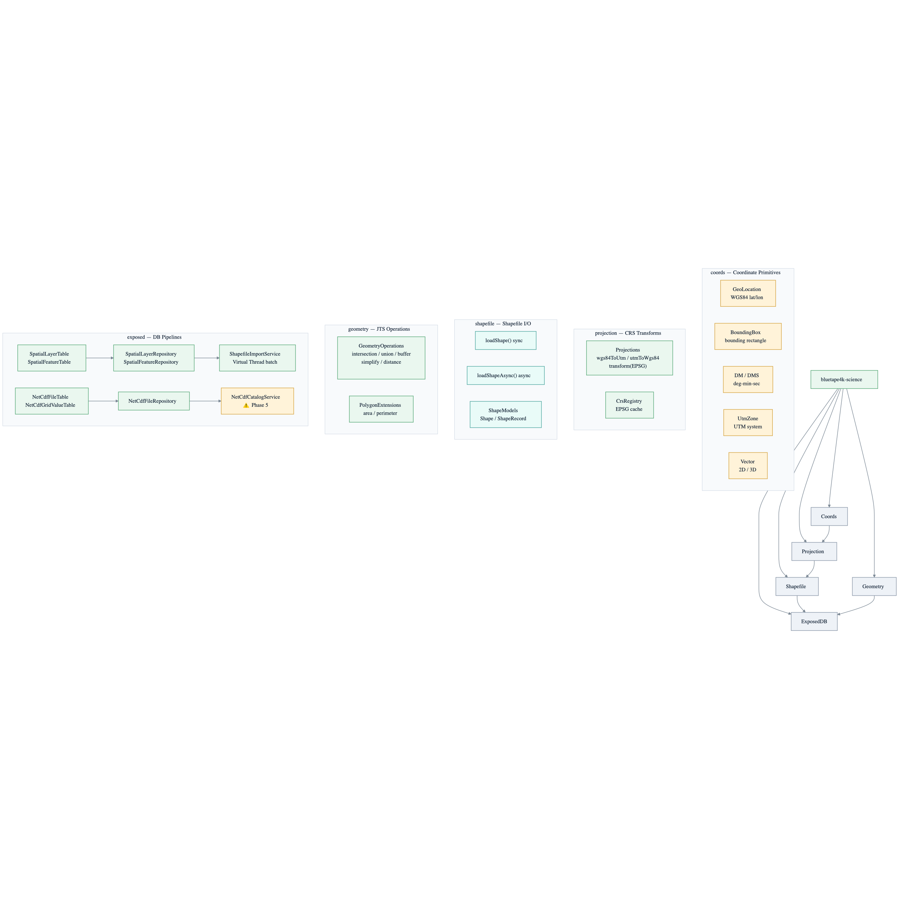
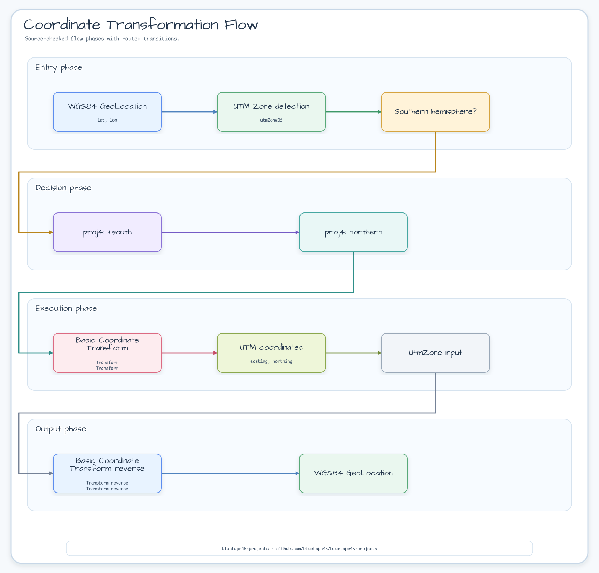
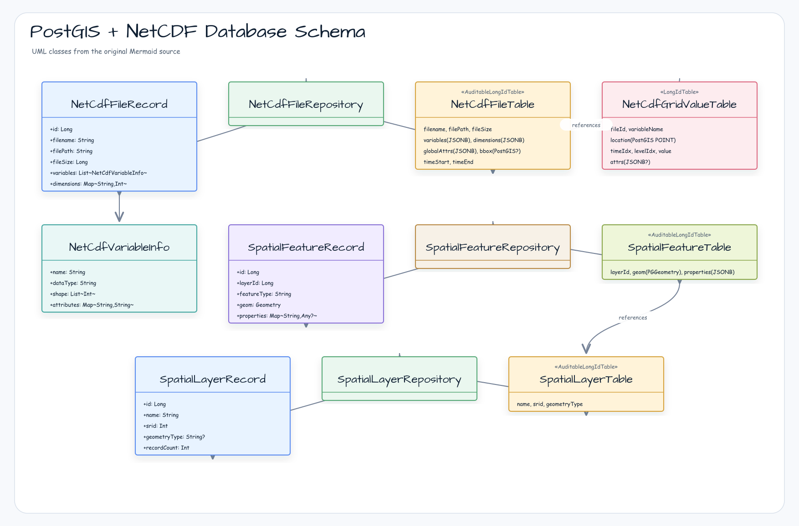

# Module bluetape4k-science

English | [한국어](./README.ko.md)

An integrated Kotlin module for scientific and geospatial data processing: GIS coordinate conversion,
Shapefile I/O, JTS geometry operations, PostGIS database pipelines, and NetCDF metadata cataloging.

## Overview

`bluetape4k-science` covers five domains:

| # | Domain | Key Libraries | Status |
|---|--------|---------------|--------|
| 1 | **GIS Coordinate Conversion** | Proj4J, proj4j-epsg | ✅ Implemented |
| 2 | **Shapefile Processing** | GeoTools (LGPL) | ✅ Implemented |
| 3 | **JTS Geometry Operations** | JTS Core | ✅ Implemented |
| 4 | **PostGIS Data Pipeline** | Exposed + PostGIS | ✅ Implemented |
| 5 | **NetCDF Metadata Catalog** | UCAR netCDF-Java 5.9.1 | ✅ Implemented |

> **NetCDF status**: `NetCdfCatalogService.registerFile()` and
> `NetCdfCatalogService.importGridValues()` are implemented and covered by the module tests.
> The service is a blocking API backed by UCAR netCDF-Java 5.9.1, and the UCAR artifacts remain
> `compileOnly`: applications that call the service must provide them at runtime.
>
> The current importer supports rank 1–4 variables, one- and two-dimensional coordinate axes,
> and numeric CF auxiliary coordinates. It provides bounded tile reads, slice-wide duplicate
> preflight, resumable imports with a five-minute heartbeat lease, a CRS whitelist with
> reprojection to EPSG:4326, and automatic NaN/`_FillValue` skipping. Auxiliary values are
> stored in the existing `attrs` JSONB column; canonical `(longitude, latitude)` values remain
> in the existing PostGIS `location` column.

---

## Architecture

### Integrated Module Overview



### Coordinate Transformation Flow



### PostGIS + NetCDF Database Schema



---

## Module Layout

```
io.bluetape4k.science/
├── coords/                          — Coordinate primitives
│   ├── GeoLocation.kt              — WGS84 lat/lon, Haversine distance
│   ├── BoundingBox.kt              — Rectangular boundary, contains/intersects
│   ├── BoundingBoxRelation.kt      — Relationship computation
│   ├── DM.kt / DMS.kt              — Degree-minute / degree-minute-second notation
│   ├── Vector.kt                   — 2D/3D vector
│   ├── UtmZone.kt                  — UTM zone data class
│   ├── UtmZoneSupport.kt           — utmZoneOf(), boundingBox()
│   └── CoordConverters.kt          — Decimal ↔ DM/DMS utilities
│
├── projection/                      — CRS transforms (Proj4J)
│   ├── CrsRegistry.kt              — EPSG/Proj4 registry with instance caching
│   └── Projections.kt              — wgs84ToUtm(), utmToWgs84(), transform()
│
├── shapefile/                       — Shapefile I/O (GeoTools)
│   ├── ShapeModels.kt              — Shape, ShapeRecord, ShapeHeader (GeoTools-free public API)
│   ├── ShapefileReader.kt          — Synchronous reader
│   └── ShapefileExtensions.kt      — loadShape(), loadShapeAsync()
│
├── geometry/                        — Spatial geometry (JTS)
│   ├── GeometryOperations.kt       — intersection, union, buffer, simplify, distance
│   └── PolygonExtensions.kt        — area, perimeter
│
└── exposed/                         — Database pipelines
    ├── model/
    │   ├── SpatialModels.kt        — SpatialLayerRecord, SpatialFeatureRecord
    │   └── NetCdfModels.kt         — NetCdfFileRecord, NetCdfVariableInfo, NetCdfDimensionInfo
    ├── schema/
    │   ├── SpatialTables.kt        — SpatialLayerTable, SpatialFeatureTable
    │   ├── PoiTable.kt             — Point of Interest table
    │   └── NetCdfTables.kt         — NetCdfFileTable, NetCdfGridValueTable
    ├── repository/
    │   ├── SpatialFeatureRepository.kt — Spatial feature CRUD + bbox search
    │   └── NetCdfRepository.kt    — NetCdfFileRepository metadata CRUD
    └── service/
        ├── ShapefileImportService.kt — Virtual Thread batch importer
        └── NetCdfCatalogService.kt  — registerFile() + importGridValues()
```

---

## Features

| Domain | Feature | API |
|--------|---------|-----|
| **Coordinates** | WGS84 lat/lon with Haversine distance | `GeoLocation.distanceTo()` |
| | Rectangular bounding box | `BoundingBox.contains()`, `.intersects()` |
| | Degree-minute-second notation | `DMS.parse()`, `.toDecimal()` |
| | UTM zone detection | `utmZoneOf(lat, lon)` |
| | 2D/3D vector math | `Vector(x, y, z?)` |
| **Projection** | WGS84 ↔ UTM conversion | `wgs84ToUtm()`, `utmToWgs84()` |
| | Arbitrary EPSG conversion | `transform(x, y, srcEpsg, tgtEpsg)` |
| | CRS instance caching | `CrsRegistry` |
| **Shapefile** | Synchronous Shapefile reading | `loadShape(file)` |
| | Coroutine-based async reading | `loadShapeAsync(file)` |
| | Type-safe models (no GeoTools leakage) | `Shape`, `ShapeRecord` |
| **Geometry** | JTS intersection / union / difference | `GeometryOperations.intersection()` |
| | Buffer zone creation | `GeometryOperations.buffer()` |
| | Douglas-Peucker simplification | `GeometryOperations.simplify()` |
| | Distance calculation | `GeometryOperations.distance()` |
| **Database** | Spatial layer + feature CRUD | `SpatialLayerRepository`, `SpatialFeatureRepository` |
| | Virtual Thread batch Shapefile import | `ShapefileImportService` |
| | NetCDF file metadata catalog | `NetCdfFileRepository` ✅ |
| | NetCDF grid value storage schema | `NetCdfGridValueTable` ✅ |
| | `.nc` file registration | `NetCdfCatalogService.registerFile()` ✅ |
| | Rank 1–4 grid import | `NetCdfCatalogService.importGridValues()` ✅ |
| | Import progress diagnostics | `NetCdfCatalogService.findImportProgress()` ✅ |
| | CoordinateAxis2D / CF auxiliary coordinates | `NetCdfCatalogService.importGridValues()` ✅ |

---

## Quick Start

### 5.1 GIS Coordinate Conversion

```kotlin
import io.bluetape4k.science.coords.GeoLocation
import io.bluetape4k.science.coords.BoundingBox
import io.bluetape4k.science.coords.DMS
import io.bluetape4k.science.coords.utmZoneOf
import io.bluetape4k.science.projection.wgs84ToUtm
import io.bluetape4k.science.projection.utmToWgs84
import io.bluetape4k.science.projection.transform

val seoul = GeoLocation(latitude = 37.5665, longitude = 126.9780)
val tokyo = GeoLocation(latitude = 35.6762, longitude = 139.6503)

// Haversine distance
val distanceKm = seoul.distanceTo(tokyo) / 1000.0
println("Seoul ↔ Tokyo: $distanceKm km")

// Bounding box
val seoulArea = BoundingBox(minLat = 37.4, maxLat = 37.6, minLon = 126.8, maxLon = 127.0)
println("Contains Seoul City Hall: ${seoulArea.contains(seoul)}")
println("Center: ${seoulArea.center}, Width: ${seoulArea.widthKm} km")

// Degree-minute-second
val dms = DMS.parse("37°33'59.4\"N")
println("DMS → decimal: ${dms.toDecimal()}")  // 37.5665

// UTM zone
val zone = utmZoneOf(37.5665, 126.9780)
println("Seoul UTM Zone: ${zone.longitudeZone}${zone.hemisphere}")  // 52S

// WGS84 ↔ UTM roundtrip
val (easting, northing) = wgs84ToUtm(seoul)
val restored = utmToWgs84(easting, northing, zone)
println("Roundtrip: $restored")

// Arbitrary EPSG transform (WGS84 → Korea 2000 Central Belt)
val (kx, ky) = transform(x = 126.9780, y = 37.5665, sourceEpsg = 4326, targetEpsg = 5179)
println("EPSG:4326 → EPSG:5179: ($kx, $ky)")
```

### 5.2 Shapefile Processing

```kotlin
import io.bluetape4k.science.shapefile.loadShape
import io.bluetape4k.science.shapefile.loadShapeAsync
import java.io.File

// Synchronous
val shapeFile = File("/data/provinces.shp")
val shape = loadShape(shapeFile, charset = Charsets.UTF_8)
println("Type: ${shape.shapeType}, Records: ${shape.recordCount}")

shape.records.forEach { record ->
    println("Geometry: ${record.geometry.geometryType}")
    println("Attributes: ${record.attributes}")
}

// Asynchronous (Coroutines — dispatches to Dispatchers.IO)
suspend fun processAsync() {
    val large = loadShapeAsync(File("/data/large_dataset.shp"))
    println("Loaded ${large.recordCount} records")
}
```

### 5.3 JTS Geometry Operations

```kotlin
import io.bluetape4k.science.geometry.GeometryOperations
import org.locationtech.jts.io.WKTReader

val wkt = WKTReader()
val poly1 = wkt.read("POLYGON((0 0, 10 0, 10 10, 0 10, 0 0))")
val poly2 = wkt.read("POLYGON((5 5, 15 5, 15 15, 5 15, 5 5))")

val intersection = GeometryOperations.intersection(poly1, poly2)
val union        = GeometryOperations.union(poly1, poly2)
val buffered     = GeometryOperations.buffer(poly1, 100.0)
val simplified   = GeometryOperations.simplify(poly1, 1.0)
val distance     = GeometryOperations.distance(poly1, poly2)
println("Distance: $distance m")
```

### 5.4 PostGIS Data Pipeline

```kotlin
import io.bluetape4k.science.exposed.service.ShapefileImportService
import io.bluetape4k.science.exposed.repository.SpatialLayerRepository
import io.bluetape4k.science.exposed.repository.SpatialFeatureRepository
import org.jetbrains.exposed.sql.Database
import java.io.File

val database = Database.connect(
    url = "jdbc:postgresql://localhost:5432/gis_db",
    driver = "org.postgresql.Driver",
    user = "postgres",
    password = "password"
)

val service = ShapefileImportService(SpatialLayerRepository(), SpatialFeatureRepository())
val importedCount = service.importShapefile(
    file = File("/data/harbors.shp"),
    layerName = "harbors-2024"
)
println("Imported: $importedCount records")
```

`ShapefileImportService` reads the companion `.prj` file when present. Projected
input such as Web Mercator or UTM is transformed to EPSG:4326 before storage, and
the stored PostGIS geometry is written with SRID 4326. Shapefiles without `.prj`
metadata are treated as already WGS84.

### 5.5 NetCDF Metadata Catalog

The DB schema and repository are ready. Register NetCDF file metadata directly using `NetCdfFileRepository`.

```kotlin
import io.bluetape4k.science.exposed.model.NetCdfFileRecord
import io.bluetape4k.science.exposed.model.NetCdfVariableInfo
import io.bluetape4k.science.exposed.repository.NetCdfFileRepository
import org.jetbrains.exposed.v1.jdbc.transactions.transaction

val repo = NetCdfFileRepository()

transaction {
    val record = NetCdfFileRecord(
        filename = "ERA5_2024_01.nc",
        filePath = "/data/era5/ERA5_2024_01.nc",
        fileSize = 104_857_600L,
        variables = listOf(
            NetCdfVariableInfo(
                name = "temperature",
                dataType = "float",
                shape = listOf(24, 181, 360),
                attributes = mapOf("units" to "K", "long_name" to "Air Temperature")
            ),
            NetCdfVariableInfo(
                name = "precipitation",
                dataType = "float",
                shape = listOf(24, 181, 360),
                attributes = mapOf("units" to "mm", "long_name" to "Total Precipitation")
            )
        ),
        dimensions = mapOf("time" to 24, "lat" to 181, "lon" to 360),
        globalAttrs = mapOf("Conventions" to "CF-1.8", "institution" to "ECMWF")
    )

    val saved = repo.save(record)
    println("Saved: id=${saved.id}, filename=${saved.filename}")

    val found = repo.findById(saved.id)
    println("Variables: ${found?.variables?.map { it.name }}")  // [temperature, precipitation]
    println("Time steps: ${found?.dimensions?.get("time")}")     // 24
}
```

### 5.6 NetCDF Grid Import

`NetCdfCatalogService` opens a `.nc` file, stores its metadata, and imports one
variable into the Exposed/PostGIS grid tables. The API is blocking, so call it
from a worker or virtual-thread executor rather than an event-loop thread.

```kotlin
import io.bluetape4k.science.exposed.repository.NetCdfFileRepository
import io.bluetape4k.science.exposed.repository.NetCdfImportProgressRepository
import io.bluetape4k.science.exposed.service.NetCdfCatalogService

val catalog = NetCdfCatalogService(
    fileRepo = NetCdfFileRepository(),
    progressRepo = NetCdfImportProgressRepository(),
)

val fileId = catalog.registerFile("/data/era5/ERA5_2024_01.nc")
catalog.importGridValues(fileId, variableName = "temperature")
```

Both calls are blocking. Complete registration outside the import deadline so the
caller retains `fileId`, then submit only `importGridValues()` to the worker. A
timeout requests cooperative cancellation; it does not prove that the worker or
database transaction stopped.

<!-- netcdf-timeout-example:start -->
```kotlin
import io.bluetape4k.science.exposed.NetCdfException
import io.bluetape4k.science.exposed.model.NetCdfImportStatus
import java.util.concurrent.CancellationException
import java.util.concurrent.Executors
import java.util.concurrent.ExecutionException
import java.util.concurrent.TimeUnit
import java.util.concurrent.TimeoutException
import java.util.concurrent.atomic.AtomicReference

val fileId = catalog.registerFile("/srv/netcdf/quarantine/grid.nc")
val workerFailure = AtomicReference<Throwable?>()
val executor = Executors.newVirtualThreadPerTaskExecutor()
val task = executor.submit {
    try {
        catalog.importGridValues(fileId, "temperature")
    } catch (failure: Throwable) {
        workerFailure.set(failure)
        throw failure
    }
}
var outcome = "RUNNING"
var callerInterrupted = false
try {
    task.get(30, TimeUnit.MINUTES)
    outcome = "COMPLETED"
} catch (timeout: TimeoutException) {
    task.cancel(true)
    outcome = "TIMED_OUT"
} catch (cancelled: CancellationException) {
    outcome = "CANCELLED"
} catch (failure: ExecutionException) {
    outcome = "FAILED"
} catch (interrupted: InterruptedException) {
    task.cancel(true)
    callerInterrupted = true
    outcome = "INTERRUPTED"
} finally {
    executor.shutdownNow()
}

var workerTerminated = false
try {
    workerTerminated = executor.awaitTermination(30, TimeUnit.SECONDS)
} catch (interrupted: InterruptedException) {
    callerInterrupted = true
}
if (!workerTerminated) {
    outcome = "RECOVERY_REQUIRED"
    // Isolate the worker, alert, and do not retry.
} else {
    val progress = catalog.findImportProgress(fileId, "temperature")
    val failure = workerFailure.get()
    outcome = when {
        outcome == "COMPLETED" || progress?.status == NetCdfImportStatus.COMPLETED -> "COMPLETED"
        failure is NetCdfException.ImportAlreadyRunning -> "RUNNING"
        failure is NetCdfException -> "RECOVERY_REQUIRED"
        failure != null -> "RECOVERY_REQUIRED"
        else -> "RETRY_REVIEW"
    }
}
if (callerInterrupted) Thread.currentThread().interrupt()
```
<!-- netcdf-timeout-example:end -->

`awaitTermination=false` is always `RECOVERY_REQUIRED`: isolate the worker, emit
`netcdf.import.worker.stuck`, and perform zero automatic retries. After a confirmed
worker exit, classify the worker exception and progress together:

| Worker/progress/authoritative signal | Outcome | Caller action |
|--------------------------------------|---------|---------------|
| `terminated=false` | `RECOVERY_REQUIRED` | Isolate worker, emit stuck alert, do not retry |
| Progress `COMPLETED` | `COMPLETED` | Finish the job |
| First `ImportAlreadyRunning` | `RUNNING` | Trust the DB lease result; do not retry |
| `PENDING`, `FAILED`, no row, or indeterminate `IN_PROGRESS` | `RETRY_REVIEW` | Zero automatic retries; require operational review |
| Repeated `ImportAlreadyRunning` or exhausted attempt limit | `RECOVERY_REQUIRED` | Stop retries and alert |
| Non-transient typed failure | `RECOVERY_REQUIRED` | Repair input or operating conditions before retrying |
| Unexpected worker failure | `RECOVERY_REQUIRED` | Fail closed, preserve diagnostics, and alert |

Do not compare `leaseExpiresAt` with the application host clock. The database decides
whether an expired lease can be reacquired; `ImportAlreadyRunning` is the authoritative
active-lease signal. `fileId` is not an authorization token. Authenticate and authorize
register, import, progress, and retry independently, verify tenant/job ownership each time,
and accept paths only from a caller-owned allowed-root policy.

The service rejects symlinks, non-regular files, identity changes, and files that change
during open, but this guard is not a sandbox. Stage uploads in an immutable quarantine
directory and protect them from hostile writers. The fingerprint is only a
`fileKey|size|lastModifiedTime` heuristic, not a content hash or TOCTOU proof. A mismatch raises
`FileChanged`, but an attacker may preserve the same metadata; do not replace the registered path
and assume a matching fingerprint or filename proves content integrity.

`findImportProgress()` returns an operational model. Convert it to a caller-owned DTO that
allowlists only status, the last committed slice, and a coarse outcome. Do not serialize
`errorMessage`, `leaseExpiresAt`, timestamps, raw paths, tenant identifiers, or fingerprints.
The library metric `netcdf.import.progress.lookup` uses a fixed `status` tag. Caller alerts
may use `netcdf.import.timeout`, `netcdf.import.worker.stuck`, and
`netcdf.import.retry.exhausted`; keep metric tags to bounded values such as `operation` and
`outcome`. Put the correlation ID in a structured log or trace field, never in a metric tag.

`NetCdfException` is sealed, so adding a subtype can require source migration for exhaustive
consumer `when` expressions. Keep an `else` fallback at integration boundaries and map only
the subtypes whose policy the caller owns.

Operator recovery order:

1. Stop automatic retries.
2. Isolate the worker and confirm termination.
3. Preserve progress and partial grid rows for diagnosis.
4. Alert with a correlation ID, without raw path, tenant, or exception text tags.
5. Verify input identity, authorization, and tenant/job binding.
6. Perform manual cleanup only after explicit operational approval.

The importer maps the supported ranks as follows:

| Variable rank | Stored coordinates |
|---------------|--------------------|
| 1D (`time`) | `timeIdx=t`, `levelIdx=0`, `location=null` |
| 2D (`lat`, `lon`), including `CoordinateAxis2D` | `timeIdx=0`, `levelIdx=0`, one PostGIS `POINT` per cell |
| 3D (`time`, `lat`, `lon`) | `timeIdx=t`, `levelIdx=0`, one `POINT` per cell |
| 4D (`time`, `level`, `lat`, `lon`) | `timeIdx=t`, `levelIdx=k`, one `POINT` per cell |

CF `coordinates` tokens that are not time, level, latitude, or longitude are treated as
numeric auxiliary coordinates and serialized into `attrs` (for example,
`{"altitude": 125.0}`). The importer preserves non-standard data dimension order such as
`[time, x, y]`, bounds each tile to 65,536 cells and each JDBC batch to 1,000 rows, and
rejects duplicate canonical coordinates before writing a slice. Unsupported axes, malformed
CRS metadata, changed files, corrupt progress, and resource-limit violations are reported as
typed `NetCdfException` subtypes.

Each `(fileId, variableName)` import has a five-minute heartbeat lease and a
slice cursor. `COMPLETED` imports are no-ops; a failed or expired import resumes
at `lastSliceIdx + 1`. Supported source CRS values are EPSG:4326, 4269, 3857,
3031, 3413, and UTM EPSG:32601–32660/32701–32760; other values raise
`NetCdfException.UnsupportedProjection`. NaN and `_FillValue` cells are skipped
and counted by `netcdf.import.nan.skipped`.

---

## API Guide

### coords

| Class / Function | Description |
|------------------|-------------|
| `GeoLocation(lat, lon)` | WGS84 coordinate; `.distanceTo()` for Haversine distance |
| `BoundingBox(minLat, maxLat, minLon, maxLon)` | Rectangular boundary; `.contains()`, `.intersects()` |
| `DMS.parse(str)` / `DM.parse(str)` | Parse degree-minute-second / degree-minute strings |
| `UtmZone(zone, hemisphere)` | UTM zone data class |
| `utmZoneOf(lat, lon)` | Auto-detect UTM zone from WGS84 coordinates |
| `Vector(x, y, z?)` | 2D/3D vector with arithmetic operations |

### projection

| Function | Description |
|----------|-------------|
| `wgs84ToUtm(geoLocation)` | WGS84 → UTM (easting, northing) |
| `utmToWgs84(e, n, zone)` | UTM → WGS84 |
| `transform(x, y, srcEpsg, tgtEpsg)` | Arbitrary EPSG-to-EPSG conversion |
| `CrsRegistry` | Thread-safe CRS instance cache by EPSG code |

### shapefile

| Function | Description |
|----------|-------------|
| `loadShape(file, charset?)` | Synchronous Shapefile reading |
| `loadShapeAsync(file, charset?)` | Coroutine-based async reading (`Dispatchers.IO`) |
| `Shape` | File metadata + record list |
| `ShapeRecord` | Geometry + attribute map (GeoTools-free public API) |

### geometry

| Function | Description |
|----------|-------------|
| `GeometryOperations.intersection(a, b)` | Geometric intersection |
| `GeometryOperations.union(a, b)` | Geometric union |
| `GeometryOperations.buffer(g, dist)` | Buffer zone at given distance |
| `GeometryOperations.simplify(g, tol)` | Douglas-Peucker simplification |
| `GeometryOperations.distance(a, b)` | Minimum distance between geometries |
| `Polygon.area()` / `.perimeter()` | Area and perimeter extensions |

### exposed (PostGIS)

| Class | Description |
|-------|-------------|
| `SpatialLayerRepository` | Layer CRUD (`save`, `findByName`) |
| `SpatialFeatureRepository` | Feature CRUD + PostGIS bbox search |
| `ShapefileImportService` | Virtual Thread batch import from Shapefile |

### exposed (NetCDF)

| Class | Status | Description |
|-------|--------|-------------|
| `NetCdfFileRecord` | ✅ | File metadata model (filename, path, size, variables, dimensions) |
| `NetCdfVariableInfo` | ✅ | Variable descriptor (name, dataType, shape, attributes) |
| `NetCdfDimensionInfo` | ✅ | Dimension descriptor (name, length, isUnlimited) |
| `NetCdfFileRepository` | ✅ | File metadata CRUD (`save`, `findById`, `findAll`, `deleteById`) |
| `NetCdfFileTable` | ✅ | Exposed table — JSONB columns + PostGIS bbox + time range |
| `NetCdfGridValueTable` | ✅ | Grid value table (location: PostGIS POINT, value, timeIdx, levelIdx) |
| `NetCdfCatalogService` | ✅ | Blocking `registerFile()`, `importGridValues()`, and read-only `findImportProgress()`; rank 1–4, 1D/2D axes, CF numeric auxiliary coordinates, bounded tiles, lease/resume, CRS whitelist, NaN/`_FillValue` handling |

`NetCdfCatalogService` reports typed failures through sealed `NetCdfException` subtypes.
Consumer code should retain an `else` fallback because a new subtype can require source
migration for an exhaustive `when`. Blank paths or variable names raise
`IllegalArgumentException`; missing files, variables,
coordinates, unsupported ranks/axes/CRS, active leases, lost leases, changed
files, corrupt progress, duplicates, and resource-limit violations are reported
as the corresponding `NetCdfException` subtype. Existing schema columns are reused:
`location` stores canonical `(lon, lat)` and `attrs` stores bounded numeric auxiliary JSONB.

---

## Dependencies

`bluetape4k-science` declares optional feature-specific libraries as `compileOnly`.
Add only what your application uses at runtime.

### Base

```kotlin
dependencies {
    implementation("io.github.bluetape4k:bluetape4k-science:${bluetape4kVersion}")
}
```

### GIS Coordinate Conversion (Proj4J)

```kotlin
implementation(Libs.proj4j)
implementation(Libs.proj4j_epsg)
```

### Shapefile (GeoTools — LGPL)

```kotlin
repositories {
    maven(url = "https://repo.osgeo.org/repository/release/") { name = "OSGeo Release" }
}
dependencies {
    implementation(Libs.geotools_shapefile)
    implementation(Libs.geotools_referencing)
    implementation(Libs.geotools_epsg_hsql)
}
```

> **License note**: GeoTools uses LGPL. `bluetape4k-science` declares it `compileOnly`.
> Add it explicitly only if your application redistributes GeoTools classes.

### JTS Geometry

```kotlin
implementation(Libs.jts_core)
```

### PostGIS Database

```kotlin
implementation("io.github.bluetape4k:bluetape4k-exposed-postgresql:${bluetape4kVersion}")
implementation(Libs.postgis_jdbc)
```

### Coroutines (async Shapefile reading)

```kotlin
implementation("io.github.bluetape4k:bluetape4k-coroutines:${bluetape4kVersion}")
implementation(Libs.kotlinx_coroutines_core)
```

### NetCDF (UCAR netCDF-Java 5.9.1)

`utils/science/build.gradle.kts` compiles the NetCDF integration against
`edu.ucar:cdm-core:5.9.1` and `edu.ucar:netcdf4:5.9.1` as `compileOnly`
dependencies. The application that calls `NetCdfCatalogService` must provide
the same artifacts at runtime:

```kotlin
repositories {
    maven(url = "https://artifacts.unidata.ucar.edu/repository/unidata-all/") { name = "Unidata" }
}
dependencies {
    implementation("edu.ucar:cdm-core:5.9.1")
    implementation("edu.ucar:netcdf4:5.9.1")
}
```

The former aggregate coordinate is not part of the current contract and must not
be used. The Unidata repository is already declared by the root build;
applications outside this repository should add the repository shown above when
their dependency management does not inherit it.

### Full Example

```kotlin
dependencies {
    implementation("io.github.bluetape4k:bluetape4k-science:${bluetape4kVersion}")
    implementation(Libs.proj4j)
    implementation(Libs.proj4j_epsg)
    implementation(Libs.geotools_shapefile)
    implementation(Libs.geotools_referencing)
    implementation(Libs.geotools_epsg_hsql)
    implementation(Libs.jts_core)
    implementation("io.github.bluetape4k:bluetape4k-exposed-postgresql:${bluetape4kVersion}")
    implementation(Libs.postgis_jdbc)
    implementation("io.github.bluetape4k:bluetape4k-coroutines:${bluetape4kVersion}")
    implementation(Libs.kotlinx_coroutines_core)
    implementation("edu.ucar:cdm-core:5.9.1")
    implementation("edu.ucar:netcdf4:5.9.1")
}
```

---

## Tests

Integration tests run against a Testcontainers-managed PostgreSQL + PostGIS container (`postgis/postgis:16-3.4`).

### NetCDF Catalog Test

```kotlin
@Testcontainers
class NetCdfTableTest : AbstractPostgisTest() {

    private val repo = NetCdfFileRepository()

    @Test
    fun `save and retrieve NetCDF file record`() {
        transaction(db) {
            val record = NetCdfFileRecord(
                filename = "ERA5_2024_01.nc",
                filePath = "/data/ERA5_2024_01.nc",
                fileSize = 1_024_000L,
                variables = listOf(
                    NetCdfVariableInfo("temperature", "float", listOf(24, 181, 360),
                        mapOf("units" to "K"))
                ),
                dimensions = mapOf("time" to 24, "lat" to 181, "lon" to 360),
                globalAttrs = mapOf("Conventions" to "CF-1.8", "institution" to "ECMWF")
            )
            val saved = repo.save(record)

            val found = repo.findById(saved.id)
            found shouldNotBeNull()
            found.filename shouldBeEqualTo "ERA5_2024_01.nc"
            found.variables.size shouldBeEqualTo 1
            found.dimensions["time"] shouldBeEqualTo 24
        }
    }
}
```

`NetCdfCatalogServiceTest` covers the current service contract with dynamically
generated rank 1–4 files: metadata registration, grid-row counts, missing
variables/coordinates, NaN and `_FillValue` filtering, CRS reprojection and
whitelist failures, resume/no-op behavior, heartbeat lease contention and
stale-owner protection. The public Unidata CF-1.x sample regression is tagged
`slow-netcdf`.

```bash
# Local/default profile: excludes the slow public-sample regression.
./gradlew :bluetape4k-science:test --no-configuration-cache

# Explicitly run the slow regression (the nightly workflow uses this profile).
./gradlew :bluetape4k-science:test -PincludeTags=slow-netcdf --no-configuration-cache
```

The module's default test configuration excludes `slow-netcdf`; specifying
`-PincludeTags` disables that exclusion. Testcontainers-backed tests require a
working Docker runtime and PostgreSQL/PostGIS access.

### Shapefile Import Test

```kotlin
@Test
fun `import shapefile into PostGIS`() {
    transaction(db) {
        SchemaUtils.create(SpatialLayerTable, SpatialFeatureTable)
        val service = ShapefileImportService(SpatialLayerRepository(), SpatialFeatureRepository())
        val count = service.importShapefile(
            file = File("src/test/resources/test-data/provinces.shp"),
            layerName = "provinces-test"
        )
        count shouldBeGreaterThan 0
    }
}
```

---

## Performance / Operations

### Coordinate Transforms

- **CRS caching**: `CrsRegistry` caches instances by EPSG code — repeated transforms have near-zero overhead.
- **Thread safety**: `CrsRegistry` uses a concurrent map; safe for multi-threaded use.

### Shapefile Processing

- Use `loadShapeAsync()` for large files — dispatches to `Dispatchers.IO`, non-blocking.
- Stream records lazily for memory-efficient processing of multi-GB Shapefiles.

### PostGIS Database

- **Spatial indexes**: `CREATE INDEX ON spatial_features USING GIST (geom)` for fast bbox queries.
- **Batch loading**: `ShapefileImportService` processes rows in configurable batches (default: 1000) via Virtual Threads.
- **Connection pooling**: Use HikariCP or Exposed's built-in pool.

### JTS Geometry

- Apply `GeometryOperations.simplify()` before persistence to reduce coordinate count.
- Set a consistent `PrecisionModel` in your `GeometryFactory` for reproducible results.

### NetCDF Catalog

- `NetCdfFileTable` stores `bbox` (PostGIS POLYGON) and `timeStart/timeEnd` for spatio-temporal filtering.
- Add index on `netcdf_files(time_start, time_end)` for time-range queries.
- Add composite index on `netcdf_grid_values(file_id, variable_name)` for per-variable lookups.

---

## Related Modules

| Module | Purpose |
|--------|---------|
| `bluetape4k-core` | Core utilities (compression, assertions) |
| `bluetape4k-coroutines` | Coroutine extensions (Flow, DeferredValue) |
| `bluetape4k-exposed-postgresql` | PostGIS column types |
| `bluetape4k-exposed-jdbc` | Exposed JDBC repository base |
| `bluetape4k-testing-testcontainers` | Testcontainers helpers |
