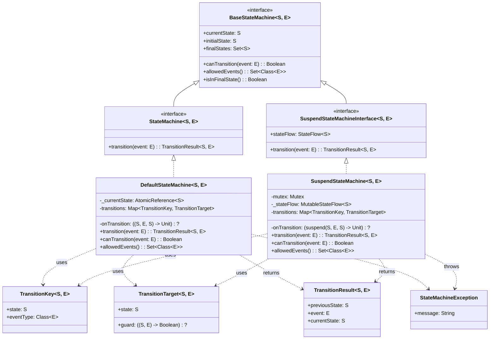
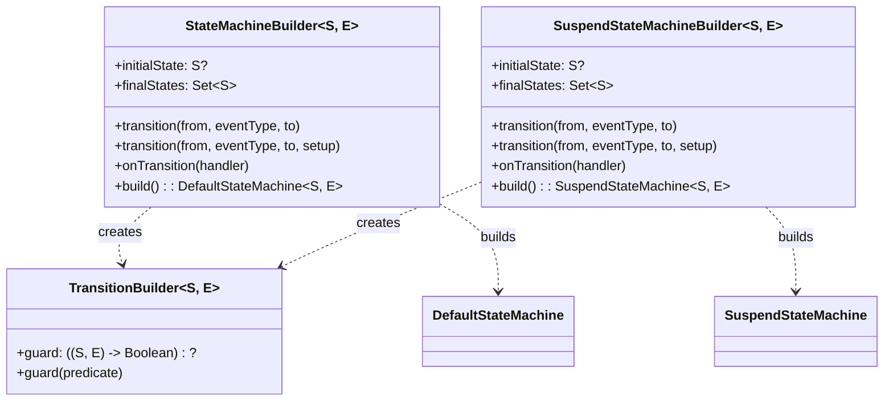
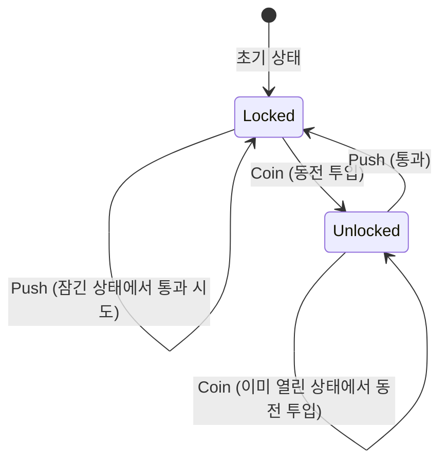
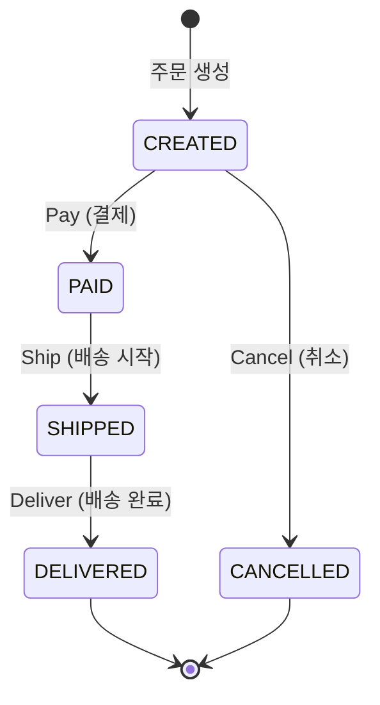
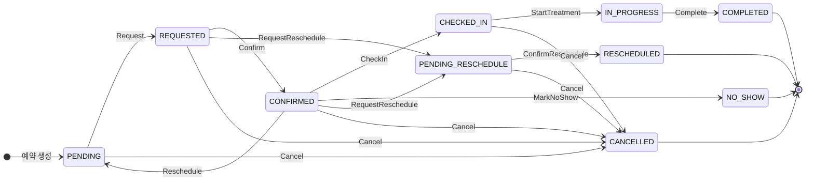
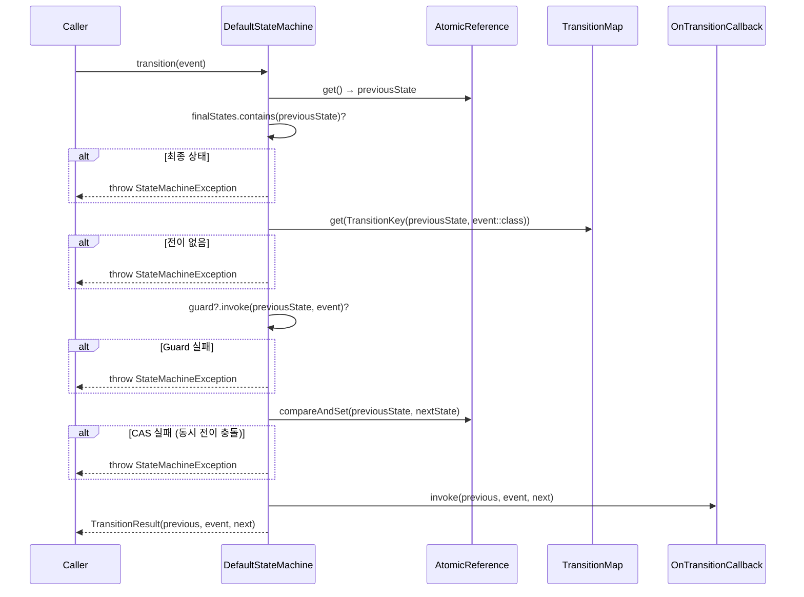
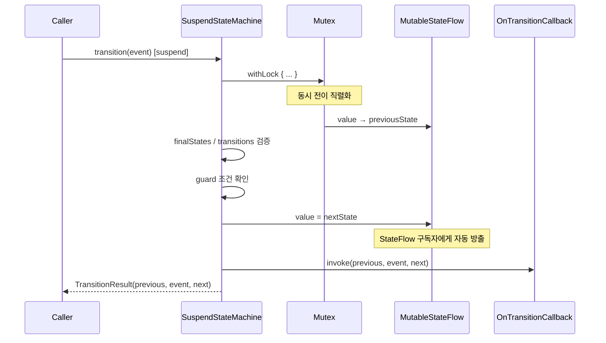
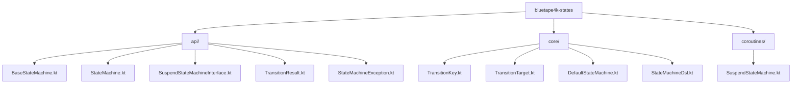

# bluetape4k-states

[English](./README.md) | 한국어

Kotlin DSL 기반 유한 상태 머신(FSM) 라이브러리입니다. 동기 및 코루틴 FSM을 모두 지원하며, Guard 조건과 StateFlow 기반 상태 관찰 기능을 제공합니다.

## 주요 특징

- **타입 안전 DSL**: `stateMachine {}`, `suspendStateMachine {}` DSL로 간결하게 FSM 정의
- **동기 FSM**: `AtomicReference` CAS 기반 Thread-Safe 상태 전이
- **코루틴 FSM**: `Mutex` + `StateFlow` 기반 suspend 전이 및 상태 관찰
- **Guard 조건**: 전이 전 조건 검증 지원
- **clinic-appointment 패턴**: Map 기반 전이 + suspend 콜백 패턴 채택

## Quick Start

### 의존성

```kotlin
dependencies {
    implementation(project(":bluetape4k-states"))
}
```

### 동기 FSM

```kotlin
val orderFsm = stateMachine<OrderState, OrderEvent> {
    initialState = OrderState.CREATED
    finalStates = setOf(OrderState.DELIVERED, OrderState.CANCELLED)

    transition(OrderState.CREATED, on<OrderEvent.Pay>(), to = OrderState.PAID)
    transition(OrderState.PAID, on<OrderEvent.Ship>(), to = OrderState.SHIPPED)
    transition(OrderState.SHIPPED, on<OrderEvent.Deliver>(), to = OrderState.DELIVERED)
    transition(OrderState.CREATED, on<OrderEvent.Cancel>(), to = OrderState.CANCELLED)

    onTransition { prev, event, next ->
        println("$prev --[$event]--> $next")
    }
}

val result = orderFsm.transition(OrderEvent.Pay())
// result.previousState == CREATED
// result.currentState == PAID
```

### 코루틴 FSM

```kotlin
val suspendFsm = suspendStateMachine<AppointmentState, AppointmentEvent> {
    initialState = AppointmentState.PENDING
    finalStates = setOf(AppointmentState.COMPLETED, AppointmentState.CANCELLED)

    transition(AppointmentState.PENDING, on<AppointmentEvent.Request>(), to = AppointmentState.REQUESTED)
    transition(AppointmentState.REQUESTED, on<AppointmentEvent.Confirm>(), to = AppointmentState.CONFIRMED)

    onTransition { prev, event, next ->
        println("상태 전이: $prev --> $next")
    }
}

// StateFlow 관찰
launch { suspendFsm.stateFlow.collect { state -> println("현재 상태: $state") } }

// suspend 전이
val result = suspendFsm.transition(AppointmentEvent.Request())
```

### Guard 조건

```kotlin
val fsm = stateMachine<State, Event> {
    initialState = State.PENDING

    transition(State.PENDING, on<ApproveEvent>(), to = State.APPROVED) {
        guard { state, event -> (event as ApproveEvent).approvedBy != null }
    }
}
```

## 인터페이스 계층

### 클래스 다이어그램



> `StateMachine`과 `SuspendStateMachineInterface`는 서로 독립적입니다. `suspend fun transition()`과 `fun transition()`의 시그니처 충돌을 방지하기 위해 공통 기반인 `BaseStateMachine`에서 읽기 전용 속성만 공유합니다.

---

### DSL 빌더 구조



---

## 상태 전이 다이어그램 예시

### 1. 회전문 (Turnstile) — 단순 FSM



### 2. 주문 (Order) — 단방향 FSM



### 3. 예약 (Appointment) — 복잡한 FSM (clinic-appointment)



---

## 상태 전이 시퀀스 다이어그램

### 동기 FSM 전이 흐름



### 코루틴 FSM 전이 흐름 (SuspendStateMachine)



---

## 패키지 구조



## clinic-appointment 마이그레이션 가이드

기존 `AppointmentStateMachine` (Map 기반 직접 구현)을 `suspendStateMachine` DSL로 대체할 수 있습니다:

**Before** (직접 구현):
```kotlin
class AppointmentStateMachine {
    private val transitions: Map<Pair<State, Class<out Event>>, State> = buildMap { ... }
    suspend fun transition(currentState: State, event: Event): State { ... }
}
```

**After** (bluetape4k-states DSL):
```kotlin
val fsm = suspendStateMachine<AppointmentState, AppointmentEvent> {
    initialState = AppointmentState.PENDING
    finalStates = setOf(AppointmentState.COMPLETED, AppointmentState.CANCELLED)

    transition(AppointmentState.PENDING, on<AppointmentEvent.Request>(), to = AppointmentState.REQUESTED)
    transition(AppointmentState.REQUESTED, on<AppointmentEvent.Confirm>(), to = AppointmentState.CONFIRMED)
    // ... 나머지 전이 등록
}

// 사용
val result = fsm.transition(AppointmentEvent.Request())
println(result.currentState) // REQUESTED

// StateFlow 관찰 (신규 기능)
launch { fsm.stateFlow.collect { state -> updateUI(state) } }
```

**개선점**:
- 상태와 전이를 DSL로 선언적 정의
- `StateFlow` 기반 상태 관찰 내장
- Guard 조건 지원
- `TransitionResult`로 전이 이력 추적
- `Mutex` 기반 동시성 안전 보장
