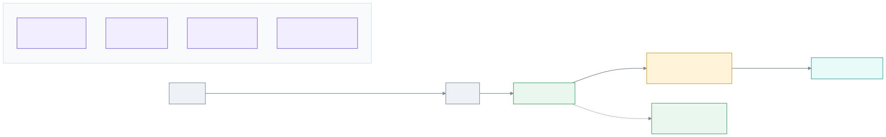
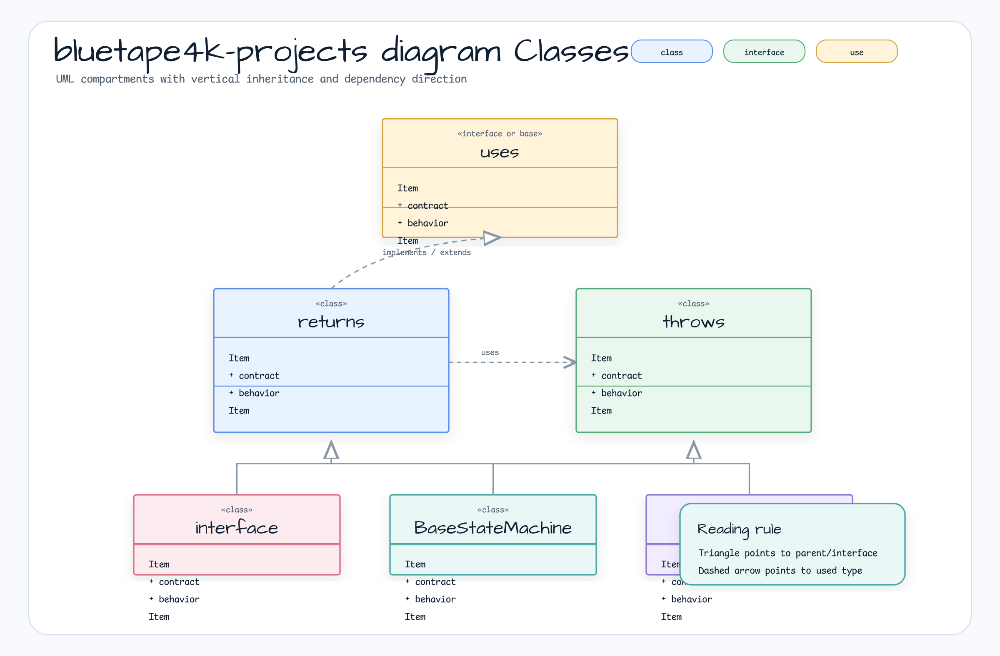
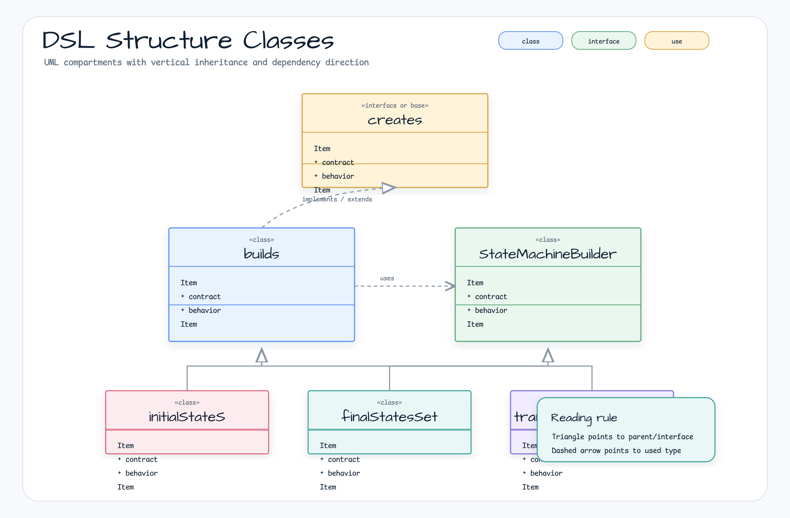
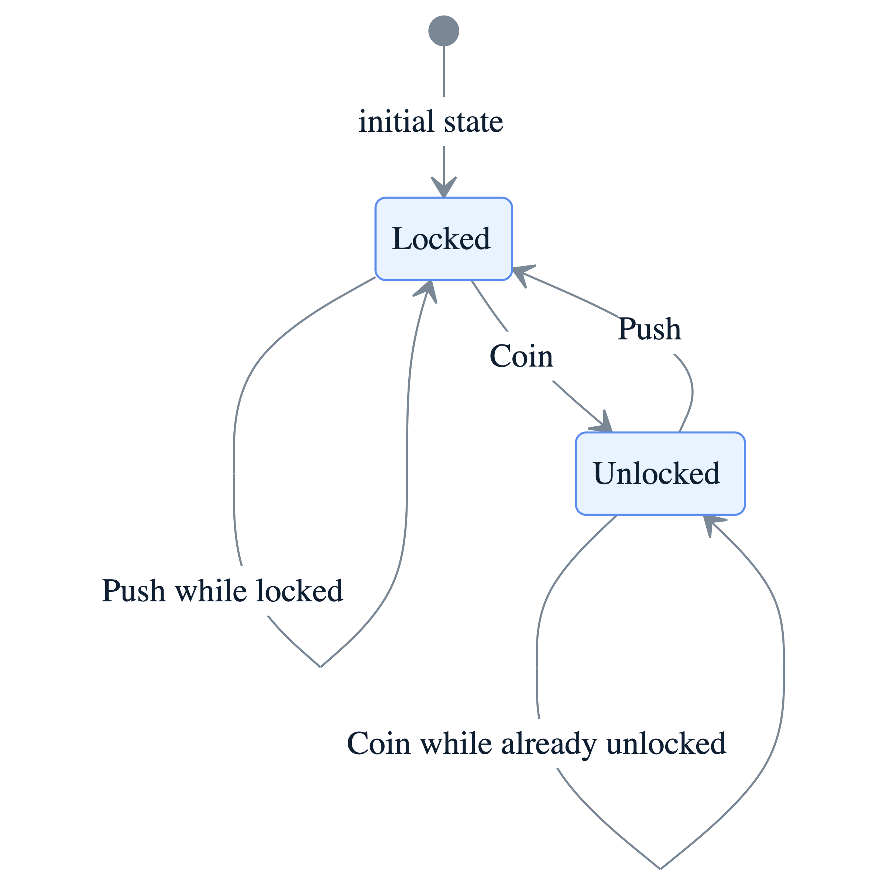
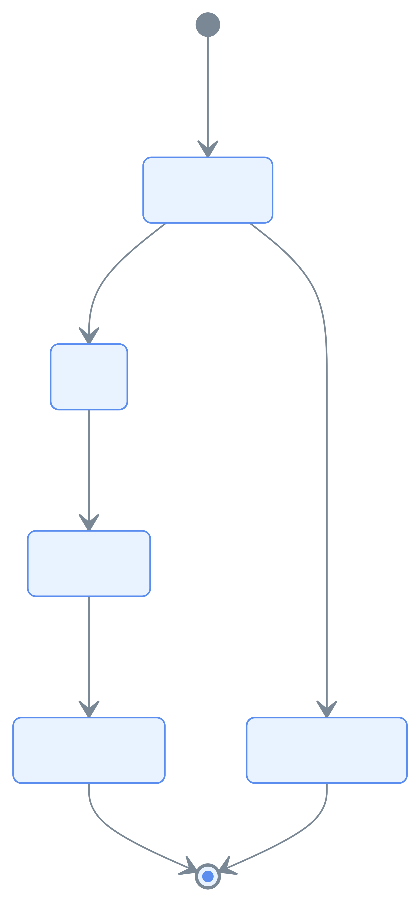
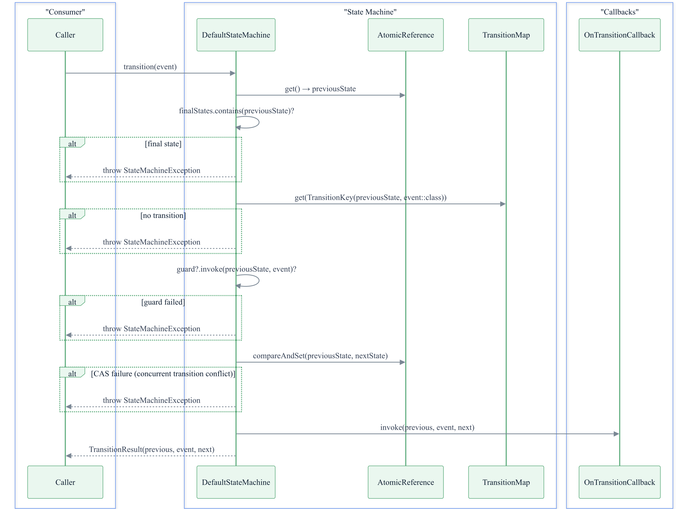
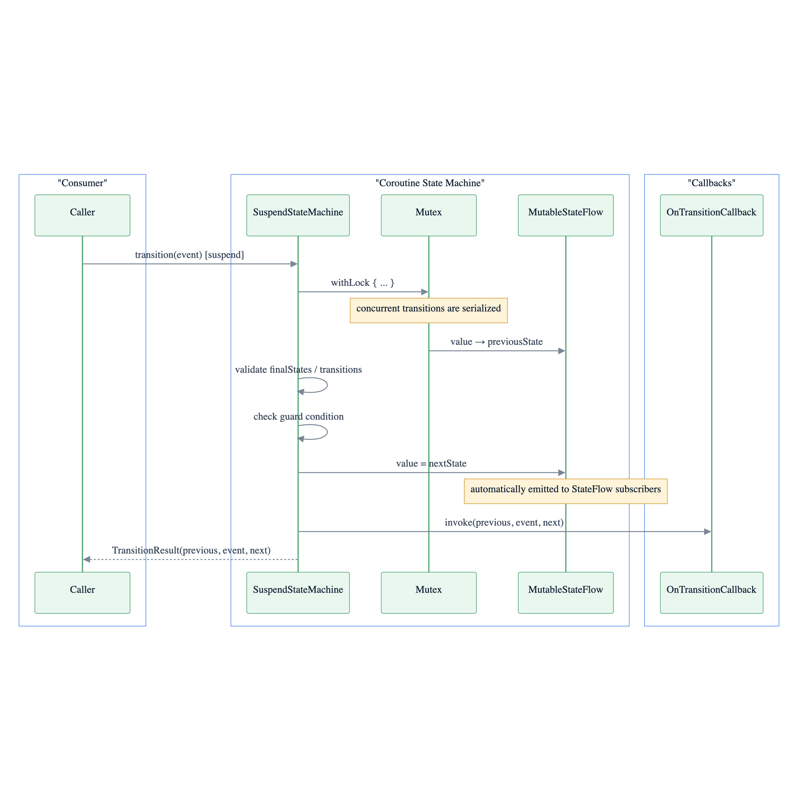

# bluetape4k-states

[English](./README.md) | 한국어

JVM backend/library 코드를 위한 Kotlin DSL 기반 유한 상태 머신(FSM) 라이브러리입니다. 동기 FSM, 코루틴 FSM,
선택적 reactive event/effect runtime, Guard 조건, nested state-family 전이, StateFlow 기반 상태 관찰을 제공합니다.

## 아키텍처

### 개념 개요

상태, 이벤트, 상태 머신이 어떻게 상호 작용하는지:



`StateMachine`은 타입화된 **전이 규칙** (출발 상태 + 이벤트 타입 → 도착 상태) 집합을 보유합니다.  
각 전이는 상태 변경 전에 검사되는 선택적 **Guard 조건**을 가질 수 있습니다.  
`SuspendStateMachine`은 `StateFlow`를 추가로 제공하여 상태 변화를 반응형으로 관찰할 수 있습니다.

### 클래스 다이어그램



> `StateMachine`과 `SuspendStateMachineInterface`는 서로 독립적입니다. `suspend fun transition()`과
`fun transition()`의 시그니처 충돌을 방지하기 위해 공통 기반인 `BaseStateMachine`에서 읽기 전용 속성만 공유합니다.

### DSL 빌더 구조



## 주요 특징

- **타입 안전 DSL**: `stateMachine {}`, `suspendStateMachine {}` DSL로 간결하게 FSM 정의
- **동기 FSM**: `AtomicReference` CAS 기반 Thread-Safe 상태 전이
- **코루틴 FSM**: `Mutex` + `StateFlow` 기반 suspend 전이 및 상태 관찰
- **Reactive runtime**: `reactiveStateMachine {}` 기반 event queue, one-time effect, lifecycle side effect
- **Nested state-family 전이**: `state<ParentState>()`로 sealed state family에 공통 전이 등록
- **Guard 조건**: 전이 전 조건 검증 지원
- **종료 상태 일관성**: 종료 상태에 도달하면 `canTransition()`은 `false`, `allowedEvents()`는 빈 집합을 반환
- **clinic-appointment 패턴**: Map 기반 전이 + suspend 콜백 패턴 채택

## 모듈 포지셔닝

`bluetape4k-states`는 backend workflow, domain service, library 코드에서 작은 Kotlin/JVM FSM이 필요할 때 사용합니다.
명시적 `TransitionResult`, guard, final-state 검사, 결정적인 테스트가 중요한 경우에 맞습니다.

주 관심사가 ViewModel/Compose 상태, multiplatform UI target, UI lifecycle 통합이라면 UI/presentation-layer state
machine을 선택하는 편이 낫습니다. [`joost-klitsie/StateMachine`](https://github.com/joost-klitsie/StateMachine)은
event/effect와 nested-state 아이디어의 참고 자료일 뿐, 이 모듈의 의존성이 아닙니다. 비교와 개선 작업은 #436,
#437, #438에서 추적합니다.

## 상태 전이 다이어그램 예시

### 1. 회전문 (Turnstile) — 단순 FSM



### 2. 주문 (Order) — 단방향 FSM



### 3. 예약 (Appointment) — 복잡한 FSM (clinic-appointment)


## Quick Start

### 의존성

```kotlin
dependencies {
    implementation(project(":bluetape4k-states"))
}
```

### 동기 FSM

```kotlin
val orderFsm = stateMachine<OrderState, OrderEvent> {
    initialState = OrderState.CREATED
    finalStates = setOf(OrderState.DELIVERED, OrderState.CANCELLED)

    transition(OrderState.CREATED, on<OrderEvent.Pay>(), to = OrderState.PAID)
    transition(OrderState.PAID, on<OrderEvent.Ship>(), to = OrderState.SHIPPED)
    transition(OrderState.SHIPPED, on<OrderEvent.Deliver>(), to = OrderState.DELIVERED)
    transition(OrderState.CREATED, on<OrderEvent.Cancel>(), to = OrderState.CANCELLED)

    onTransition { prev, event, next ->
        println("$prev --[$event]--> $next")
    }
}

val result = orderFsm.transition(OrderEvent.Pay())
// result.previousState == CREATED
// result.currentState == PAID
```

### 코루틴 FSM

```kotlin
val suspendFsm = suspendStateMachine<AppointmentState, AppointmentEvent> {
    initialState = AppointmentState.PENDING
    finalStates = setOf(AppointmentState.COMPLETED, AppointmentState.CANCELLED)

    transition(AppointmentState.PENDING, on<AppointmentEvent.Request>(), to = AppointmentState.REQUESTED)
    transition(AppointmentState.REQUESTED, on<AppointmentEvent.Confirm>(), to = AppointmentState.CONFIRMED)

    onTransition { prev, event, next ->
        println("상태 전이: $prev --> $next")
    }
}

// StateFlow 관찰
launch { suspendFsm.stateFlow.collect { state -> println("현재 상태: $state") } }

// suspend 전이
val result = suspendFsm.transition(AppointmentEvent.Request())
```

### Guard 조건

```kotlin
val fsm = stateMachine<State, Event> {
    initialState = State.PENDING

    transition(State.PENDING, on<ApproveEvent>(), to = State.APPROVED) {
        guard { state, event -> (event as ApproveEvent).approvedBy != null }
    }
}
```

### Nested State-Family 전이

sealed parent type에 매칭되는 모든 상태에 inherited transition을 등록할 수 있습니다. 정확한 state 전이가 있으면
그 전이가 inherited transition보다 우선합니다.

```kotlin
sealed interface OrderState
data object Created: OrderState
sealed interface ActiveOrder: OrderState
data object Paid: ActiveOrder
data object Packed: ActiveOrder
data object Cancelled: OrderState

sealed class OrderEvent {
    data object Cancel: OrderEvent()
}

val fsm = stateMachine<OrderState, OrderEvent> {
    initialState = Paid
    finalStates = setOf(Cancelled)

    transition(state<ActiveOrder>(), on<OrderEvent.Cancel>(), to = Cancelled)
}
```

### Reactive Event/Effect Runtime

event queue, one-time effect, lifecycle-managed state side effect가 필요할 때 `reactiveStateMachine {}`를 사용합니다.
더 작은 명시적 FSM이면 기존 sync/suspend API가 더 적합합니다.

```kotlin
val machine = reactiveStateMachine<OrderState, OrderEvent, OrderEffect>(scope) {
    initialState = Created
    finalStates = setOf(Cancelled)

    transition(Created, on<OrderEvent.Cancel>(), to = Cancelled) {
        effect { _, _, _ -> emit(OrderEffect.ShowCancelledMessage) }
    }

    onState(state<ActiveOrder>()) {
        sideEffect(key = { state -> state::class }) {
            auditOrderState(it)
        }
    }
}

val effectJob = launch {
    machine.effects.collect { effect -> handle(effect) }
}

machine.send(OrderEvent.Cancel)
```

## 상태 전이 시퀀스 다이어그램

### 동기 FSM 전이 흐름



### 코루틴 FSM 전이 흐름 (SuspendStateMachine)



## clinic-appointment 마이그레이션 가이드

기존 `AppointmentStateMachine` (Map 기반 직접 구현)을 `suspendStateMachine` DSL로 대체할 수 있습니다:

**Before** (직접 구현):

```kotlin
class AppointmentStateMachine {
    private val transitions: Map<Pair<State, Class<out Event>>, State> = buildMap { ... }
    suspend fun transition(currentState: State, event: Event): State { ... }
}
```

**After** (bluetape4k-states DSL):

```kotlin
val fsm = suspendStateMachine<AppointmentState, AppointmentEvent> {
    initialState = AppointmentState.PENDING
    finalStates = setOf(AppointmentState.COMPLETED, AppointmentState.CANCELLED)

    transition(AppointmentState.PENDING, on<AppointmentEvent.Request>(), to = AppointmentState.REQUESTED)
    transition(AppointmentState.REQUESTED, on<AppointmentEvent.Confirm>(), to = AppointmentState.CONFIRMED)
    // ... 나머지 전이 등록
}

// 사용
val result = fsm.transition(AppointmentEvent.Request())
println(result.currentState) // REQUESTED

// StateFlow 관찰 (신규 기능)
launch { fsm.stateFlow.collect { state -> updateUI(state) } }
```

**개선점**:

- 상태와 전이를 DSL로 선언적 정의
- `StateFlow` 기반 상태 관찰 내장
- Guard 조건 지원
- `TransitionResult`로 전이 이력 추적
- `Mutex` 기반 동시성 안전 보장
