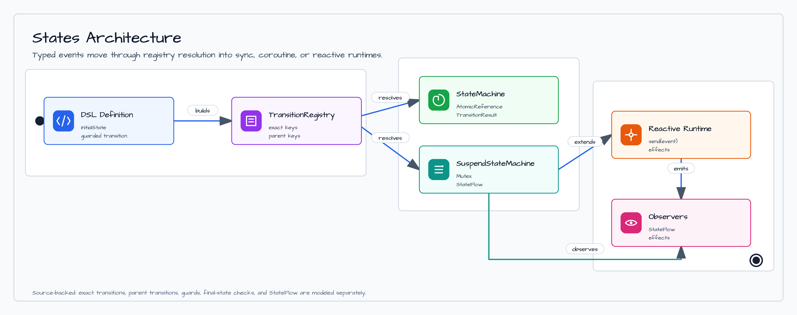
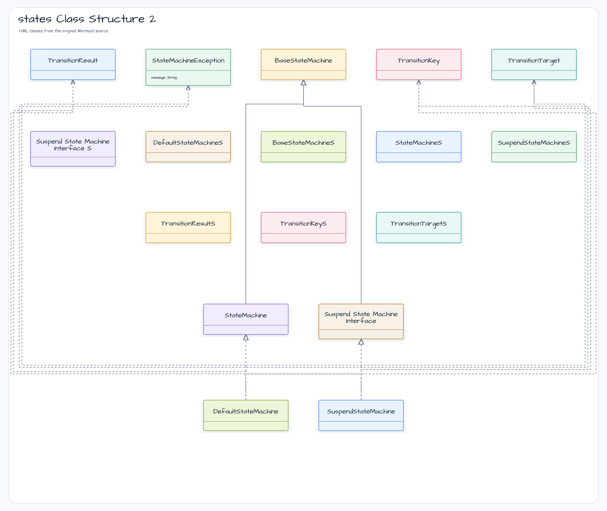
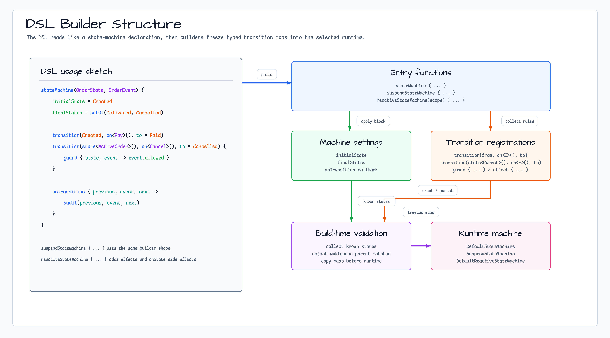
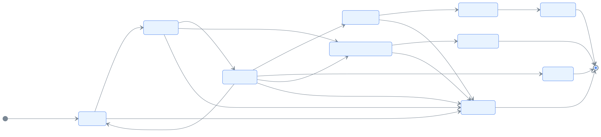
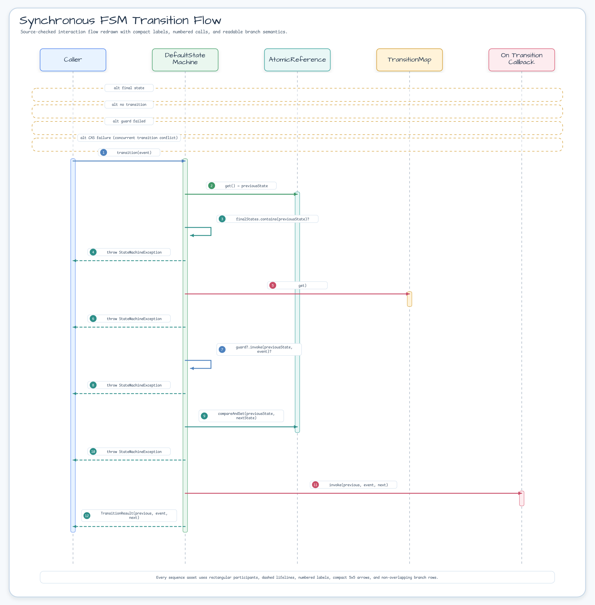
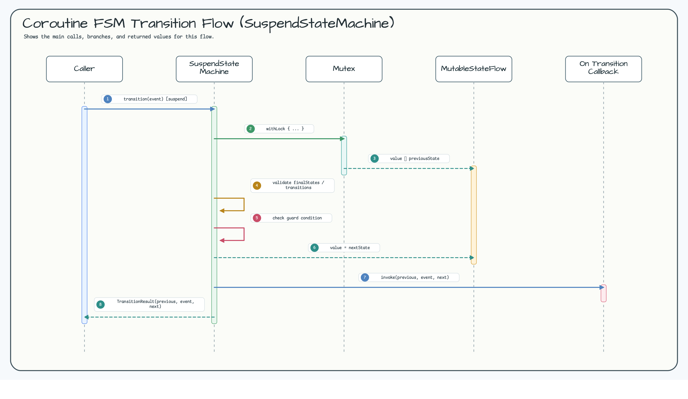

# bluetape4k-states

English | [한국어](./README.ko.md)

A Kotlin DSL-based finite state machine (FSM) library for JVM backend and library code. It supports synchronous,
coroutine-based, and optional reactive event/effect state machines, along with guard conditions, nested state-family
transitions, and `StateFlow`-based state observation.

## Architecture

### Concept Overview

How states, events, and the state machine interact:



A `StateMachine` holds a set of typed **transitions** (from-state + event-type → to-state).  
Each transition can have an optional **guard condition** that must pass before the state changes.  
`SuspendStateMachine` adds a `StateFlow` so consumers can reactively observe state changes.

### Class Diagram



> `StateMachine` and `SuspendStateMachineInterface` are independent from each other. To avoid a signature clash between
`suspend fun transition()` and `fun transition()`, only read-only properties are shared through the common
`BaseStateMachine`.

### DSL Builder Structure



## Key Features

- **Type-safe DSL**: concise FSM definitions with `stateMachine {}` and `suspendStateMachine {}`
- **Synchronous FSM**: thread-safe state transitions based on `AtomicReference` CAS
- **Coroutine FSM**: suspend transitions and state observation based on `Mutex` + `StateFlow`
- **Reactive runtime**: optional event queue, one-time effects, and lifecycle side effects through `reactiveStateMachine {}`
- **Nested state-family transitions**: register shared transitions for sealed state families with `state<ParentState>()`
- **Guard conditions**: validate conditions before transitions
- **Final state consistency**: once a final state is reached, `canTransition()` returns `false` and `allowedEvents()` returns an empty set
- **clinic-appointment pattern**: adopts a map-based transition model plus suspend callback pattern

## Module Positioning

Use `bluetape4k-states` when you need a small Kotlin/JVM FSM for backend workflows, domain services, or libraries where
explicit `TransitionResult` values, guards, final-state checks, and deterministic tests matter.

Use a UI/presentation-layer state machine when the primary concern is ViewModel or Compose state, multiplatform UI
targets, and UI lifecycle integration. The [`joost-klitsie/StateMachine`](https://github.com/joost-klitsie/StateMachine)
project is a useful design reference for event/effect and nested-state ideas, but it is not a dependency of this module.
The comparison work is tracked through #436, #437, and #438.

## Example State Diagrams

### 1. Turnstile — Simple FSM


### 2. Order — One-Way FSM


### 3. Appointment — Complex FSM (`clinic-appointment`)



## Quick Start

### Dependency

```kotlin
dependencies {
    implementation(project(":bluetape4k-states"))
}
```

### Synchronous FSM

```kotlin
val orderFsm = stateMachine<OrderState, OrderEvent> {
    initialState = OrderState.CREATED
    finalStates = setOf(OrderState.DELIVERED, OrderState.CANCELLED)

    transition(OrderState.CREATED, on<OrderEvent.Pay>(), to = OrderState.PAID)
    transition(OrderState.PAID, on<OrderEvent.Ship>(), to = OrderState.SHIPPED)
    transition(OrderState.SHIPPED, on<OrderEvent.Deliver>(), to = OrderState.DELIVERED)
    transition(OrderState.CREATED, on<OrderEvent.Cancel>(), to = OrderState.CANCELLED)

    onTransition { prev, event, next ->
        println("$prev --[$event]--> $next")
    }
}

val result = orderFsm.transition(OrderEvent.Pay())
// result.previousState == CREATED
// result.currentState == PAID
```

### Coroutine FSM

```kotlin
val suspendFsm = suspendStateMachine<AppointmentState, AppointmentEvent> {
    initialState = AppointmentState.PENDING
    finalStates = setOf(AppointmentState.COMPLETED, AppointmentState.CANCELLED)

    transition(AppointmentState.PENDING, on<AppointmentEvent.Request>(), to = AppointmentState.REQUESTED)
    transition(AppointmentState.REQUESTED, on<AppointmentEvent.Confirm>(), to = AppointmentState.CONFIRMED)

    onTransition { prev, event, next ->
        println("State transition: $prev --> $next")
    }
}

// observe StateFlow
launch { suspendFsm.stateFlow.collect { state -> println("Current state: $state") } }

// suspend transition
val result = suspendFsm.transition(AppointmentEvent.Request())
```

### Guard Conditions

```kotlin
val fsm = stateMachine<State, Event> {
    initialState = State.PENDING

    transition(State.PENDING, on<ApproveEvent>(), to = State.APPROVED) {
        guard { state, event -> (event as ApproveEvent).approvedBy != null }
    }
}
```

### Nested State-Family Transitions

Register an inherited transition for every state matching a sealed parent type. Exact state transitions still win.

```kotlin
sealed interface OrderState
data object Created: OrderState
sealed interface ActiveOrder: OrderState
data object Paid: ActiveOrder
data object Packed: ActiveOrder
data object Cancelled: OrderState

sealed class OrderEvent {
    data object Cancel: OrderEvent()
}

val fsm = stateMachine<OrderState, OrderEvent> {
    initialState = Paid
    finalStates = setOf(Cancelled)

    transition(state<ActiveOrder>(), on<OrderEvent.Cancel>(), to = Cancelled)
}
```

### Reactive Event/Effect Runtime

Use `reactiveStateMachine {}` when callers need queued events, one-time effects, and lifecycle-managed state side
effects. The core sync/suspend FSM APIs remain smaller and more explicit.

```kotlin
val machine = reactiveStateMachine<OrderState, OrderEvent, OrderEffect>(scope) {
    initialState = Created
    finalStates = setOf(Cancelled)

    transition(Created, on<OrderEvent.Cancel>(), to = Cancelled) {
        effect { _, _, _ -> emit(OrderEffect.ShowCancelledMessage) }
    }

    onState(state<ActiveOrder>()) {
        sideEffect(key = { state -> state::class }) {
            auditOrderState(it)
        }
    }
}

val effectJob = launch {
    machine.effects.collect { effect -> handle(effect) }
}

machine.send(OrderEvent.Cancel)
```

## State Transition Sequence Diagrams

### Synchronous FSM Transition Flow



### Coroutine FSM Transition Flow (`SuspendStateMachine`)



## `clinic-appointment` Migration Guide

An existing `AppointmentStateMachine` implemented directly with maps can be replaced with the `suspendStateMachine` DSL:

**Before** (direct implementation):

```kotlin
class AppointmentStateMachine {
    private val transitions: Map<Pair<State, Class<out Event>>, State> = buildMap { ... }
    suspend fun transition(currentState: State, event: Event): State { ... }
}
```

**After** (bluetape4k-states DSL):

```kotlin
val fsm = suspendStateMachine<AppointmentState, AppointmentEvent> {
    initialState = AppointmentState.PENDING
    finalStates = setOf(AppointmentState.COMPLETED, AppointmentState.CANCELLED)

    transition(AppointmentState.PENDING, on<AppointmentEvent.Request>(), to = AppointmentState.REQUESTED)
    transition(AppointmentState.REQUESTED, on<AppointmentEvent.Confirm>(), to = AppointmentState.CONFIRMED)
    // ... register the remaining transitions
}

// usage
val result = fsm.transition(AppointmentEvent.Request())
println(result.currentState) // REQUESTED

// observe StateFlow (new feature)
launch { fsm.stateFlow.collect { state -> updateUI(state) } }
```

**Improvements**:

- declarative definition of states and transitions through DSL
- built-in state observation through `StateFlow`
- support for guard conditions
- transition-history tracking through `TransitionResult`
- concurrency safety guaranteed by `Mutex`
