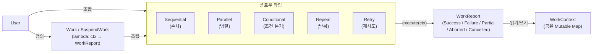
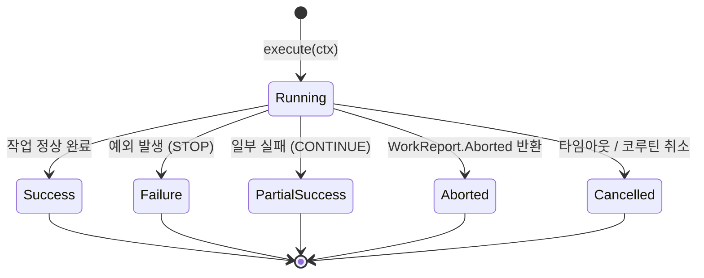
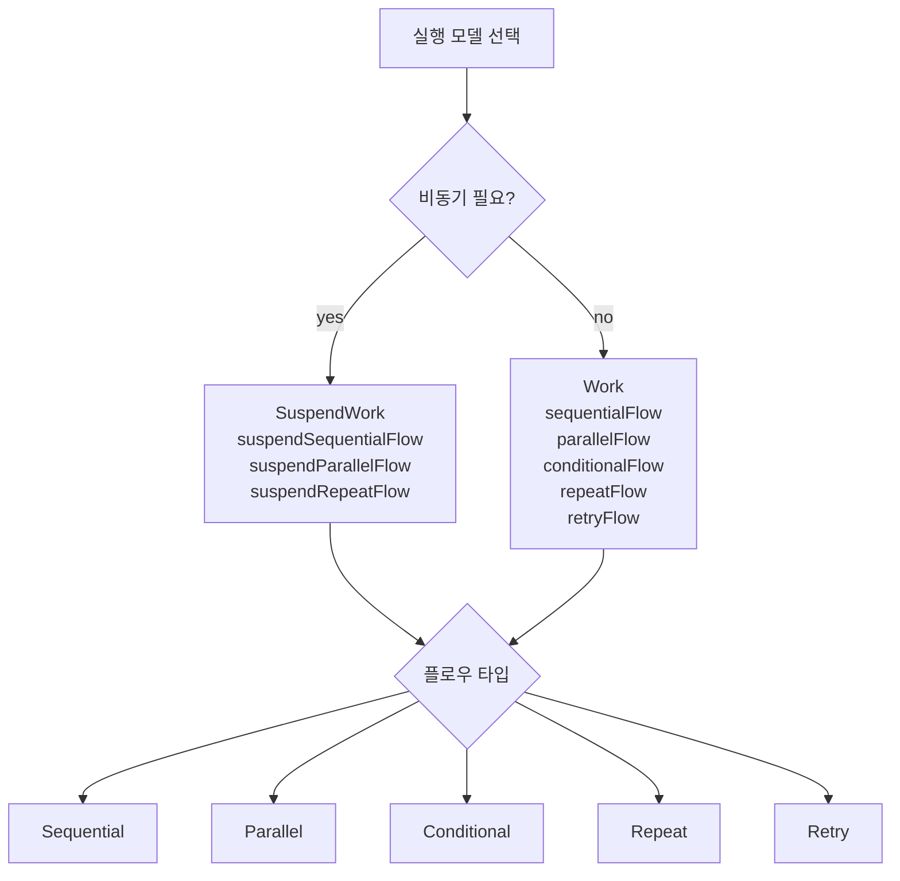
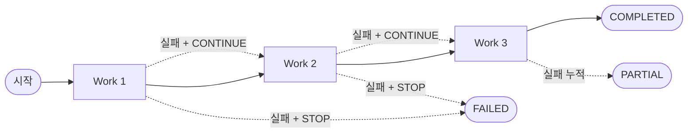
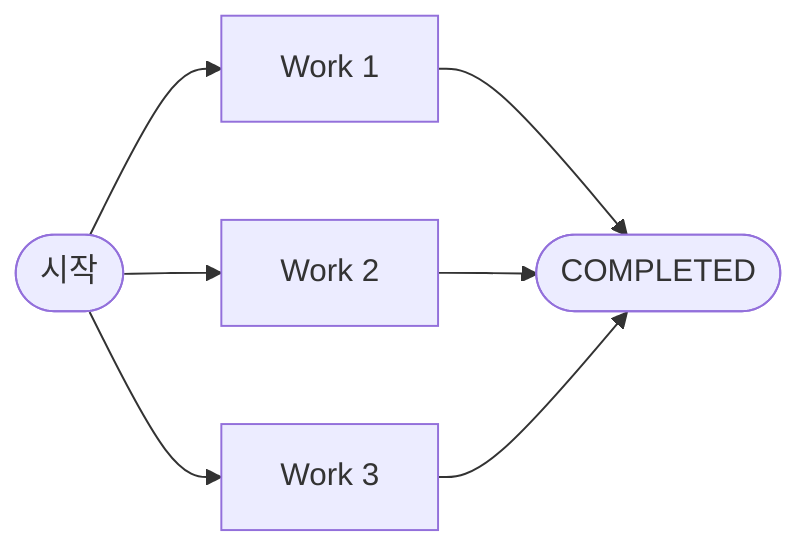
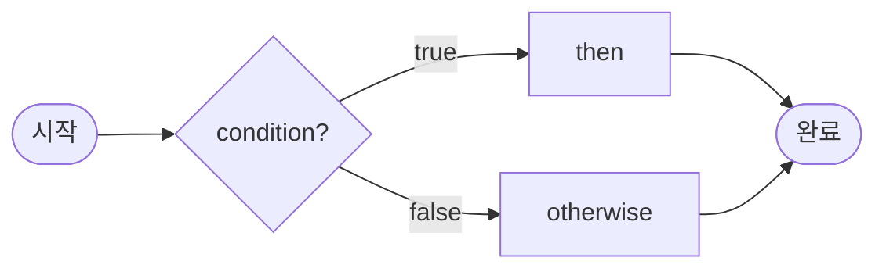
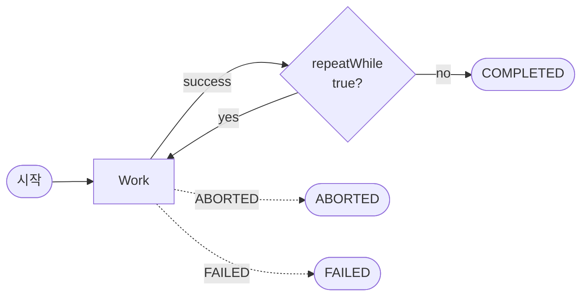
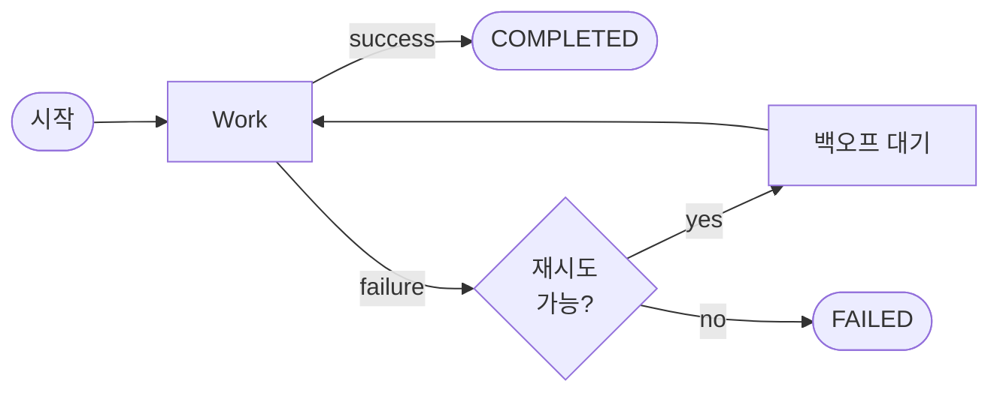

# bluetape4k-workflow

[English](./README.md) | 한국어

Kotlin DSL 기반 워크플로우 오케스트레이션 라이브러리입니다. 동기, 코루틴, Virtual Thread 실행 모델을 지원하며 선언적 DSL로 복잡한 워크플로우를 구성할 수 있습니다.

추가 참고: [easy-flows](https://github.com/j-easy/easy-flows)

## 아키텍처

### 개념 개요

Work 단위, 컨텍스트, 플로우가 어떻게 연관되는지:



`Work` 단위는 `WorkContext`를 받아 `WorkReport`를 반환하는 이름 있는 람다입니다.  
플로우는 여러 Work 단위를 실행 전략으로 조합합니다.  
`WorkContext`는 워크플로우 실행 동안 모든 작업 간 공유 상태를 전달합니다.

### WorkReport 상태



### 실행 모델 선택



## 주요 특징

- **다중 실행 모델**: 동기(Virtual Threads), 코루틴(suspend), 혼합 워크플로우 지원
- **타입 안전 DSL**: `workflow {}`, `sequentialFlow {}`, `suspendWorkflow {}` 등으로 선언적 정의
- **조합 가능**: 워크플로우 내에 워크플로우 중첩으로 임의 복잡도 구성
- **에러 전략**: `STOP`(즉시 중단) 또는 `CONTINUE`(부분 성공)
- **재시도 백오프**: 지수 백오프 정책으로 복원력 제공
- **WorkContext**: 작업 간 상태 공유용 Mutable Map

## WorkStatus & WorkReport

워크 실행의 5가지 가능한 결과:

| Status | Type | 비유 | 설명 |
|--------|------|------|------|
| `COMPLETED` | `Success` | 정상 반환 | 작업 성공, 컨텍스트 유지 |
| `FAILED` | `Failure` | 예외 발생 | 작업 실패, 에러 발생; 흐름 중단 (STOP) |
| `PARTIAL` | `PartialSuccess` | 부분 반환 | 하나 이상 실패했으나 흐름 계속 (CONTINUE) |
| `ABORTED` | `Aborted` | `break` 문 | 작업이 워크플로 즉시 중단 요청 |
| `CANCELLED` | `Cancelled` | 외부 인터럽트 | 타임아웃 또는 코루틴 취소 발생 |

### 제어 흐름 비유

WorkReport 결과는 while 루프 제어 흐름에 대응됩니다:
```
while (condition) {
    val result = doWork()
    when (result) {
        is Success         -> 다음 작업으로 진행
        is Failure + STOP  -> 에러 반환 (루프 종료)
        is Failure + CONT  -> 다음 작업으로 진행 (실패 누적)
        is Aborted         -> break (루프 즉시 종료)
        is Cancelled       -> throw (외부 인터럽트)
    }
}
```

## 핵심 API

### WorkContext
작업 간 상태 공유를 위한 Mutable Map:
```kotlin
val ctx = WorkContext()
ctx["key"] = value
val value = ctx.get<Type>("key")
val default = ctx.getOrDefault("key", defaultValue)
```

### Work & SuspendWork
동기 또는 suspend 단일 작업 실행:
```kotlin
// 동기
val work = Work("task-name") { ctx -> WorkReport.Success(ctx) }
val report = work.execute(ctx)

// Suspend
val suspendWork = SuspendWork("task-name") { ctx -> WorkReport.Success(ctx) }
val report = suspendWork.execute(ctx)
```

## 흐름 타입

### 순차 흐름

작업을 순서대로 실행; 에러 처리는 `ErrorStrategy` 제어:



```kotlin
// 동기 버전
val flow = sequentialFlow("order-processing") {
    execute("validate") { ctx ->
        ctx["valid"] = true
        WorkReport.Success(ctx)
    }
    execute("charge-card") { ctx ->
        // ctx["valid"] 사용 가능
        WorkReport.Success(ctx)
    }
    errorStrategy(ErrorStrategy.STOP)  // 또는 CONTINUE
}

// Suspend 버전
val flow = suspendSequentialFlow("order-processing") {
    execute("validate") { ctx ->
        ctx["valid"] = true
        WorkReport.Success(ctx)
    }
    execute("charge-card") { ctx ->
        WorkReport.Success(ctx)
    }
}

val report = flow.execute(WorkContext())
```

### 병렬 흐름

작업 동시 실행:



```kotlin
// 동기 (Virtual Threads)
val flow = parallelFlow("fetch-data") {
    execute("fetch-user") { ctx -> WorkReport.Success(ctx) }
    execute("fetch-inventory") { ctx -> WorkReport.Success(ctx) }
    timeout(30.seconds)
}

// Suspend (coroutineScope)
val flow = suspendParallelFlow("fetch-data") {
    execute("fetch-user") { ctx -> WorkReport.Success(ctx) }
    execute("fetch-inventory") { ctx -> WorkReport.Success(ctx) }
}

val report = flow.execute(WorkContext())
```

### 조건 흐름

Predicate 기반 분기 실행:



```kotlin
val flow = conditionalFlow("check-valid") {
    condition { ctx -> ctx.get<Boolean>("valid") == true }
    then("process") { ctx -> WorkReport.Success(ctx) }
    otherwise("reject") { ctx -> WorkReport.Failure(ctx) }
}

val report = flow.execute(ctx)
```

### 반복 흐름

조건이 참인 동안 작업 반복:



```kotlin
// 동기
val flow = repeatFlow("poll-status") {
    execute("check") { ctx ->
        ctx["count"] = (ctx.getOrDefault("count", 0) as Int) + 1
        WorkReport.Success(ctx)
    }
    repeatWhile { report -> report.isSuccess && report.context.get<Int>("count")!! < 10 }
    maxIterations(20)
}

// Suspend (repeatDelay 지원)
val flow = suspendRepeatFlow("poll-status") {
    execute("check") { ctx -> WorkReport.Success(ctx) }
    until { report -> report.context.get<Boolean>("done") == true }
    maxIterations(100)
    repeatDelay(500.milliseconds)
}

val report = flow.execute(WorkContext())
```

### 재시도 흐름

실패한 작업을 지수 백오프로 자동 재시도:



```kotlin
val flow = retryFlow("call-api") {
    execute("http-call") { ctx ->
        try {
            // 외부 API 호출
            WorkReport.Success(ctx)
        } catch (e: Exception) {
            WorkReport.Failure(ctx, e)
        }
    }
    policy {
        maxAttempts = 5
        delay = 200.milliseconds
        backoffMultiplier = 2.0
        maxDelay = 30.seconds
    }
}

val report = flow.execute(WorkContext())
```

## DSL 예제

### 중첩 워크플로우

```kotlin
val order = workflow("order-flow") {
    sequential("main") {
        execute("validate") { ctx -> WorkReport.Success(ctx) }
        
        parallel("fetch") {
            execute("fetch-user") { ctx -> WorkReport.Success(ctx) }
            execute("fetch-product") { ctx -> WorkReport.Success(ctx) }
        }
        
        execute("save") { ctx -> WorkReport.Success(ctx) }
    }
}

val report = order.execute(WorkContext())
```

### 에러 처리

```kotlin
val flow = sequentialFlow("payment") {
    execute("validate") { ctx -> WorkReport.Success(ctx) }
    execute("charge") { ctx ->
        if (someError) {
            WorkReport.Failure(ctx, Exception("결제 실패"))
        } else {
            WorkReport.Success(ctx)
        }
    }
    execute("confirm") { ctx -> WorkReport.Success(ctx) }
    errorStrategy(ErrorStrategy.CONTINUE)
}

val report = flow.execute(WorkContext())
if (report is WorkReport.PartialSuccess) {
    println("${report.failedReports.size}개 작업 실패")
}
```

### 즉시 중단

```kotlin
val flow = sequentialFlow("process") {
    execute("step1") { ctx -> WorkReport.Success(ctx) }
    execute("step2") { ctx ->
        if (ctx.get<Boolean>("abort") == true) {
            WorkReport.Aborted(ctx, "중단 플래그 감지")
        } else {
            WorkReport.Success(ctx)
        }
    }
    // step2에서 중단하면 step3은 실행되지 않음
    execute("step3") { ctx -> WorkReport.Success(ctx) }
}

val report = flow.execute(ctx)
```

## 에러 처리 전략

- **`ErrorStrategy.STOP`** (기본값): 첫 번째 실패 시 즉시 중단
- **`ErrorStrategy.CONTINUE`**: 다음 작업으로 진행하며 실패 누적 (PartialSuccess)

## 의존성

```kotlin
dependencies {
    implementation(project(":bluetape4k-workflow"))
}
```
