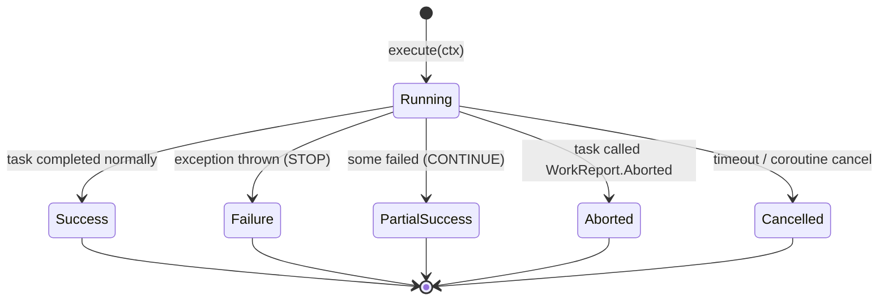
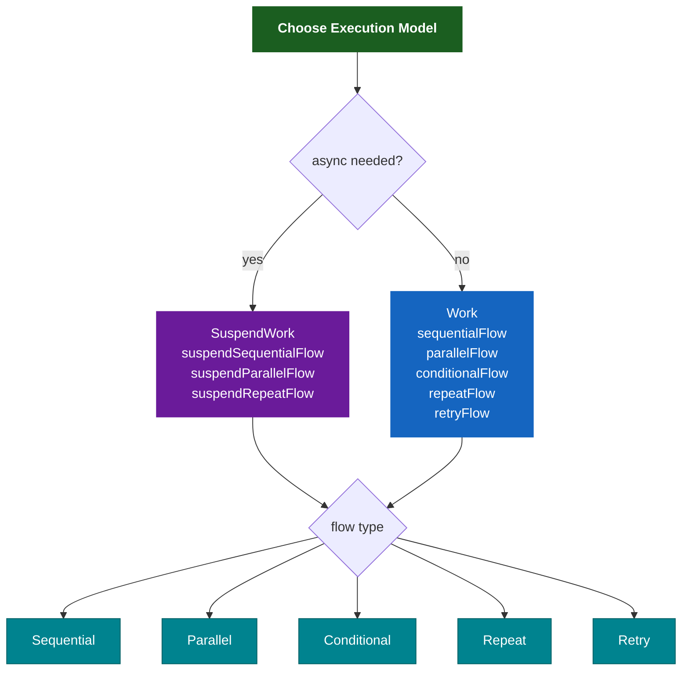
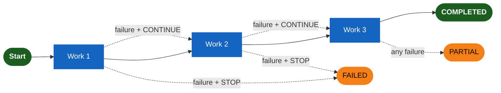
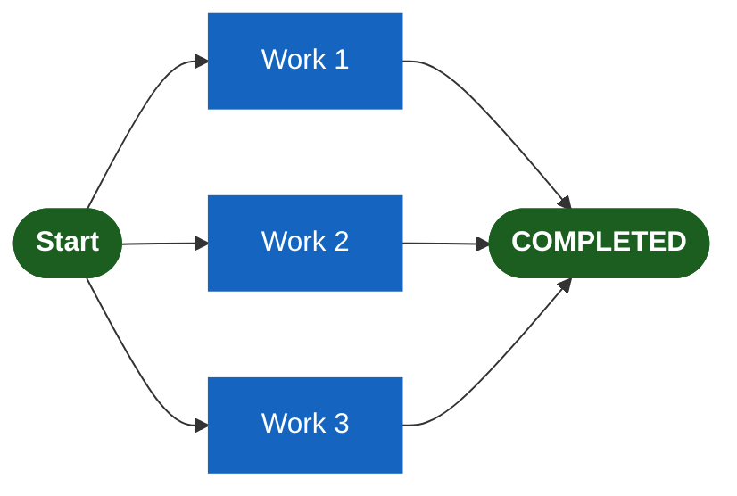
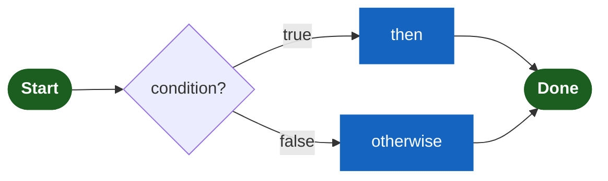
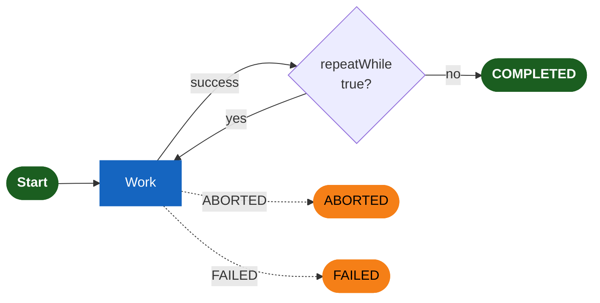
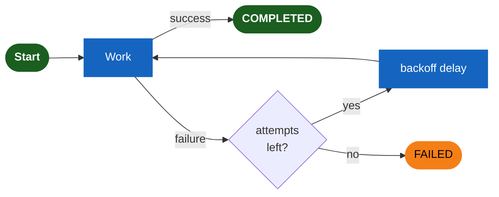

# bluetape4k-workflow

[한국어](./README.ko.md) | English

A Kotlin DSL-based workflow orchestration library with support for sync, coroutine-based, and Virtual Thread execution models. Define complex workflows declaratively using composable flow builders.

For additional reference, see [easy-flows](https://github.com/j-easy/easy-flows).

## Architecture

### Concept Overview

How work units, context, and flows relate:

```mermaid
flowchart LR
    subgraph Flows["Flow Types"]
        SF["Sequential\n(ordered)"]
        PF["Parallel\n(concurrent)"]
        CF["Conditional\n(branching)"]
        RF["Repeat\n(looping)"]
        RT["Retry\n(backoff)"]
    end

    User -->|" defines "| W["Work / SuspendWork\n(lambda: ctx → WorkReport)"]
    User -->|" composes "| Flows
    W -->|" assembled into "| Flows
    Flows -->|" execute(ctx) "| WR["WorkReport\n(Success / Failure / Partial\n/ Aborted / Cancelled)"]
    WR -->|" reads/writes "| WC["WorkContext\n(shared mutable map)"]

    classDef coreStyle fill:#1B5E20,stroke:#1B5E20,color:#FFFFFF,font-weight:bold
    classDef serviceStyle fill:#1565C0,stroke:#1565C0,color:#FFFFFF
    classDef utilStyle fill:#E65100,stroke:#E65100,color:#FFFFFF
    classDef asyncStyle fill:#6A1B9A,stroke:#6A1B9A,color:#FFFFFF
    classDef dataStyle fill:#F57F17,stroke:#F57F17,color:#000000
    classDef dslStyle fill:#00838F,stroke:#006064,color:#FFFFFF

    class SF,PF,CF,RF,RT dslStyle
    class W serviceStyle
    class WR dataStyle
    class WC utilStyle
```



A `Work` unit is a named lambda that receives a `WorkContext` and returns a `WorkReport`.  
Flows compose multiple work units into an execution strategy.  
`WorkContext` carries shared state across all tasks in a workflow run.

### WorkReport States



### Execution Model



## Key Features

- **Multi-execution model**: sync (Virtual Threads), coroutine (suspend), and hybrid workflows
- **Type-safe DSL**: declarative workflow definitions with `workflow {}`, `sequentialFlow {}`,
  `suspendWorkflow {}`, etc.
- **Composable**: nest flows within flows for arbitrary complexity
- **Error strategies**: `STOP` (fail fast) or `CONTINUE` (partial success)
- **Retry with backoff**: exponential backoff policy for resilience
- **Cancellation-aware coroutine flows**: suspend flows rethrow `CancellationException` instead of converting it to `WorkReport.Failure`
- **Execution model comparison benchmark**: example benchmark tests compare sync(Virtual Threads) and coroutine workflows with the same order-processing scenario
  - Recent sample measurement (2026-04-11): normal scenario sync=43.989ms, suspend=46.153ms, ratio=1.07
  - Recent sample measurement (2026-04-11): retry+poll scenario sync=264.568ms, suspend=251.904ms, ratio=0.95
- **WorkContext**: shared mutable map for inter-task communication

## WorkStatus & WorkReport

Five possible outcomes for work execution:

| Status      | Type             | Analogy            | Description                                              |
|-------------|------------------|--------------------|----------------------------------------------------------|
| `COMPLETED` | `Success`        | Normal return      | Task succeeded, context preserved                        |
| `FAILED`    | `Failure`        | Exception thrown   | Task failed with error; flow stops (STOP strategy)       |
| `PARTIAL`   | `PartialSuccess` | Partial return     | One+ tasks failed but flow continued (CONTINUE strategy) |
| `ABORTED`   | `Aborted`        | `break` statement  | Task requested immediate workflow termination            |
| `CANCELLED` | `Cancelled`      | External interrupt | Timeout or coroutine cancellation occurred               |

### Control Flow Analogy

WorkReport results map to while-loop control flow:

```
while (condition) {
    val result = doWork()
    when (result) {
        is Success         -> continue to next work
        is Failure + STOP  -> return error (exit loop)
        is Failure + CONT  -> continue to next work (accumulate failure)
        is Aborted         -> break (exit loop immediately)
        is Cancelled       -> throw (external interrupt)
    }
}
```

## Core API

### WorkContext

A mutable map for sharing state between tasks:

```kotlin
val ctx = WorkContext()
ctx["key"] = value
val value = ctx.get<Type>("key")
val default = ctx.getOrDefault("key", defaultValue)
```

### Work & SuspendWork

Execute a single synchronous or suspend task:

```kotlin
// Sync
val work = Work("task-name") { ctx -> WorkReport.Success(ctx) }
val report = work.execute(ctx)

// Suspend
val suspendWork = SuspendWork("task-name") { ctx -> WorkReport.Success(ctx) }
val report = suspendWork.execute(ctx)
```

## Flow Types

### Sequential Flow

Execute tasks in order; error handling controlled by `ErrorStrategy`:



```kotlin
// Sync version
val flow = sequentialFlow("order-processing") {
    execute("validate") { ctx ->
        ctx["valid"] = true
        WorkReport.Success(ctx)
    }
    execute("charge-card") { ctx ->
        // ctx["valid"] is available
        WorkReport.Success(ctx)
    }
    errorStrategy(ErrorStrategy.STOP)  // or CONTINUE
}

// Suspend version
val flow = suspendSequentialFlow("order-processing") {
    execute("validate") { ctx ->
        ctx["valid"] = true
        WorkReport.Success(ctx)
    }
    execute("charge-card") { ctx ->
        WorkReport.Success(ctx)
    }
}

val report = flow.execute(WorkContext())
```

### Parallel Flow

Execute tasks concurrently:



```kotlin
// Sync (Virtual Threads)
val flow = parallelFlow("fetch-data") {
    execute("fetch-user") { ctx -> WorkReport.Success(ctx) }
    execute("fetch-inventory") { ctx -> WorkReport.Success(ctx) }
    timeout(30.seconds)
}

// Suspend (coroutineScope)
val flow = suspendParallelFlow("fetch-data") {
    execute("fetch-user") { ctx -> WorkReport.Success(ctx) }
    execute("fetch-inventory") { ctx -> WorkReport.Success(ctx) }
}

val report = flow.execute(WorkContext())
```

### Conditional Flow

Branch execution based on a predicate:



```kotlin
val flow = conditionalFlow("check-valid") {
    condition { ctx -> ctx.get<Boolean>("valid") == true }
    then("process") { ctx -> WorkReport.Success(ctx) }
    otherwise("reject") { ctx -> WorkReport.Failure(ctx) }
}

val report = flow.execute(ctx)
```

### Repeat Flow

Execute a task repeatedly until a condition is met:



```kotlin
// Sync
val flow = repeatFlow("poll-status") {
    execute("check") { ctx ->
        ctx["count"] = (ctx.getOrDefault("count", 0) as Int) + 1
        WorkReport.Success(ctx)
    }
    repeatWhile { report -> report.isSuccess && report.context.get<Int>("count")!! < 10 }
    maxIterations(20)
}

// Suspend (also supports repeatDelay)
val flow = suspendRepeatFlow("poll-status") {
    execute("check") { ctx -> WorkReport.Success(ctx) }
    until { report -> report.context.get<Boolean>("done") == true }
    maxIterations(100)
    repeatDelay(500.milliseconds)
}

val report = flow.execute(WorkContext())
```

### Retry Flow

Automatically retry failed tasks with exponential backoff:



```kotlin
val flow = retryFlow("call-api") {
    execute("http-call") { ctx ->
        try {
            // call external API
            WorkReport.Success(ctx)
        } catch (e: Exception) {
            WorkReport.Failure(ctx, e)
        }
    }
    policy {
        maxAttempts = 5
        delay = 200.milliseconds
        backoffMultiplier = 2.0
        maxDelay = 30.seconds
    }
}

val report = flow.execute(WorkContext())
```

## DSL Examples

### Nested Workflows

```kotlin
val order = workflow("order-flow") {
    sequential("main") {
        execute("validate") { ctx -> WorkReport.Success(ctx) }
        
        parallel("fetch") {
            execute("fetch-user") { ctx -> WorkReport.Success(ctx) }
            execute("fetch-product") { ctx -> WorkReport.Success(ctx) }
        }
        
        execute("save") { ctx -> WorkReport.Success(ctx) }
    }
}

val report = order.execute(WorkContext())
```

### Error Handling

```kotlin
val flow = sequentialFlow("payment") {
    execute("validate") { ctx -> WorkReport.Success(ctx) }
    execute("charge") { ctx ->
        if (someError) {
            WorkReport.Failure(ctx, Exception("Payment failed"))
        } else {
            WorkReport.Success(ctx)
        }
    }
    execute("confirm") { ctx -> WorkReport.Success(ctx) }
    errorStrategy(ErrorStrategy.CONTINUE)
}

val report = flow.execute(WorkContext())
if (report is WorkReport.PartialSuccess) {
    println("${report.failedReports.size} tasks failed")
}
```

### Early Termination

```kotlin
val flow = sequentialFlow("process") {
    execute("step1") { ctx -> WorkReport.Success(ctx) }
    execute("step2") { ctx ->
        if (ctx.get<Boolean>("abort") == true) {
            WorkReport.Aborted(ctx, "Abort flag detected")
        } else {
            WorkReport.Success(ctx)
        }
    }
    // step3 will never execute if step2 aborts
    execute("step3") { ctx -> WorkReport.Success(ctx) }
}

val report = flow.execute(ctx)
```

## Error Handling Strategies

- **`ErrorStrategy.STOP`** (default): Stop execution immediately on first failure
- **`ErrorStrategy.CONTINUE`**: Continue to next task, accumulate failures in `PartialSuccess`

## Virtual Threads vs Coroutines

Recent benchmark runs in this module show that neither model is uniformly faster.

- In the simple order-processing scenario, Virtual Threads were slightly faster.
- In the retry + polling scenario, coroutines were slightly faster.
- In practice, both models were close enough that workflow shape and I/O pattern mattered more than the execution model itself.

Use this benchmark as a relative comparison for the current examples, not as a universal performance claim. For real services, measure again with actual database, HTTP, and production-like I/O.

## Dependency

```kotlin
dependencies {
    implementation(project(":bluetape4k-workflow"))
}
```
