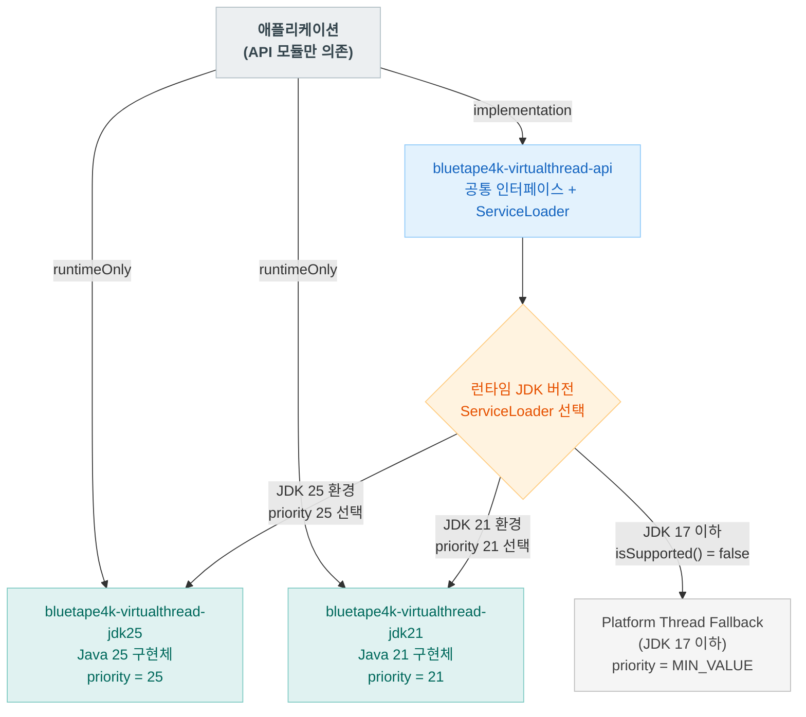
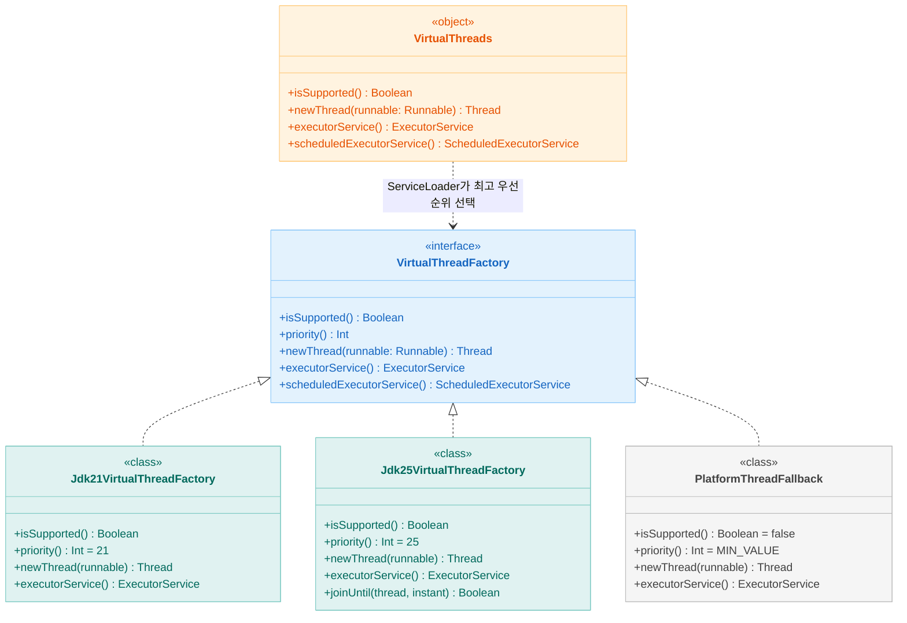
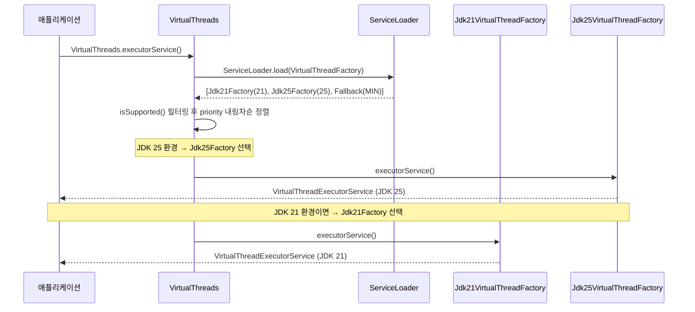

# Module bluetape4k-virtualthreads

[English](./README.md) | 한국어

Java 21/25를 같은 프로젝트에서 모듈 분리로 지원하기 위한 구조입니다.

## 아키텍처

### 모듈 구조 및 런타임 선택



---

### 클래스 다이어그램



---

### ServiceLoader 선택 시퀀스



---

## 모듈

- `bluetape4k-virtualthreads-api`
    - 공통 API 및 `ServiceLoader` 기반 런타임 선택기
- `bluetape4k-virtualthreads-jdk21`
    - Java 21 구현체
- `bluetape4k-virtualthreads-jdk25`
    - Java 25 구현체

## 주요 기능

- **ServiceLoader 기반 디스패치**: 런타임에 사용 가능한 가장 높은 우선순위 구현체를 자동 선택
- **Platform Thread 폴백**: JDK 17 이하에서는 플랫폼 스레드로 자연스럽게 대체
- **통합 API**: 애플리케이션 코드는 `api` 모듈에만 의존 — 런타임별 임포트 불필요
- **JDK 25 추가 기능**: `joinUntil(Instant)` — 데드라인까지 가상 스레드를 대기 (JDK 25 전용)

## 사용 방식

애플리케이션은 API 모듈을 기준으로 개발하고, 실행 환경에 맞는 구현 모듈을 classpath에 추가합니다.

```kotlin
import io.bluetape4k.concurrent.virtualthread.VirtualThreads

// 가상 스레드 Executor 생성
val executor = VirtualThreads.executorService()

// 단일 가상 스레드 시작
val thread = VirtualThreads.newThread {
    // 가상 스레드에서 실행
    println("Hello from virtual thread!")
}
thread.start()

// 런타임에 가상 스레드 지원 여부 확인
if (VirtualThreads.isSupported()) {
    println("가상 스레드 사용 가능")
}
```

### Gradle 의존성

```kotlin
// API만 (컴파일 타임)
implementation("io.github.bluetape4k:bluetape4k-virtualthread-api:${version}")

// 런타임 구현체 (JDK 버전에 맞는 것 추가)
runtimeOnly("io.github.bluetape4k:bluetape4k-virtualthread-jdk21:${version}")
// 또는
runtimeOnly("io.github.bluetape4k:bluetape4k-virtualthread-jdk25:${version}")
```

## 주의

- Java 21 런타임에서 Java 25 구현 모듈을 함께 classpath에 올리면 클래스 버전 충돌이 날 수 있습니다.
- 배포 시에는 런타임 버전에 맞는 구현 모듈만 포함하거나, 배포 파이프라인에서 JDK별 아티팩트를 분리하세요.
- `virtualthread-api`의 인터페이스를 추가/변경할 때는 `jdk21`과 `jdk25` 구현체를 반드시 같은 커밋에 함께 수정하세요.
