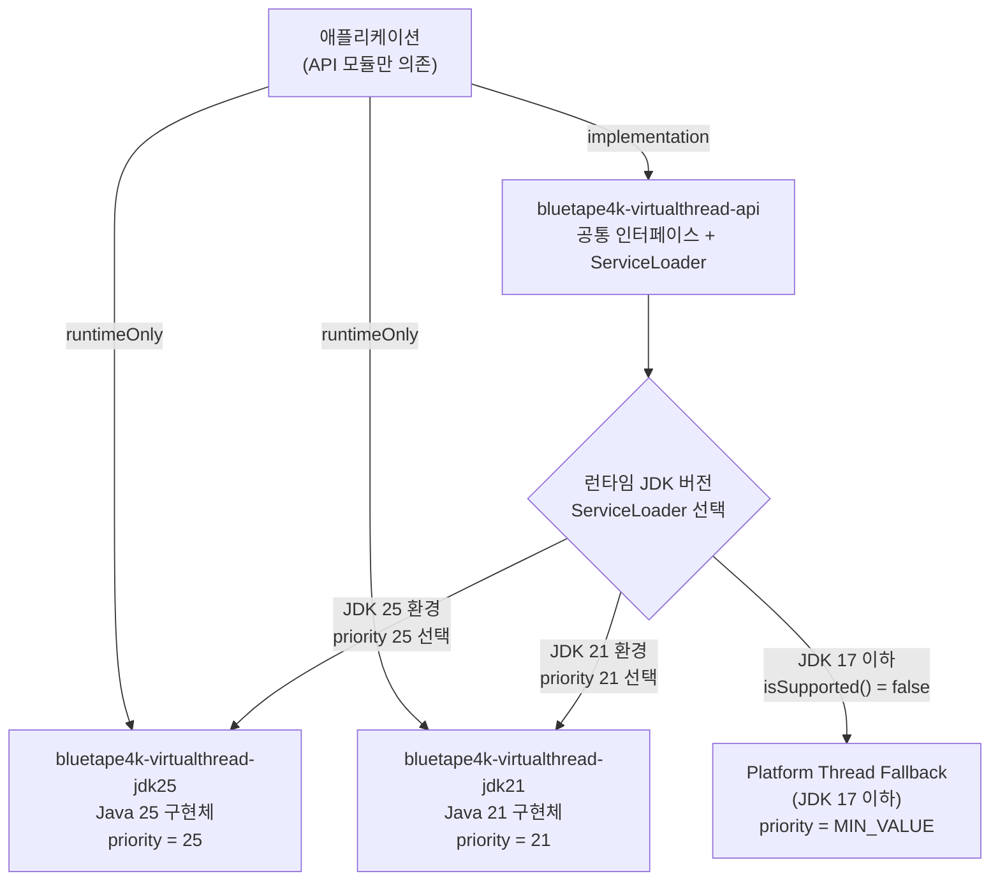

# Module bluetape4k-virtualthreads

[English](./README.md) | 한국어

Java 21/25를 같은 프로젝트에서 모듈 분리로 지원하기 위한 구조입니다.

## 모듈

- `bluetape4k-virtualthreads-api`
    - 공통 API 및 `ServiceLoader` 기반 런타임 선택기
- `bluetape4k-virtualthreads-jdk21`
    - Java 21 구현체
- `bluetape4k-virtualthreads-jdk25`
    - Java 25 구현체

## 사용 방식

애플리케이션은 API 모듈을 기준으로 개발하고, 실행 환경에 맞는 구현 모듈을 classpath에 추가합니다.

```kotlin
import io.bluetape4k.concurrent.virtualthread.VirtualThreads

val executor = VirtualThreads.executorService()
```

## 모듈 구조 및 런타임 선택



## 주의

- Java 21 런타임에서 Java 25 구현 모듈을 함께 classpath에 올리면 클래스 버전 충돌이 날 수 있습니다.
- 배포 시에는 런타임 버전에 맞는 구현 모듈만 포함하거나, 배포 파이프라인에서 JDK별 아티팩트를 분리하세요.
