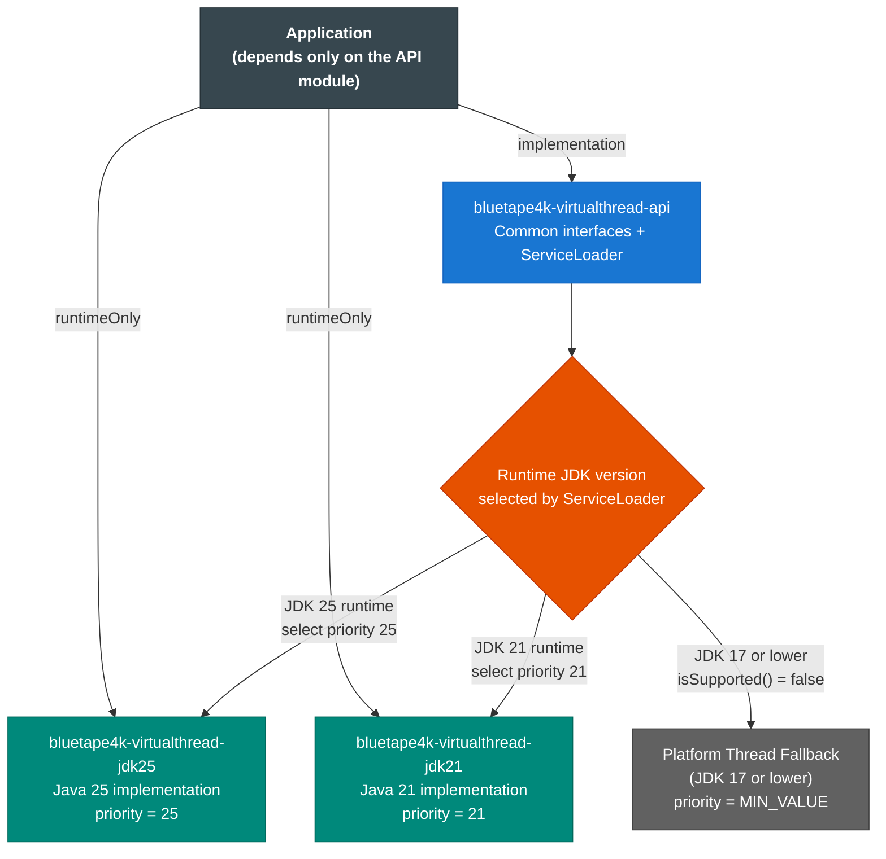
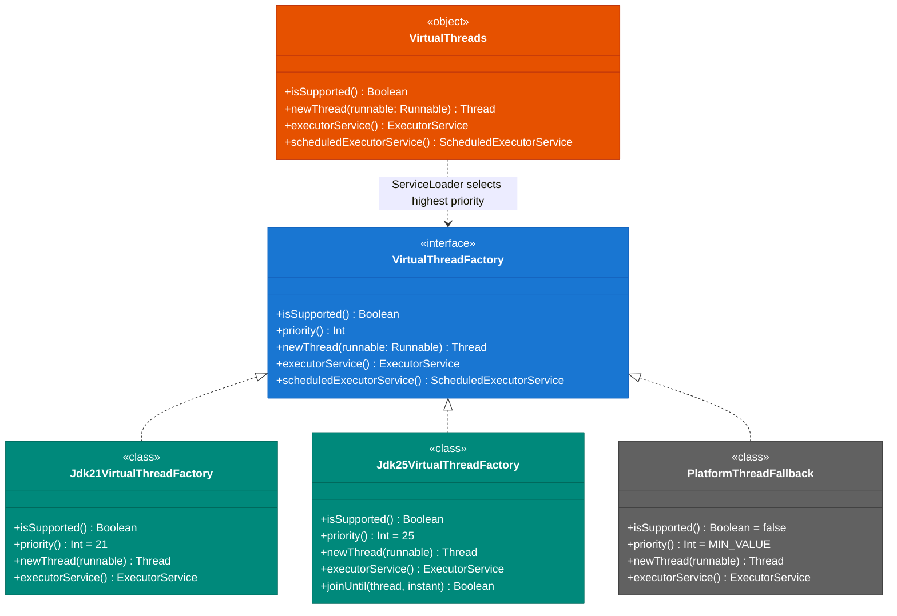
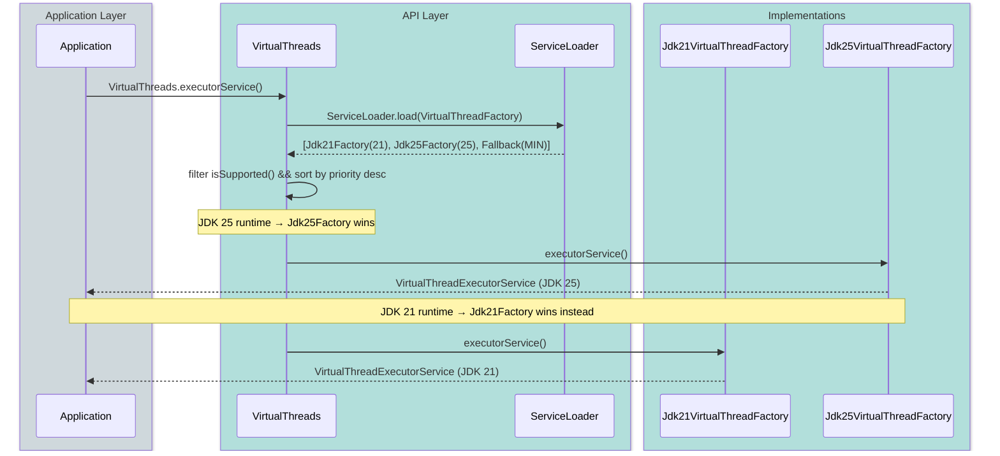

# Module bluetape4k-virtualthreads

English | [한국어](./README.ko.md)

This structure supports Java 21 and Java 25 in the same project by splitting the implementations into separate modules.

## Architecture

### Module Structure and Runtime Selection



---

### Class Diagram



---

### ServiceLoader Selection Sequence



---

## Modules

- `bluetape4k-virtualthreads-api`
    - shared API and a `ServiceLoader`-based runtime selector
- `bluetape4k-virtualthreads-jdk21`
    - Java 21 implementation
- `bluetape4k-virtualthreads-jdk25`
    - Java 25 implementation

## Key Features

- **ServiceLoader-based dispatch**: Automatically selects the highest-priority implementation available at runtime
- **Platform thread fallback**: Gracefully degrades to platform threads on JDK 17 and below
- **Unified API**: Application code depends only on the `api` module — no runtime-specific imports needed
- **JDK 25 extras**: `joinUntil(Instant)` — wait for a virtual thread until a deadline (JDK 25 only)

## Usage

Applications should depend on the API module and add the implementation module that matches the target runtime to the classpath.

```kotlin
import io.bluetape4k.concurrent.virtualthread.VirtualThreads

// Create a virtual thread executor
val executor = VirtualThreads.executorService()

// Start a single virtual thread
val thread = VirtualThreads.newThread {
    // runs on a virtual thread
    println("Hello from virtual thread!")
}
thread.start()

// Check if virtual threads are supported at runtime
if (VirtualThreads.isSupported()) {
    println("Virtual threads available")
}
```

### Gradle Dependency

```kotlin
// API only (compile time)
implementation("io.github.bluetape4k:bluetape4k-virtualthread-api:${version}")

// Runtime implementation (add the one matching your JDK)
runtimeOnly("io.github.bluetape4k:bluetape4k-virtualthread-jdk21:${version}")
// or
runtimeOnly("io.github.bluetape4k:bluetape4k-virtualthread-jdk25:${version}")
```

## Caution

- If you place the Java 25 implementation module on the classpath of a Java 21 runtime, you can run into class-version conflicts.
- During deployment, include only the implementation module that matches the target runtime, or split artifacts by JDK version in the deployment pipeline.
- When changing interfaces in `virtualthread-api`, always update **both** `jdk21` and
  `jdk25` implementations in the same commit.
