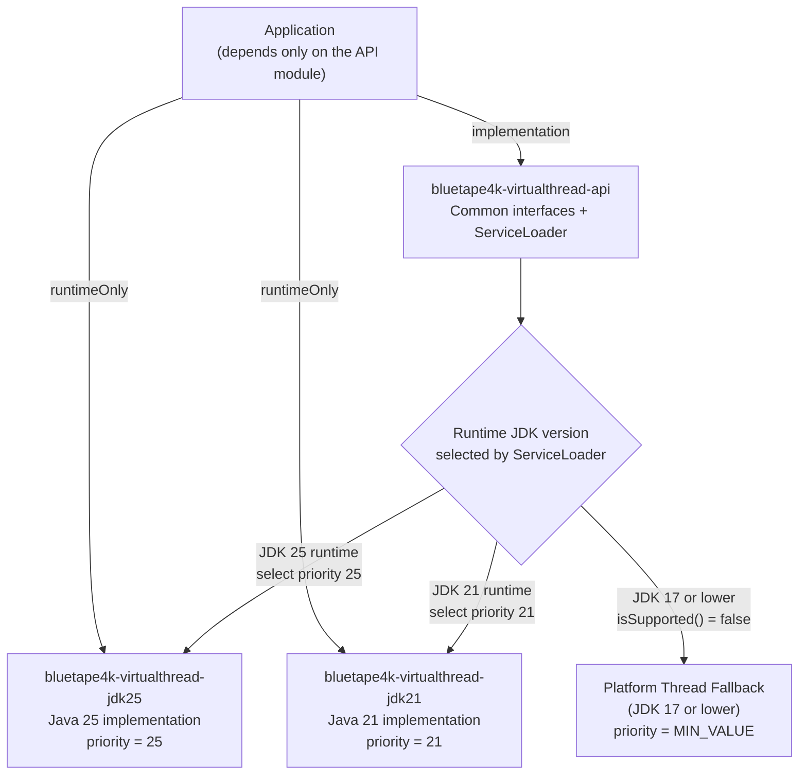

# Module bluetape4k-virtualthreads

English | [한국어](./README.ko.md)

This structure supports Java 21 and Java 25 in the same project by splitting the implementations into separate modules.

## Modules

- `bluetape4k-virtualthreads-api`
    - shared API and a `ServiceLoader`-based runtime selector
- `bluetape4k-virtualthreads-jdk21`
    - Java 21 implementation
- `bluetape4k-virtualthreads-jdk25`
    - Java 25 implementation

## Usage

Applications should depend on the API module and add the implementation module that matches the target runtime to the classpath.

```kotlin
import io.bluetape4k.concurrent.virtualthread.VirtualThreads

val executor = VirtualThreads.executorService()
```

## Module Structure and Runtime Selection



## Caution

- If you place the Java 25 implementation module on the classpath of a Java 21 runtime, you can run into class-version conflicts.
- During deployment, include only the implementation module that matches the target runtime, or split artifacts by JDK version in the deployment pipeline.
