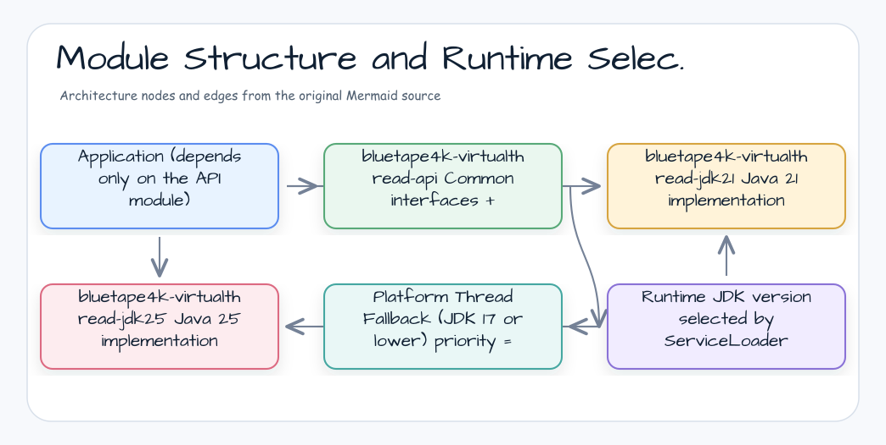
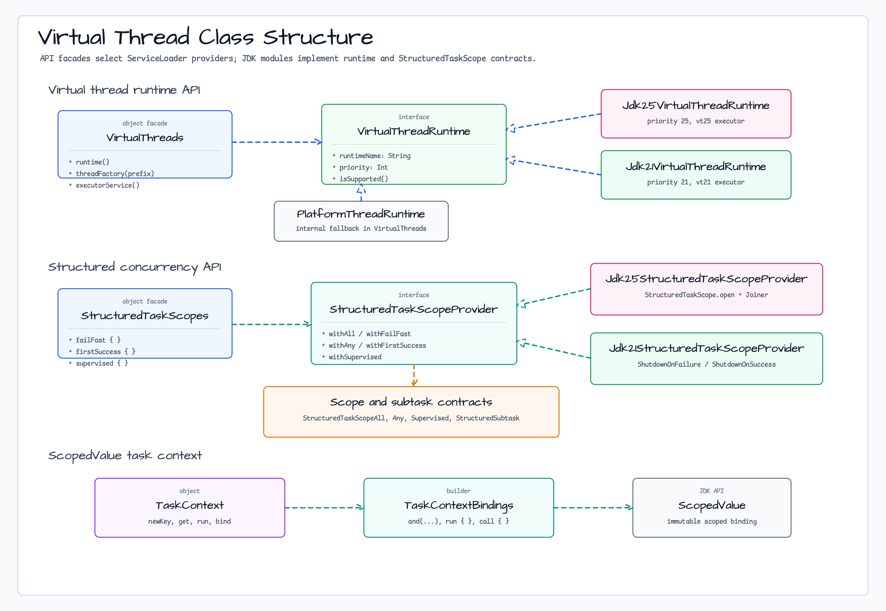
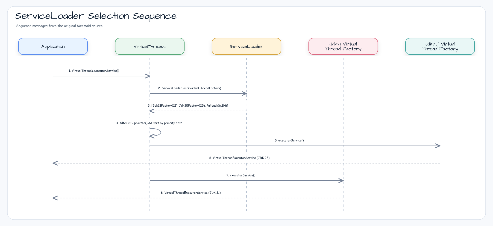

# Module bluetape4k-virtualthreads

English | [한국어](./README.ko.md)

This structure supports Java 21 and Java 25 in the same project by splitting the implementations into separate modules.

## Architecture

### Runtime Selection Flow



---

### Class Diagram



---

### ServiceLoader Selection Sequence



---

## Modules

- `bluetape4k-virtualthreads-api`
    - shared API and a `ServiceLoader`-based runtime selector
- `bluetape4k-virtualthreads-jdk21`
    - Java 21 implementation
- `bluetape4k-virtualthreads-jdk25`
    - Java 25 implementation

## Key Features

- **ServiceLoader-based dispatch**: Automatically selects the highest-priority implementation available at runtime
- **Platform thread fallback**: Gracefully degrades to platform threads on JDK 17 and below
- **Unified API**: Application code depends only on the `api` module — no runtime-specific imports needed
- **JDK 25 extras**: `joinUntil(Instant)` — wait for a virtual thread until a deadline (JDK 25 only)
- **TaskContext**: `ScopedValue`-based context propagation across `StructuredTaskScope.fork()` subtasks

## TaskContext — ScopedValue Context Propagation

`TaskContext` wraps `ScopedValue` to provide safe, immutable context propagation across virtual threads.
Unlike `ThreadLocal`, a `ScopedValue` binding is confined to its scope and never leaks.

> **Note**: Bindings are automatically inherited by threads created via `StructuredTaskScope.fork()`.
> Plain `Thread.ofVirtual().start {}` does **not** inherit bindings.

```kotlin
val REQUEST_ID: ScopedValue<String> = TaskContext.newKey()
val TENANT_ID:  ScopedValue<String> = TaskContext.newKey()

// Single binding — top-level style (preferred)
withTaskContext(REQUEST_ID, "req-001") {
    println(TaskContext.get(REQUEST_ID))  // "req-001"

    // Automatically propagated to forked subtasks
    StructuredTaskScopes.failFast { scope ->
        val result = scope.fork { TaskContext.get(REQUEST_ID) }
        scope.join().throwIfFailed()
        result.get()  // "req-001"
    }
}

// Single binding — member function style
TaskContext.run(REQUEST_ID, "req-001") {
    println(TaskContext.get(REQUEST_ID))  // "req-001"
}

// Multiple bindings
TaskContext.bind(REQUEST_ID, "req-001")
    .and(TENANT_ID, "tenant-42")
    .run {
        println(TaskContext.get(REQUEST_ID))  // "req-001"
        println(TaskContext.get(TENANT_ID))   // "tenant-42"
    }

// With supervised scope — collect Result<T> per subtask
val results: List<Result<String>> =
    withTaskContext(REQUEST_ID, "req-001") {
        StructuredTaskScopes.supervised<String, List<Result<String>>> { scope ->
            scope.fork { TaskContext.get(REQUEST_ID) ?: "" }
            scope.fork { TaskContext.get(REQUEST_ID) ?: "" }
            scope.join()
            scope.results()
        }
    }
```

| API | Description |
|-----|-------------|
| `TaskContext.newKey<T>()` | Create a new type-safe `ScopedValue` key |
| `TaskContext.get(key)` | Get the bound value, or `null` if unbound |
| `TaskContext.getOrDefault(key, default)` | Get the bound value with a fallback |
| `TaskContext.isBound(key)` | Check if a key is bound in the current scope |
| `TaskContext.run(key, value) {}` | Single-binding scope block |
| `withTaskContext(key, value) {}` | Top-level alias for `TaskContext.run` |
| `TaskContext.bind(key, value).and(...).run {}` | Multi-binding scope block |

## Usage

Applications should depend on the API module and add the implementation module that matches the target runtime to the classpath.

```kotlin
import io.bluetape4k.concurrent.virtualthread.VirtualThreads

// Create a virtual thread executor
val executor = VirtualThreads.executorService()

// Start a single virtual thread
val thread = VirtualThreads.newThread {
    // runs on a virtual thread
    println("Hello from virtual thread!")
}
thread.start()

// Check if virtual threads are supported at runtime
if (VirtualThreads.isSupported()) {
    println("Virtual threads available")
}
```

### Gradle Dependency

```kotlin
// API only (compile time)
implementation("io.github.bluetape4k:bluetape4k-virtualthread-api:${version}")

// Runtime implementation (add the one matching your JDK)
runtimeOnly("io.github.bluetape4k:bluetape4k-virtualthread-jdk21:${version}")
// or
runtimeOnly("io.github.bluetape4k:bluetape4k-virtualthread-jdk25:${version}")
```

## Caution

- If you place the Java 25 implementation module on the classpath of a Java 21 runtime, you can run into class-version conflicts.
- During deployment, include only the implementation module that matches the target runtime, or split artifacts by JDK version in the deployment pipeline.
- When changing interfaces in `virtualthread-api`, always update **both** `jdk21` and
  `jdk25` implementations in the same commit.
