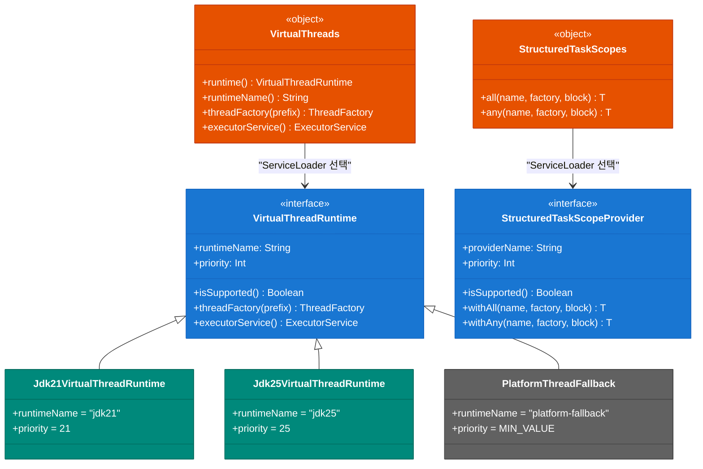
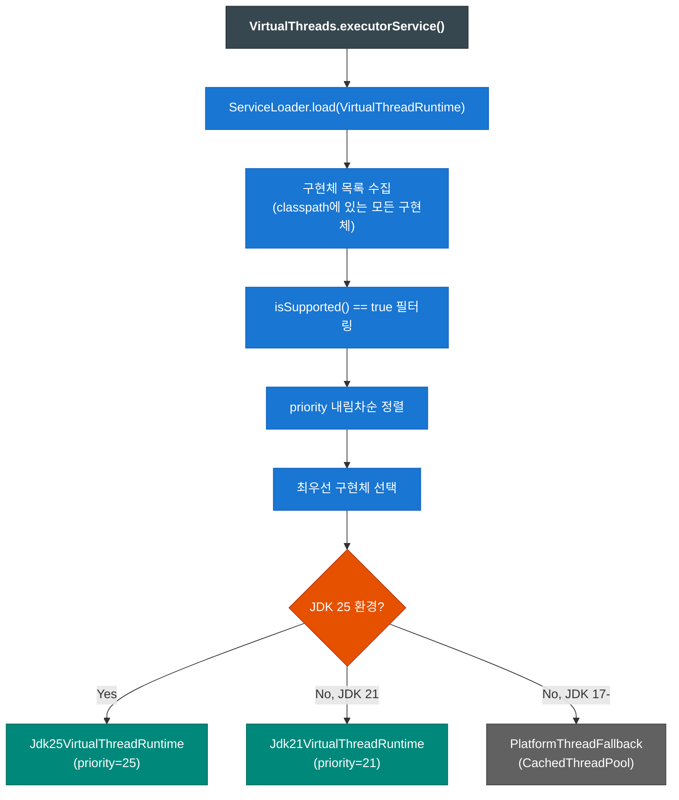

# Module bluetape4k-virtualthread-api

[English](./README.md) | 한국어

Virtual Thread 기능을 JDK 버전에 독립적으로 사용할 수 있도록 추상화한 API 모듈입니다.

## 개요

Java 21부터 정식 도입된 Virtual Thread는 기존 Platform Thread에 비해 훨씬 가벼운 경량 스레드입니다. 이 모듈은 JDK 21과 JDK 25의 Virtual Thread 구현체를 ServiceLoader 패턴을 통해 런타임에 자동으로 선택하여 사용할 수 있도록 지원합니다.

## 주요 기능

### 1. VirtualThreads - 런타임 선택 및 Executor 생성

현재 JVM 런타임에 맞는 Virtual Thread 구현체를 자동으로 선택하여 사용합니다.

```kotlin
import io.bluetape4k.concurrent.virtualthread.VirtualThreads

// 현재 런타임 확인
val runtimeName = VirtualThreads.runtimeName() // "jdk21" 또는 "jdk25"

// Virtual Thread Factory 생성
val factory = VirtualThreads.threadFactory(prefix = "my-vt-")

// Virtual Thread ExecutorService 생성
val executor = VirtualThreads.executorService()
executor.submit {
    println("Running on virtual thread: ${Thread.currentThread()}")
}
```

### 2. VirtualThreadRuntime - 구현체 인터페이스

JDK별 Virtual Thread 구현체가 구현해야 하는 인터페이스입니다.

```kotlin
interface VirtualThreadRuntime {
    val runtimeName: String        // 구현체 이름 (예: "jdk21")
    val priority: Int               // 우선순위 (높을수록 우선 선택)

    fun isSupported(): Boolean      // 현재 런타임에서 사용 가능한지 확인
    fun threadFactory(prefix: String): ThreadFactory
    fun executorService(): ExecutorService
}
```

### 3. StructuredTaskScopes - 구조화된 동시성 (Structured Concurrency)

Java의 StructuredTaskScope API를 추상화하여 JDK 버전에 관계없이 사용할 수 있습니다.

#### ShutdownOnFailure 패턴 (All)

모든 서브태스크가 성공해야 하며, 하나라도 실패하면 전체 스코프가 중단됩니다.

```kotlin
import io.bluetape4k.concurrent.virtualthread.StructuredTaskScopes

val results = StructuredTaskScopes.all(
    name = "fetch-all-data",
    factory = VirtualThreads.threadFactory("data-")
) { scope ->
    val task1 = scope.fork { fetchUserData() }
    val task2 = scope.fork { fetchOrderData() }
    val task3 = scope.fork { fetchInventoryData() }

    scope.join()
        .throwIfFailed { error ->
            println("Failed: ${error.message}")
        }

    Triple(task1.get(), task2.get(), task3.get())
}
```

#### ShutdownOnSuccess 패턴 (Any)

여러 서브태스크 중 하나라도 성공하면 나머지는 중단됩니다.

```kotlin
val fastestResult = StructuredTaskScopes.any<String>(
    name = "race-apis",
    factory = VirtualThreads.threadFactory("api-")
) { scope ->
    scope.fork { fetchFromApi1() }
    scope.fork { fetchFromApi2() }
    scope.fork { fetchFromApi3() }

    scope.join()
        .result { error -> RuntimeException("All APIs failed", error) }
}
```

## ServiceLoader 메커니즘

이 API 모듈은 `java.util.ServiceLoader`를 사용하여 JDK별 구현체를 동적으로 로드합니다.

### 구현체 등록

각 JDK 구현 모듈(`jdk21`, `jdk25`)은 다음 파일들을 제공해야 합니다:

*META-INF/services/io.bluetape4k.concurrent.virtualthread.VirtualThreadRuntime*

```
io.bluetape4k.concurrent.virtualthread.jdk21.Jdk21VirtualThreadRuntime
```

*META-INF/services/io.bluetape4k.concurrent.virtualthread.StructuredTaskScopeProvider*

```
io.bluetape4k.concurrent.virtualthread.jdk21.Jdk21StructuredTaskScopeProvider
```

### 우선순위 기반 선택

- JDK 25 구현체: `priority = 25`
- JDK 21 구현체: `priority = 21`
- Platform Thread Fallback: `priority = Int.MIN_VALUE`

런타임에서 `isSupported()`가 `true`를 반환하는 구현체 중 우선순위가 가장 높은 것이 선택됩니다.

## 의존성

```kotlin
dependencies {
    implementation("io.github.bluetape4k:bluetape4k-virtualthread-api")

    // 런타임에 맞는 구현체 선택
    runtimeOnly("io.github.bluetape4k:bluetape4k-virtualthread-jdk21")  // JDK 21 사용 시
    // 또는
    runtimeOnly("io.github.bluetape4k:bluetape4k-virtualthread-jdk25")  // JDK 25 사용 시
}
```

## Fallback 메커니즘

적합한 Virtual Thread 구현체가 없는 경우(예: JDK 17), 자동으로 Platform Thread 기반의 Fallback 구현체가 사용됩니다.

```kotlin
// JDK 17 환경에서 실행 시
VirtualThreads.runtimeName() // "platform-fallback"
VirtualThreads.executorService() // Executors.newCachedThreadPool() 반환
```

## 테스트

```kotlin
class VirtualThreadsTest {
    @Test
    fun `should select appropriate runtime`() {
        val runtime = VirtualThreads.runtime()
        println("Runtime: ${runtime.runtimeName}")

        runtime.isSupported() shouldBe true
    }

    @Test
    fun `should create virtual thread executor`() {
        val executor = VirtualThreads.executorService()
        val latch = CountDownLatch(10)

        repeat(10) {
            executor.submit {
                println("Task $it on ${Thread.currentThread()}")
                latch.countDown()
            }
        }

        latch.await(5, TimeUnit.SECONDS) shouldBe true
    }
}
```

## 클래스 다이어그램



## ServiceLoader 기반 런타임 선택 흐름



## 참고 자료

- [JEP 444: Virtual Threads (Java 21)](https://openjdk.org/jeps/444)
- [JEP 462: Structured Concurrency (Second Preview, Java 21)](https://openjdk.org/jeps/462)
- [Java ServiceLoader Documentation](https://docs.oracle.com/en/java/javase/21/docs/api/java.base/java/util/ServiceLoader.html)
