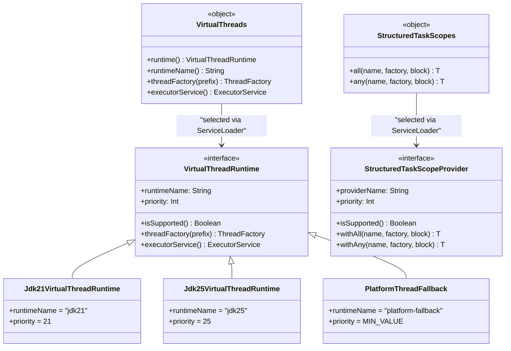
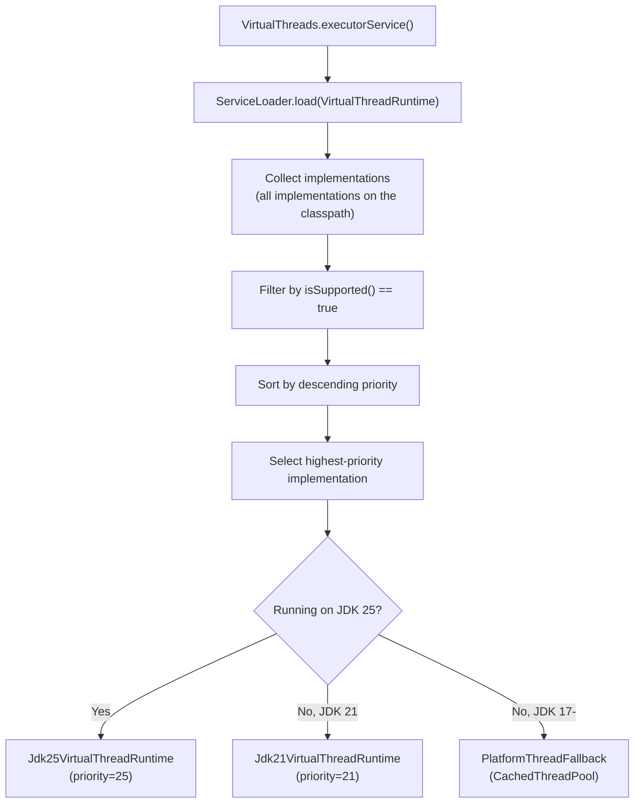

# Module bluetape4k-virtualthread-api

English | [한국어](./README.ko.md)

An API module that abstracts virtual-thread features so they can be used independently of the concrete JDK version.

## Overview

Virtual Threads, officially introduced in Java 21, are much lighter-weight than traditional platform threads. This module automatically selects the JDK 21 or JDK 25 virtual-thread implementation at runtime through `ServiceLoader`.

## Key Features

### 1. `VirtualThreads` - Runtime Selection and Executor Creation

Automatically selects the appropriate Virtual Thread implementation for the current JVM runtime.

```kotlin
import io.bluetape4k.concurrent.virtualthread.VirtualThreads

// Check the current runtime
val runtimeName = VirtualThreads.runtimeName() // "jdk21" or "jdk25"

// Create a Virtual Thread factory
val factory = VirtualThreads.threadFactory(prefix = "my-vt-")

// Create a Virtual Thread ExecutorService
val executor = VirtualThreads.executorService()
executor.submit {
    println("Running on virtual thread: ${Thread.currentThread()}")
}
```

### 2. `VirtualThreadRuntime` - Implementation Interface

This interface must be implemented by each JDK-specific Virtual Thread runtime.

```kotlin
interface VirtualThreadRuntime {
    val runtimeName: String        // implementation name (for example, "jdk21")
    val priority: Int              // higher values are selected first

    fun isSupported(): Boolean     // whether the current runtime can use this implementation
    fun threadFactory(prefix: String): ThreadFactory
    fun executorService(): ExecutorService
}
```

### 3. `StructuredTaskScopes` - Structured Concurrency

Abstracts Java's `StructuredTaskScope` API so it can be used consistently across JDK versions.

#### `ShutdownOnFailure` Pattern (`all`)

All subtasks must succeed. If any subtask fails, the entire scope is cancelled.

```kotlin
import io.bluetape4k.concurrent.virtualthread.StructuredTaskScopes

val results = StructuredTaskScopes.all(
    name = "fetch-all-data",
    factory = VirtualThreads.threadFactory("data-")
) { scope ->
    val task1 = scope.fork { fetchUserData() }
    val task2 = scope.fork { fetchOrderData() }
    val task3 = scope.fork { fetchInventoryData() }

    scope.join()
        .throwIfFailed { error ->
            println("Failed: ${error.message}")
        }

    Triple(task1.get(), task2.get(), task3.get())
}
```

#### `ShutdownOnSuccess` Pattern (`any`)

As soon as one of the subtasks succeeds, the remaining subtasks are cancelled.

```kotlin
val fastestResult = StructuredTaskScopes.any<String>(
    name = "race-apis",
    factory = VirtualThreads.threadFactory("api-")
) { scope ->
    scope.fork { fetchFromApi1() }
    scope.fork { fetchFromApi2() }
    scope.fork { fetchFromApi3() }

    scope.join()
        .result { error -> RuntimeException("All APIs failed", error) }
}
```

## `ServiceLoader` Mechanism

This API module uses `java.util.ServiceLoader` to load JDK-specific implementations dynamically.

### Implementation Registration

Each JDK runtime module (`jdk21`, `jdk25`) must provide the following files:

*META-INF/services/io.bluetape4k.concurrent.virtualthread.VirtualThreadRuntime*

```
io.bluetape4k.concurrent.virtualthread.jdk21.Jdk21VirtualThreadRuntime
```

*META-INF/services/io.bluetape4k.concurrent.virtualthread.StructuredTaskScopeProvider*

```
io.bluetape4k.concurrent.virtualthread.jdk21.Jdk21StructuredTaskScopeProvider
```

### Priority-Based Selection

- JDK 25 implementation: `priority = 25`
- JDK 21 implementation: `priority = 21`
- Platform Thread fallback: `priority = Int.MIN_VALUE`

At runtime, the implementation with the highest priority among those that return `true` from `isSupported()` is selected.

## Dependency

```kotlin
dependencies {
    implementation("io.github.bluetape4k:bluetape4k-virtualthread-api")

    // Choose the runtime implementation that matches the deployment JDK
    runtimeOnly("io.github.bluetape4k:bluetape4k-virtualthread-jdk21")  // for JDK 21
    // or
    runtimeOnly("io.github.bluetape4k:bluetape4k-virtualthread-jdk25")  // for JDK 25
}
```

## Fallback Mechanism

If no suitable Virtual Thread implementation is available, for example on JDK 17, the module automatically falls back to a platform-thread-based implementation.

```kotlin
// When running on JDK 17
VirtualThreads.runtimeName() // "platform-fallback"
VirtualThreads.executorService() // returns Executors.newCachedThreadPool()
```

## Tests

```kotlin
class VirtualThreadsTest {
    @Test
    fun `should select appropriate runtime`() {
        val runtime = VirtualThreads.runtime()
        println("Runtime: ${runtime.runtimeName}")

        runtime.isSupported() shouldBe true
    }

    @Test
    fun `should create virtual thread executor`() {
        val executor = VirtualThreads.executorService()
        val latch = CountDownLatch(10)

        repeat(10) {
            executor.submit {
                println("Task $it on ${Thread.currentThread()}")
                latch.countDown()
            }
        }

        latch.await(5, TimeUnit.SECONDS) shouldBe true
    }
}
```

## Class Diagram



## `ServiceLoader`-Based Runtime Selection Flow



## References

- [JEP 444: Virtual Threads (Java 21)](https://openjdk.org/jeps/444)
- [JEP 462: Structured Concurrency (Second Preview, Java 21)](https://openjdk.org/jeps/462)
- [Java ServiceLoader Documentation](https://docs.oracle.com/en/java/javase/21/docs/api/java.base/java/util/ServiceLoader.html)
