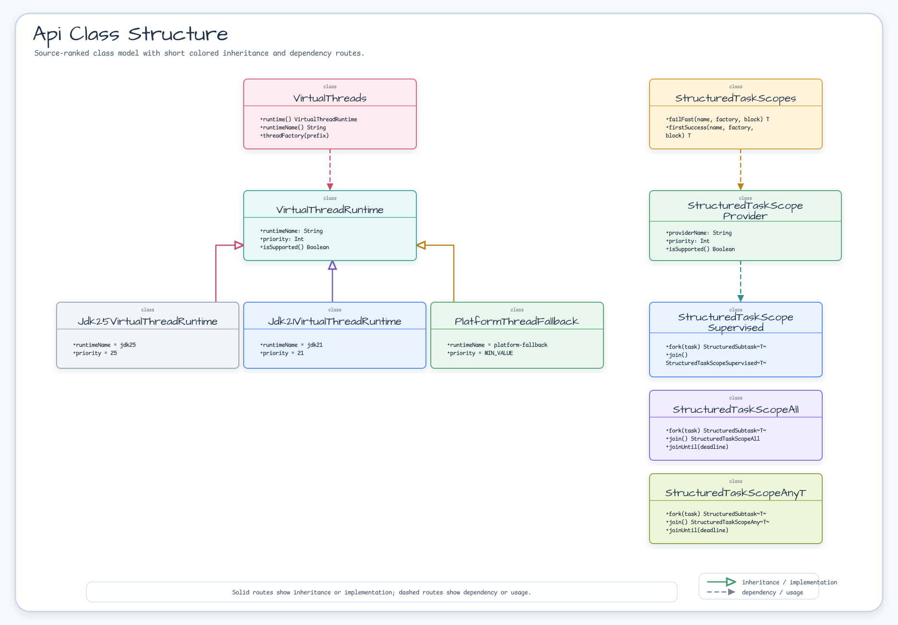
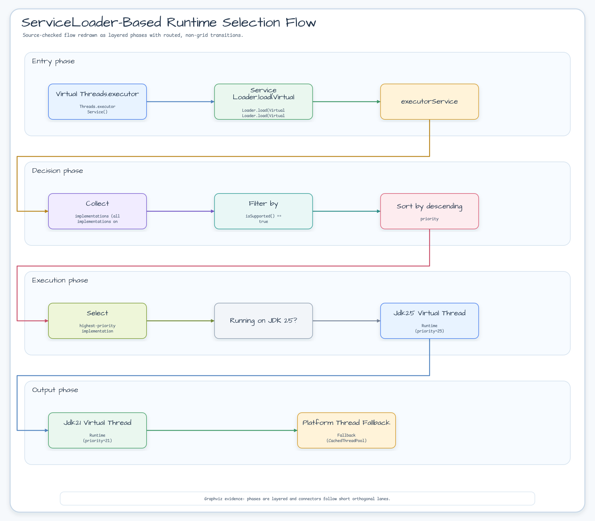

# Module bluetape4k-virtualthread-api

English | [한국어](./README.ko.md)

An API module that abstracts virtual-thread features so they can be used independently of the concrete JDK version.

## Overview

Virtual Threads, officially introduced in Java 21, are much lighter-weight than traditional platform threads. This module automatically selects the JDK 21 or JDK 25 virtual-thread implementation at runtime through
`ServiceLoader`.

## Key Features

### 1. `VirtualThreads` - Runtime Selection and Executor Creation

Automatically selects the appropriate Virtual Thread implementation for the current JVM runtime.

```kotlin
import io.bluetape4k.concurrent.virtualthread.VirtualThreads

// Check the current runtime
val runtimeName = VirtualThreads.runtimeName() // "jdk21" or "jdk25"

// Create a Virtual Thread factory
val factory = VirtualThreads.threadFactory(prefix = "my-vt-")

// Create a Virtual Thread ExecutorService
val executor = VirtualThreads.executorService()
executor.submit {
    println("Running on virtual thread: ${Thread.currentThread()}")
}
```

### 2. `VirtualThreadRuntime` - Implementation Interface

This interface must be implemented by each JDK-specific Virtual Thread runtime.

```kotlin
interface VirtualThreadRuntime {
    val runtimeName: String        // implementation name (for example, "jdk21")
    val priority: Int              // higher values are selected first

    fun isSupported(): Boolean     // whether the current runtime can use this implementation
    fun threadFactory(prefix: String): ThreadFactory
    fun executorService(): ExecutorService
}
```

### 3. `StructuredTaskScopes` - Structured Concurrency

Abstracts Java's `StructuredTaskScope` API so it can be used consistently across JDK versions.

#### Choosing the Right API

```
Need all subtasks to succeed?
  └─ Yes → failFast { }        (cancels others on first failure)
Need the first success?
  └─ Yes → firstSuccess { }    (cancels others on first success)
Need partial failure tolerance (collect success + failure separately)?
  └─ Yes → supervised { }      (all run to completion; results split)
```

#### `failFast` — All Must Succeed

All subtasks must succeed. If any subtask fails, the rest are cancelled immediately.

```kotlin
import io.bluetape4k.concurrent.virtualthread.StructuredTaskScopes

val results = StructuredTaskScopes.failFast { scope ->
    val task1 = scope.fork { fetchUserData() }
    val task2 = scope.fork { fetchOrderData() }
    val task3 = scope.fork { fetchInventoryData() }

    scope.join().throwIfFailed()
    Triple(task1.get(), task2.get(), task3.get())
}
```

#### `firstSuccess` — First Winner Takes All

Returns the result of the first subtask to succeed. Remaining subtasks are cancelled.

```kotlin
val fastestResult = StructuredTaskScopes.firstSuccess<String> { scope ->
    scope.fork { fetchFromApi1() }
    scope.fork { fetchFromApi2() }
    scope.fork { fetchFromApi3() }

    scope.join().result { error -> RuntimeException("All APIs failed", error) }
}
```

#### `supervised` — Partial Failure Tolerance

Runs all subtasks to completion regardless of individual failures. Results are split into successful results and failed exceptions.

```kotlin
val (successes, errors) = StructuredTaskScopes.supervised<String, Pair<List<String>, List<Throwable>>> { scope ->
    scope.fork { fetchFromPrimaryDb() }   // may succeed
    scope.fork { fetchFromReplicaDb() }   // may fail
    scope.fork { fetchFromCacheDb() }     // may succeed
    scope.join()
    scope.successfulResults() to scope.failedExceptions()
}
// successes: results from tasks that completed normally
// errors: exceptions from tasks that failed
println("Got ${successes.size} results, ${errors.size} failures")
```

With `joinUntil` deadline:

```kotlin
// Supervised scope — all 3 scope types support joinUntil
StructuredTaskScopes.supervised<String, Unit> { scope ->
    scope.fork { longRunningTask() }
    scope.joinUntil(Instant.now().plusSeconds(5))  // TimeoutException if exceeded
    val results = scope.successfulResults()
    val failures = scope.failedExceptions()
}

// failFast (all-scope) with deadline
StructuredTaskScopes.failFast { scope ->
    scope.fork { processA() }
    scope.fork { processB() }
    scope.joinUntil(Instant.now().plusSeconds(10))
        .throwIfFailed()
}

// firstSuccess (any-scope) with deadline
StructuredTaskScopes.firstSuccess<String> { scope ->
    scope.fork { slowTask() }
    scope.fork { fastTask() }
    scope.joinUntil(Instant.now().plusMillis(500))
        .result { RuntimeException("All tasks failed or timed out", it) }
}
```

#### `getOrNull()` — Safe Result Access

`StructuredSubtask.getOrNull()` returns `null` instead of throwing when called before `join()` or when the subtask failed/was cancelled.

```kotlin
StructuredTaskScopes.failFast { scope ->
    val task = scope.fork { 42 }
    scope.join().throwIfFailed()
    task.getOrNull()   // 42 (SUCCESS state)
    // or null if FAILED / UNAVAILABLE
}
```

#### Deprecated APIs

`all()` and `any()` are deprecated. Migrate as follows:

| Before | After |
|--------|-------|
| `StructuredTaskScopes.all(...) { }` | `StructuredTaskScopes.failFast { }` |
| `StructuredTaskScopes.any(...) { }` | `StructuredTaskScopes.firstSuccess { }` |

## `ServiceLoader` Mechanism

This API module uses `java.util.ServiceLoader` to load JDK-specific implementations dynamically.

### Implementation Registration

Each JDK runtime module (`jdk21`, `jdk25`) must provide the following files:

*META-INF/services/io.bluetape4k.concurrent.virtualthread.VirtualThreadRuntime*

```
io.bluetape4k.concurrent.virtualthread.jdk21.Jdk21VirtualThreadRuntime
```

*META-INF/services/io.bluetape4k.concurrent.virtualthread.StructuredTaskScopeProvider*

```
io.bluetape4k.concurrent.virtualthread.jdk21.Jdk21StructuredTaskScopeProvider
```

### Priority-Based Selection

- JDK 25 implementation: `priority = 25`
- JDK 21 implementation: `priority = 21`
- Platform Thread fallback: `priority = Int.MIN_VALUE`

At runtime, the implementation with the highest priority among those that return `true` from
`isSupported()` is selected.

## Dependency

```kotlin
dependencies {
    implementation("io.github.bluetape4k:bluetape4k-virtualthread-api")

    // Choose the runtime implementation that matches the deployment JDK
    runtimeOnly("io.github.bluetape4k:bluetape4k-virtualthread-jdk21")  // for JDK 21
    // or
    runtimeOnly("io.github.bluetape4k:bluetape4k-virtualthread-jdk25")  // for JDK 25
}
```

## Fallback Mechanism

If no suitable Virtual Thread implementation is available, for example on JDK 17, the module automatically falls back to a platform-thread-based implementation.

```kotlin
// When running on JDK 17
VirtualThreads.runtimeName() // "platform-fallback"
VirtualThreads.executorService() // returns Executors.newCachedThreadPool()
```

## Tests

```kotlin
class VirtualThreadsTest {
    @Test
    fun `should select appropriate runtime`() {
        val runtime = VirtualThreads.runtime()
        println("Runtime: ${runtime.runtimeName}")

        runtime.isSupported() shouldBe true
    }

    @Test
    fun `should create virtual thread executor`() {
        val executor = VirtualThreads.executorService()
        val latch = CountDownLatch(10)

        repeat(10) {
            executor.submit {
                println("Task $it on ${Thread.currentThread()}")
                latch.countDown()
            }
        }

        latch.await(5, TimeUnit.SECONDS) shouldBe true
    }
}
```

## Class Diagram



## `ServiceLoader`-Based Runtime Selection Flow



## References

- [JEP 444: Virtual Threads (Java 21)](https://openjdk.org/jeps/444)
- [JEP 462: Structured Concurrency (Second Preview, Java 21)](https://openjdk.org/jeps/462)
- [Java ServiceLoader Documentation](https://docs.oracle.com/en/java/javase/21/docs/api/java.base/java/util/ServiceLoader.html)
