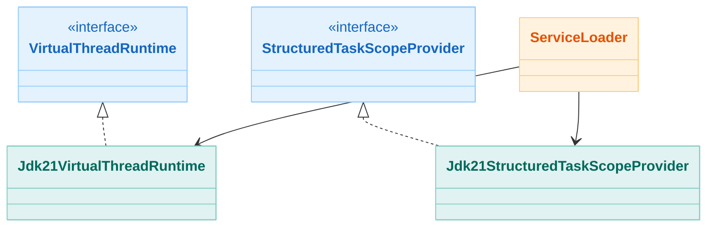

# Module bluetape4k-virtualthread-jdk21

English | [한국어](./README.ko.md)

Java 21 virtual-thread implementation module.

## Overview

This module implements the interfaces defined by
`bluetape4k-virtualthread-api` for Java 21. It is loaded automatically through
`ServiceLoader` and becomes active on JDK 21 or newer.

## UML



## Main Implementations

### `Jdk21VirtualThreadRuntime`

Implements the `VirtualThreadRuntime` interface using the Java 21 Virtual Thread API.

```java
public final class Jdk21VirtualThreadRuntime implements VirtualThreadRuntime {
    @Override
    public String getRuntimeName() {
        return "jdk21";
    }

    @Override
    public int getPriority() {
        return 21;  // lower priority than the JDK 25 implementation
    }

    @Override
    public boolean isSupported() {
        return Runtime.version().feature() >= 21;
    }

    @Override
    public ThreadFactory threadFactory(String prefix) {
        return Thread.ofVirtual().name(prefix, 0).factory();
    }

    @Override
    public ExecutorService executorService() {
        return Executors.newThreadPerTaskExecutor(threadFactory("vt21-"));
    }
}
```

### `Jdk21StructuredTaskScopeProvider`

Provides structured concurrency by using Java 21's `StructuredTaskScope` API.

```kotlin
class Jdk21StructuredTaskScopeProvider: StructuredTaskScopeProvider {
    override val providerName = "jdk21"
    override val priority = 21

    override fun isSupported(): Boolean {
        return Runtime.version().feature() >= 21
    }

    override fun <T> withAll(
        name: String?,
        factory: ThreadFactory,
        block: (scope: StructuredTaskScopeAll) -> T
    ): T {
        // wrapper around StructuredTaskScope.ShutdownOnFailure
    }

    override fun <T> withAny(
        name: String?,
        factory: ThreadFactory,
        block: (scope: StructuredTaskScopeAny<T>) -> T
    ): T {
        // wrapper around StructuredTaskScope.ShutdownOnSuccess
    }
}
```

## `ServiceLoader` Configuration

This module contains the following `ServiceLoader` configuration files:

*src/main/resources/META-INF/services/io.bluetape4k.concurrent.virtualthread.VirtualThreadRuntime*

```
io.bluetape4k.concurrent.virtualthread.jdk21.Jdk21VirtualThreadRuntime
```

*src/main/resources/META-INF/services/io.bluetape4k.concurrent.virtualthread.StructuredTaskScopeProvider*

```
io.bluetape4k.concurrent.virtualthread.jdk21.Jdk21StructuredTaskScopeProvider
```

## Build Configuration

This module is built with the Java 21 toolchain.

```kotlin
java {
    toolchain {
        languageVersion.set(JavaLanguageVersion.of(21))
    }
}

kotlin {
    jvmToolchain(21)
}

tasks.withType<JavaCompile>().configureEach {
    options.release.set(21)
}
```

## Dependencies

### Project Dependencies

```kotlin
dependencies {
    api(project(":bluetape4k-virtualthread-api"))
    implementation(project(":bluetape4k-logging"))
    implementation(Libs.kotlinx_coroutines_core)

    testImplementation(project(":bluetape4k-junit5"))
    testImplementation(Libs.kotlinx_coroutines_test)
}
```

### Gradle Usage Example

```kotlin
dependencies {
    // API module
    implementation("io.github.bluetape4k:bluetape4k-virtualthread-api:$version")

    // JDK 21 implementation (for JDK 21 environments)
    runtimeOnly("io.github.bluetape4k:bluetape4k-virtualthread-jdk21:$version")
}
```

## Usage Example

Because this module is loaded automatically at runtime, application code only needs to use the API module.

```kotlin
import io.bluetape4k.concurrent.virtualthread.VirtualThreads
import io.bluetape4k.concurrent.virtualthread.StructuredTaskScopes

fun main() {
    // When running on JDK 21, Jdk21VirtualThreadRuntime is selected automatically
    println("Runtime: ${VirtualThreads.runtimeName()}") // "jdk21"

    // Create a Virtual Thread executor
    val executor = VirtualThreads.executorService()
    executor.submit {
        println("Running on: ${Thread.currentThread()}")
    }

    // Use structured concurrency
    val results = StructuredTaskScopes.all(
        name = "parallel-tasks",
        factory = VirtualThreads.threadFactory()
    ) { scope ->
        val task1 = scope.fork { heavyComputation1() }
        val task2 = scope.fork { heavyComputation2() }

        scope.join().throwIfFailed()

        task1.get() to task2.get()
    }
}
```

## Tests

```kotlin
class Jdk21VirtualThreadRuntimeTest {
    private val runtime = Jdk21VirtualThreadRuntime()

    @Test
    fun `should be supported on JDK 21+`() {
        runtime.isSupported() shouldBe true
        runtime.runtimeName shouldBe "jdk21"
        runtime.priority shouldBe 21
    }

    @Test
    fun `should create virtual thread factory`() {
        val factory = runtime.threadFactory("test-")
        val thread = factory.newThread { }

        thread.isVirtual shouldBe true
        thread.name shouldStartWith "test-"
    }

    @Test
    fun `should create executor service`() {
        val executor = runtime.executorService()
        val future = executor.submit {
            Thread.currentThread().isVirtual
        }

        future.get() shouldBe true
    }
}
```

## JDK Version Compatibility

| JDK Version     | Supported | Activation Condition                                           |
|-----------------|-----------|----------------------------------------------------------------|
| JDK 17 or lower | ❌         | `isSupported()` returns `false`                                |
| JDK 21          | ✅         | activated automatically if the JDK 25 implementation is absent |
| JDK 25          | ✅         | the JDK 25 implementation is selected first                    |

## Caution

### Avoid Classpath Conflicts

If you include the JDK 25 implementation in a JDK 21 environment, you can get a class-version conflict.

```kotlin
// ❌ incorrect usage on JDK 21
dependencies {
    runtimeOnly("io.github.bluetape4k:bluetape4k-virtualthread-jdk21:$version")
    runtimeOnly("io.github.bluetape4k:bluetape4k-virtualthread-jdk25:$version") // may conflict
}

// ✅ correct usage
dependencies {
    runtimeOnly("io.github.bluetape4k:bluetape4k-virtualthread-jdk21:$version")
}
```

### Deployment Strategy

For production deployments, include only the implementation that matches the runtime JDK version:

```kotlin
// Gradle conditional dependency
dependencies {
    implementation("io.github.bluetape4k:bluetape4k-virtualthread-api:$version")

    if (JavaVersion.current() >= JavaVersion.VERSION_25) {
        runtimeOnly("io.github.bluetape4k:bluetape4k-virtualthread-jdk25:$version")
    } else {
        runtimeOnly("io.github.bluetape4k:bluetape4k-virtualthread-jdk21:$version")
    }
}
```

## References

- [JEP 444: Virtual Threads](https://openjdk.org/jeps/444)
- [JEP 462: Structured Concurrency (Second Preview)](https://openjdk.org/jeps/462)
- [Java 21 Release Notes](https://www.oracle.com/java/technologies/javase/21-relnote-issues.html)
