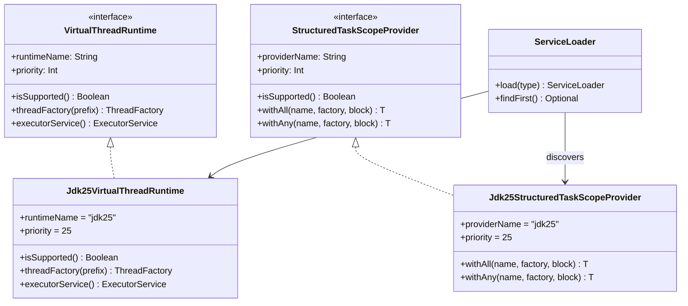

# Module bluetape4k-virtualthread-jdk25

English | [한국어](./README.ko.md)

Java 25 virtual-thread implementation module.

## Overview

This module implements the interfaces defined by `bluetape4k-virtualthread-api` for Java 25. It is loaded automatically through `ServiceLoader` and becomes active on JDK 25 or newer.

Because it has a higher priority than the JDK 21 implementation (`priority = 25`), this implementation is selected automatically in JDK 25 environments.

## UML



## Main Implementations

### `Jdk25VirtualThreadRuntime`

Implements the `VirtualThreadRuntime` interface using the Java 25 Virtual Thread API.

```java
public final class Jdk25VirtualThreadRuntime implements VirtualThreadRuntime {
    @Override
    public String getRuntimeName() {
        return "jdk25";
    }

    @Override
    public int getPriority() {
        return 25;  // higher priority than the JDK 21 implementation
    }

    @Override
    public boolean isSupported() {
        return Runtime.version().feature() >= 25;
    }

    @Override
    public ThreadFactory threadFactory(String prefix) {
        return Thread.ofVirtual().name(prefix, 0).factory();
    }

    @Override
    public ExecutorService executorService() {
        return Executors.newThreadPerTaskExecutor(threadFactory("vt25-"));
    }
}
```

### `Jdk25StructuredTaskScopeProvider`

Provides structured concurrency by using Java 25's `StructuredTaskScope` API.

```kotlin
class Jdk25StructuredTaskScopeProvider: StructuredTaskScopeProvider {
    override val providerName = "jdk25"
    override val priority = 25

    override fun isSupported(): Boolean {
        return Runtime.version().feature() >= 25
    }

    override fun <T> withAll(
        name: String?,
        factory: ThreadFactory,
        block: (scope: StructuredTaskScopeAll) -> T
    ): T {
        // wrapper around StructuredTaskScope.ShutdownOnFailure
    }

    override fun <T> withAny(
        name: String?,
        factory: ThreadFactory,
        block: (scope: StructuredTaskScopeAny<T>) -> T
    ): T {
        // wrapper around StructuredTaskScope.ShutdownOnSuccess
    }
}
```

## `ServiceLoader` Configuration

This module contains the following `ServiceLoader` configuration files:

*src/main/resources/META-INF/services/io.bluetape4k.concurrent.virtualthread.VirtualThreadRuntime*

```
io.bluetape4k.concurrent.virtualthread.jdk25.Jdk25VirtualThreadRuntime
```

*src/main/resources/META-INF/services/io.bluetape4k.concurrent.virtualthread.StructuredTaskScopeProvider*

```
io.bluetape4k.concurrent.virtualthread.jdk25.Jdk25StructuredTaskScopeProvider
```

## Build Configuration

This module is built with the Java 25 toolchain.

```kotlin
java {
    toolchain {
        languageVersion.set(JavaLanguageVersion.of(25))
    }
}

kotlin {
    jvmToolchain(25)
}

tasks.withType<JavaCompile>().configureEach {
    options.release.set(25)
}
```

## Dependencies

### Project Dependencies

```kotlin
dependencies {
    api(project(":bluetape4k-virtualthread-api"))
    implementation(project(":bluetape4k-logging"))
    implementation(Libs.kotlinx_coroutines_core)

    testImplementation(project(":bluetape4k-junit5"))
    testImplementation(Libs.kotlinx_coroutines_test)
}
```

### Gradle Usage Example

```kotlin
dependencies {
    // API module
    implementation("io.github.bluetape4k:bluetape4k-virtualthread-api:$version")

    // JDK 25 implementation (for JDK 25 environments)
    runtimeOnly("io.github.bluetape4k:bluetape4k-virtualthread-jdk25:$version")
}
```

## Usage Example

Because this module is loaded automatically at runtime, application code only needs to use the API module.

```kotlin
import io.bluetape4k.concurrent.virtualthread.VirtualThreads
import io.bluetape4k.concurrent.virtualthread.StructuredTaskScopes

fun main() {
    // When running on JDK 25, Jdk25VirtualThreadRuntime is selected automatically
    println("Runtime: ${VirtualThreads.runtimeName()}") // "jdk25"

    // Create a Virtual Thread executor
    val executor = VirtualThreads.executorService()
    executor.submit {
        println("Running on: ${Thread.currentThread()}")
    }

    // Use structured concurrency
    val results = StructuredTaskScopes.all(
        name = "parallel-tasks",
        factory = VirtualThreads.threadFactory()
    ) { scope ->
        val task1 = scope.fork { fetchDataFromApi1() }
        val task2 = scope.fork { fetchDataFromApi2() }
        val task3 = scope.fork { fetchDataFromApi3() }

        scope.join().throwIfFailed { error ->
            logger.error { "Task failed: ${error.message}" }
        }

        Triple(task1.get(), task2.get(), task3.get())
    }
}
```

## Improvements in JDK 25

Java 25 may include the following improvements for Virtual Threads and Structured Concurrency:

### Virtual Thread Performance Optimizations

- improved carrier-thread scheduling
- reduced pinning and better pinning optimizations
- optimized memory usage

### Structured Concurrency Stabilization

- API stabilization, possibly moving from preview to final
- better exception handling and error propagation
- improved integration with scoped values

**Note**: If Java 25-specific optimizations are needed, they can be implemented in this class.

## Tests

```kotlin
class Jdk25VirtualThreadRuntimeTest {
    private val runtime = Jdk25VirtualThreadRuntime()

    @Test
    fun `should be supported on JDK 25+`() {
        runtime.isSupported() shouldBe true
        runtime.runtimeName shouldBe "jdk25"
        runtime.priority shouldBe 25
    }

    @Test
    fun `should have higher priority than JDK 21`() {
        val jdk21Priority = 21
        runtime.priority shouldBeGreaterThan jdk21Priority
    }

    @Test
    fun `should create virtual thread factory`() {
        val factory = runtime.threadFactory("test-")
        val thread = factory.newThread { }

        thread.isVirtual shouldBe true
        thread.name shouldStartWith "test-"
    }

    @Test
    fun `should create executor service`() {
        val executor = runtime.executorService()
        val future = executor.submit {
            Thread.currentThread().isVirtual
        }

        future.get() shouldBe true
    }
}
```

## JDK Version Compatibility

| JDK Version | Supported | Activation Condition |
|---|---|---|
| JDK 17 or lower | ❌ | `isSupported()` returns `false` |
| JDK 21 | ⚠️ | class-version conflict is possible, not recommended |
| JDK 25 | ✅ | activated automatically, selected with highest priority |

## Priority-Based Selection

When multiple implementations are present, `ServiceLoader` selects the one with the highest priority:

```kotlin
// When both implementations are on the classpath in a JDK 25 environment
VirtualThreads.runtimeName() // "jdk25" (priority 25 > 21)

// Priority comparison
Jdk25VirtualThreadRuntime.priority = 25  // ← selected
Jdk21VirtualThreadRuntime.priority = 21
```

## Caution

### Match the JDK Version with the Implementation

Including this module outside a JDK 25 environment adds an unnecessary dependency.

```kotlin
// ✅ correct usage (JDK 25 environment)
dependencies {
    runtimeOnly("io.github.bluetape4k:bluetape4k-virtualthread-jdk25:$version")
}

// ⚠️ not recommended (including the JDK 25 module on JDK 21)
// On JDK 21, isSupported() returns false, so it will not be used
dependencies {
    runtimeOnly("io.github.bluetape4k:bluetape4k-virtualthread-jdk25:$version")
}
```

### Deployment Strategy

For production deployments, include only the implementation that matches the runtime JDK version:

```kotlin
// Gradle conditional dependency
dependencies {
    implementation("io.github.bluetape4k:bluetape4k-virtualthread-api:$version")

    if (JavaVersion.current() >= JavaVersion.VERSION_25) {
        runtimeOnly("io.github.bluetape4k:bluetape4k-virtualthread-jdk25:$version")
    } else {
        runtimeOnly("io.github.bluetape4k:bluetape4k-virtualthread-jdk21:$version")
    }
}
```

## Migration Guide

### Upgrading from JDK 21 to JDK 25

```kotlin
// 1. Change the build.gradle.kts dependency
dependencies {
    // runtimeOnly("io.github.bluetape4k:bluetape4k-virtualthread-jdk21:$version")
    runtimeOnly("io.github.bluetape4k:bluetape4k-virtualthread-jdk25:$version")
}

// 2. Install JDK 25 and change JAVA_HOME

// 3. Rebuild and test the application
    // ./gradlew clean build

// 4. Verify the runtime
        VirtualThreads.runtimeName() // "jdk25"
```

No code changes are required. Any code that uses the API module continues to work as-is.

## References

- [JEP 444: Virtual Threads](https://openjdk.org/jeps/444)
- [JEP 462: Structured Concurrency (Second Preview)](https://openjdk.org/jeps/462)
- [Java 25 Release Notes](https://www.oracle.com/java/technologies/javase/25-relnote-issues.html)
- [Project Loom](https://openjdk.org/projects/loom/)
