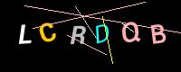
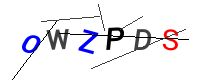
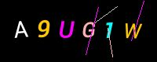
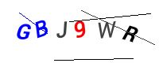

# Module bluetape4k-captha

English | [한국어](./README.ko.md)

A library for generating CAPTCHA images.

## Usage

### Configuration

Use the `CaptchaConfig` class to configure the settings for CAPTCHA image generation.

```kotlin
import java.awt.Color

private val config = CaptchaConfig(
    width = 200,
    height = 80,
    length = 6,                     // captcha code length
    noiseCount = 5,
    theme = CaptchaTheme.DARK,
    darkBackgroundColor = Color.BLACK,
    lightBackgroundColor = Color.WHITE
)
```

### Generating an ImageCaptcha

```kotlin
config.noiseCount = 6
val codeGen = CaptchaCodeGenerator(symbols = CaptchaCodeGenerator.UPPER)
val captchaGen = ImageCaptchaGenerator(config, codeGen)

val captcha = captchaGen.generate()  // Generate CAPTCHA
val jpgBytes = captcha.toBytes()     // Convert to JPG bytes
```

### CAPTCHA Data Model

```kotlin
/**
 * An image-based CAPTCHA
 *
 * @property image the captcha image
 * @property code  the captcha code
 */
data class ImageCaptcha(
    override val code: String,
    override val content: ImmutableImage,
): Captcha<ImmutableImage>
```

Use the provided extension methods to convert an `ImageCaptcha` to JPG or save it to a file.

```kotlin
internal val DEFAULT_IMAGE_WRITER = JpegWriter()

/**
 * Converts the [ImageCaptcha] image to a ByteArray in the specified format.
 *
 * @param writer an [ImageWriter] instance (default: JpegWriter)
 * @return the image as a ByteArray
 */
fun ImageCaptcha.toBytes(writer: ImageWriter = DEFAULT_IMAGE_WRITER): ByteArray {
    return content.bytes(writer)
}

/**
 * Saves the [ImageCaptcha] image to the given [path] in the specified format.
 *
 * @param path the path to write the image file
 * @param writer an [ImageWriter] instance (default: JpegWriter)
 * @return the path of the written file
 */
fun ImageCaptcha.writeToFile(path: Path, writer: ImageWriter = DEFAULT_IMAGE_WRITER): Path {
    return content.forWriter(writer).write(path)
}
```

## Sample Images

1. CAPTCHA images generated with uppercase letters only




2. CAPTCHA images generated with uppercase letters and digits



